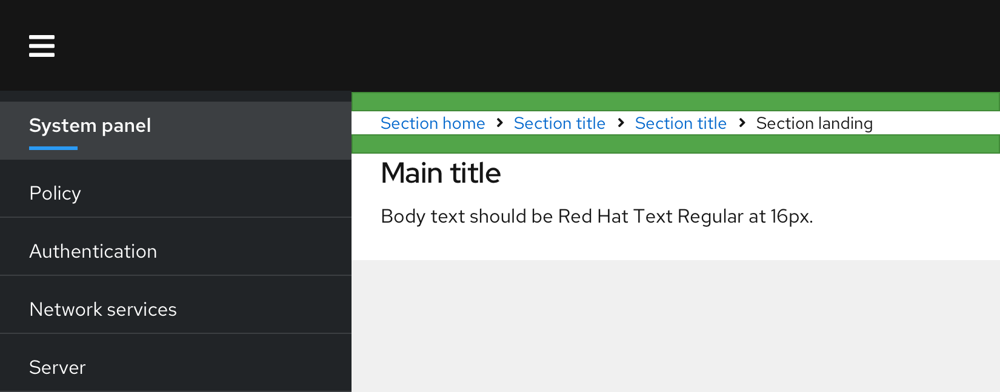

## Usage

Use breadcrumbs in addition to your global navigation to display a user's location in the application.

### Guidelines
* Use breadcrumbs when the primary global navigation items are not always exposed.
* Never use breadcrumbs as a replacement for global navigation.
* Breadcrumbs in PatternFly are intended to show the location of a page in the site hierarchy, and are **not intended to map the user's path through the application**.

## Placement
Breadcrumbs should be placed underneath the masthead, at the top of the page. There should be 16px of padding both between the breadcrumb and the masthead, and between the breadcrumbs and anything that comes below.

## Accessibility
For information regarding accessibility, visit the [breadcrumb accessibility](/components/breadcrumb/accessibility) tab. 
