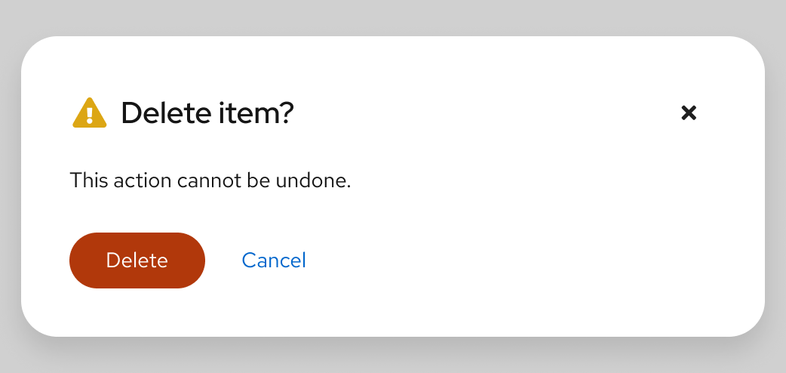
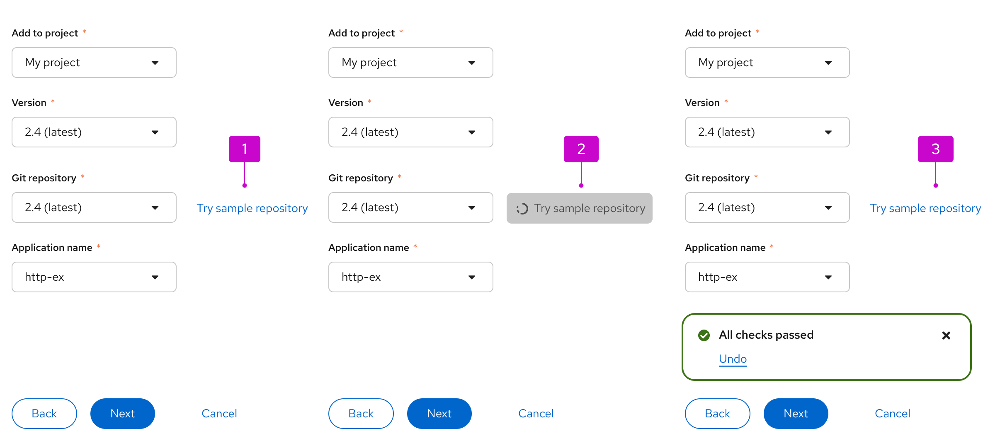
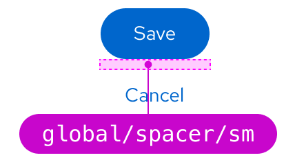
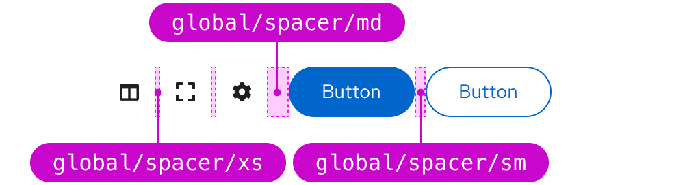
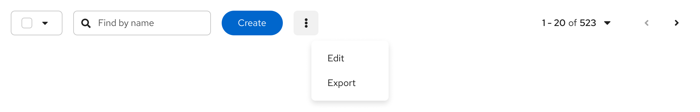

import '../components.css';

## Usage

There are certain cases where specific buttons must be used within your UI.

Follow these guidelines for buttons in wizards (shown in the image below):  

* The **Next** button should always be a [primary button](#primary-button).
* The **Back** button should always be a [secondary button](#secondary-button).
* The **Cancel** button should always be a [link button](#link-button).

    

## Variations

The following button styles, shown in order of visual hierarchy, can be used in your designs according to your needs.

* [Danger button](#danger-button)
* [Primary button](#primary-button)
* [Secondary button](#secondary-button)
* [Tertiary button](#tertiary-button)
* [Link button](#link-button)
* [Icon button](#icon-button)
* [Call To Action button](#call-to-action-button)
* [Progress button](#progress-button)

    

You don't need to use these buttons in the order that their labels imply. For example, you don't always need to use the secondary button as the second button in your designs. The most important thing is to establish a visual hierarchy between any buttons in your designs. There are, however, some best practices to keep in mind.

### Danger button ###

Danger buttons are the most prominent of all the button options. Use danger buttons for actions a user can take that are potentially destructive or difficult/impossible to undo, like deleting or removing user data. These are mostly found in modals to emphasize a destructive action the user is about to take.

_Example of a danger button in a modal_

    

### Primary button ###

A primary button is the most prominent button on a page, used for the most important call to action on a page. Try to limit primary buttons to one per page.

_Example of a primary button inside a toolbar_

    

_Example of a primary button inside an empty state_

    

### Secondary button ###

Secondary buttons are buttons with less visual prominence than primary buttons. Use secondary buttons for general actions on a page, that don’t require as much emphasis as primary button actions. For example, you can use secondary buttons where there are multiple actions, like in toolbars or data lists.

_Example of secondary buttons in data lists_

    

### Tertiary button ###

Tertiary buttons are one the least visually prominent buttons and are designed to be less striking than a primary or secondary button, while still retaining a classic button format. Tertiary buttons are flexible and can be used as needed.

In this example, you can see a tertiary button used to show a possible “Edit” action. This button format highlights the action, while making it clear that it is not the main call to action on the page.

_Example of tertiary button on a page_

    

### Link button ###

Links buttons are labeled buttons with no background or border. Link buttons can be used for actions that:

* May not need as much emphasis.
* Navigate users to another page within the same window.
* Navigate users to an external page.

While all link buttons lack borders, they can still vary in appearance. 

#### External links 

Link buttons that navigate users to another page within the same window should be presented as stand-alone text. 

Links that navigate users to an external page should include an external link icon beside the text to show that clicking on it will bring users to another website or application. 

This is the recommendation for both default and inline links:

    

#### Default link buttons 

Default link buttons have no default background or border, but do have a hover background to indicate the clickable area.

    

##### When to use default links

Use default link buttons for actions that do not require the visual emphasis of a standard button, or when a link will be placed alongside other buttons and should match the spacing. 

For example, the ‘Cancel’ button in modals or links within an empty state.

_Example of a link button in a modal_

    

_Example of link buttons in an empty state_

    

#### Inline links 

Inline links are styled with a persistent underline, to indicate that they are clickable. When users hover over an inline link, the color changes from `global/text/color/link/default` to `global/text/color/link/hover`, which is darker. Once a link is clicked, the text color becomes `global/text/color/link/visited`.

    

##### When to use inline links 

Inline link buttons are to be used for links placed within text content. If a link will take users to a different window or application, use an external icon link.

* Within text content

    

* For action buttons in tables

    

* For action buttons in alerts

    

### Icon button ###

Icon buttons are useful in places where space is limited. For example, if you have too many actions within a menu, you could use a kebab icon to indicate more actions, or an export icon for exporting data. You can also use this button type for actions that are commonly associated with icons, like an exit icon to close a window or a hamburger icon to open a menu.

For example, this toolbar uses a kebab icon as an action button due to limited space.

    

### Call To Action button ###

Call To Action (CTA) buttons and links are used on websites to direct users to complete an action. For example, a product detail page could include a CTA button labeled 'Try it now,' which would guide users to a purchase page.

    

Call To Actions have similar variants to regular buttons (although they have a larger padding), and follow the same visual hierarchy. However, CTA buttons are used only to indicate a desired next step, whereas other button types may also be used to link to additional information or actions. Call To Actions should be used sparingly (ideally one per page, or a primary and secondary CTA).

### Progress button ###

A progress button can be used to provide the user with feedback that an action is in progress after the button is clicked. To indicate that an action is taking place, a spinner is inserted in front of the button label.

**When to use a progress button**

Use a progress button for in-page checks that must be completed before proceeding to the next screen.

**When not to use a progress button**

Do not use a progress button for operations that will take more than a few seconds, or operations that open to a new page. Instead, use a [progress bar](/components/progress).

_Example of using a progress button to test a repository before final configuration_

    

  

1. The user clicks “try sample repository".

2. The spinner will become disabled, indicating to the user that a process is loading and there is no action to take on the button at this time.

3. When complete, a toast message will appear to indicate the status of the process (successful or unsuccessful), and the progress button will return to it’s initial state.

<!--  ### Using buttons in your designs
We recommend aligning buttons to different elements or areas on the screen depending on the content being provided. The recommended alignment simplifies scanning and helps users complete and submit form content more quickly.  

#### Buttons on full page forms
* Place the primary button to the left of the cancel button.
* Align submit buttons with left-edge of input fields.

#### Buttons on modals
* Align submit buttons to the bottom right of the modal.
* Place the primary button to the right of the cancel button.
* Align submit buttons with right-edge of input fields.

We'll want to include some information for button usage on wizards when we have some examples.
 #### Buttons on wizards
The placement of buttons on wizards will depend on the layout of content you present. -->

## Spacing

### Button spacing and action lists

The standard spacing between each button is `--pf-t--global--spacer--md` (16px), even for danger buttons. If buttons are stacked vertically, the spacing between each button should be `--pf-t--global--spacer--sm` (8px).

_Standard spacing_

    

_Stacked spacing_

    

### Exceptions ###

Exceptions to the standard spacing guidelines are as follows:

#### Wizards ####

In wizards, the **Cancel** button is spaced `--pf-t--global--spacer--2xl` (48px) away from the primary and secondary **Next** and **Back** buttons, and `--pf-t--global--spacer--lg` (24px) away if stacked.

_Wizard spacing_

    

_Wizard stacked spacing_

    

#### Toolbars ####

Button spacing in toolbars depends on the button type and how they are grouped. For example, groups of primary and secondary buttons use `--pf-t--global--spacer--sm` (8px) spacing between buttons and `--pf-t--global--spacer--md` (16px) between groups. Icon buttons inside a grouping use `--pf-t--global--spacer--xs` (4px) spacing and `--pf-t--global--spacer--md` (16px) between groups.

_Toolbar spacing_

    

If you have a specific use case where buttons need to be spaced further away from the rest, the button groups action list allows for customization as needed.

_Action group spacing_

    

### Buttons and overflow menus

There are cases where you will have multiple buttons next to each other, like in a toolbar. When the space shrinks (e.g., switching from desktop to mobile view), you can have the buttons collapse into a kebab overflow menu. Additionally, you can choose to make the primary action persist or have all options collapse into the kebab.

_Buttons appear in the toolbar_

    

_Buttons placed in overflow menu due to limited space, with primary button persisting_

    

## Placement

Buttons in forms, modals, or wizards should always be left aligned in the box. This solves for:

* **Modularity and flexibility:** A standard alignment creates consistency in how objects appear across all areas of an app.
* **Accessibility:** The form submit buttons are on the same scan line as the form fields, which benefits users who are sight-limited. Also, users who are blind can more easily navigate left-aligned form submit buttons because the button order is consistent across all contexts.
* **Responsiveness:** The most important actions (i.e., primary buttons) are encountered first when elements are stacked vertically.

## Content considerations

### Writing button labels

When writing button labels:

* Be specific and clearly communicate the button's action.
* Make sure that button text is unique and easily understood on its own, so that screen readers may read buttons to users out of context. Refer to [PatternFly's accessibility guide](/accessibility/about-accessibility) for more information.
* Use simple verbs or verb phrases.
* Aim for short labels when possible (1–3 words), to avoid wrapping.
* Avoid using articles (for example, write “Add source” instead of “Add a source”).
* Avoid punctuation on buttons.
* Add an icon to the button to call a user's attention to it or to clarify the button's action.
* Do not create icons on buttons using punctuation (for example, "+"). Instead, refer to [PatternFly's icons page](/design-foundations/icons) for any icons you place on buttons.

### Writing link labels

Use specific, action-focused labels that match what the user will see when they arrive at their location. For example, if you are sending a user to a dashboard, your link label might read _View dashboard_. For a link directing a user to a support forum, the label might read _Get help in the support forum_. See [PatternFly's content guidelines](/ux-writing/about-ux-writing) for additional guidance.

## Accessibility

For information regarding accessibility, visit the [button accessibility page](/components/button/accessibility).
