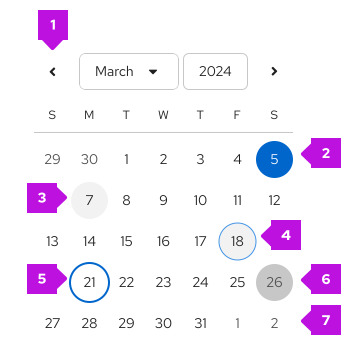

import '../components.css';

## Elements

1. **Selection arrow**: Allows users to navigate between months.
2. **Selected date**
3. **Current date (today’s date)**: Indicates the day users access the calendar. Always highlighted.
4. **Hover state**
5. **Focus state**: Indicates keyboard focus.
6. **Disabled state**
7. **Previous/future date**: Utilizes subtle text colors for days outside of the selected month. 

## Accessibility 
For information regarding accessibility, visit the [calendar month accessibility](/components/date-and-time/calendar-month/accessibility) tab.
