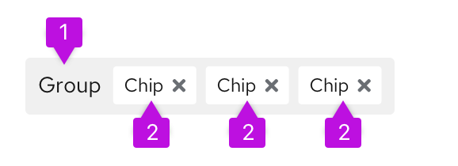
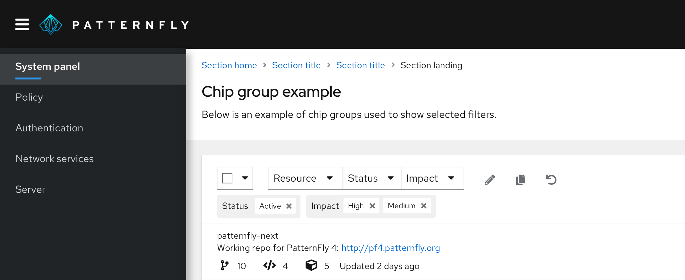

**Note:** Chip is now deprecated. Use the [label](/components/label) component instead.

## Elements

Chips are mainly used within chip groups, which represent an attribute that has been assigned one or more values. 

Chip groups contain two elements.

1. **Chip group:** indicates the main attribute in which selections were made.
2. **Chip:** indicates the selections made within the attribute.

## Usage

Chip groups are typically used in filter and selection use cases to indicate to the user what selections they have made. They separate selections by attribute, for added clarity. An OR relationship is implied between values in the group. Chip groups also give users the ability to either delete an entire chip group at once using the group X, or delete individual chips at a time.

Chip groups are useful to express complex filters to a data set, for example.

## Accessibility
For information regarding accessibility, visit the [chip accessibility](/components/chip/accessibility) tab. 
