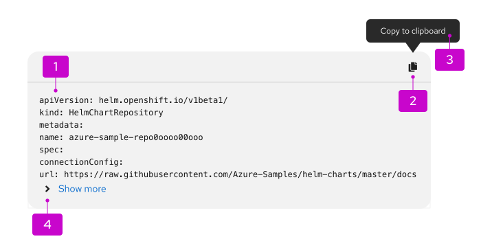
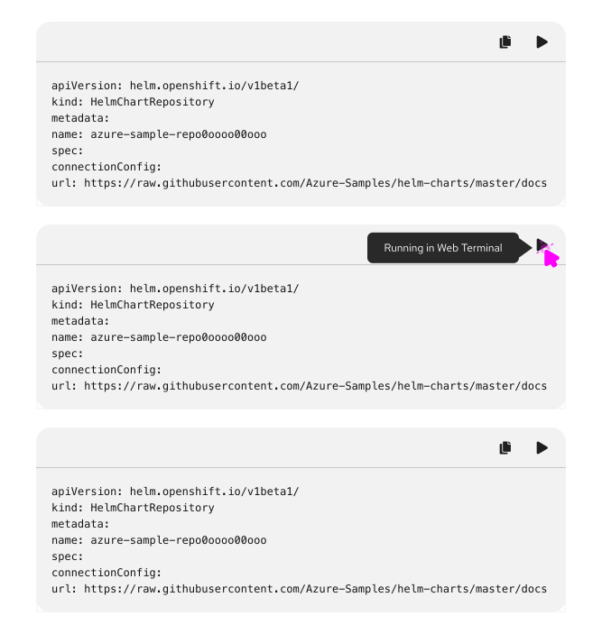
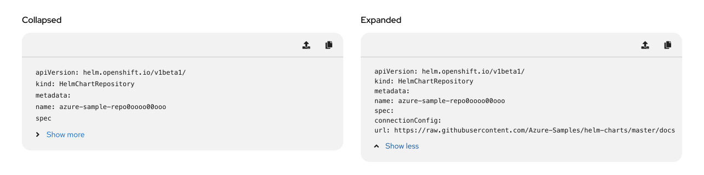

import '../components.css';

## Elements
Code block has 4 main components.

1. **Code snippet:**  the content that will be copied to the user’s clipboard.
2. **[Action buttons](#multiple-action-buttons):** completes an action when clicked. The copy button is the most common, but different or additional action buttons can be added on an as-needed basis.
3. **Tooltip:** informs users that clicking the button will copy the content to their clipboard, or that the content has successfully been copied.
4. **[Show more/less (optional)](#show-moreless):** expands and collapses the code snippet.

### Multiple action buttons

Code blocks can include multiple actions. Any actions are optional and customizable, but the copy action is the most common.

The additional actions to the copy action can include the option to show a checkmark after the user has clicked the action button. The checkmark can be used to indicate to the user that the action was successfully triggered.

### Show more/less

There is the option to include a show more/less section in the code block. The show more/less section can be used to collapse larger code snippets. An expandable code block allows for long lines of code to be stored in an expansion panel. Expanding the code block allows the user to view the full string that they can copy.
