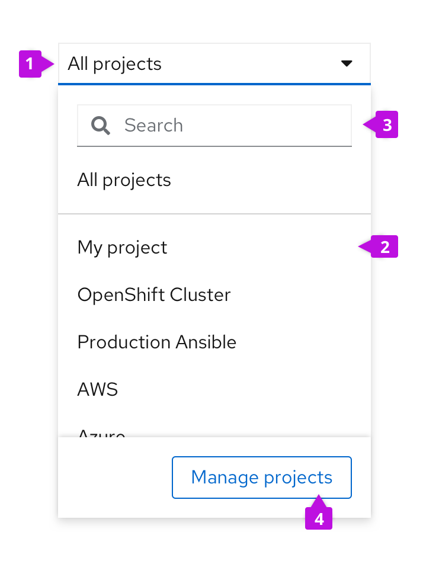
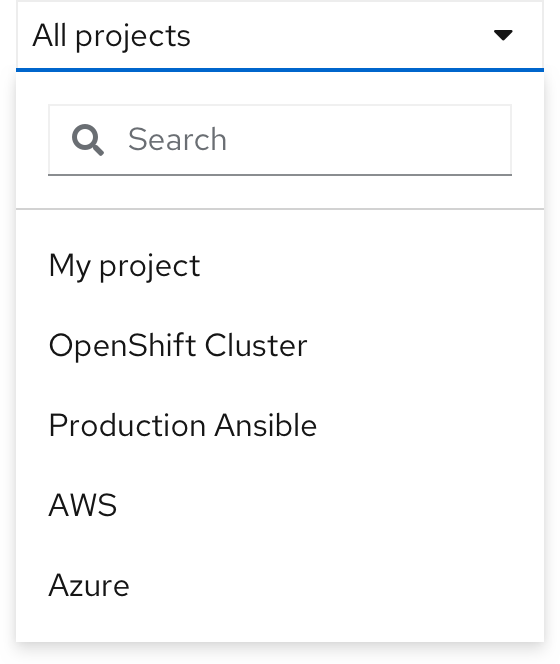
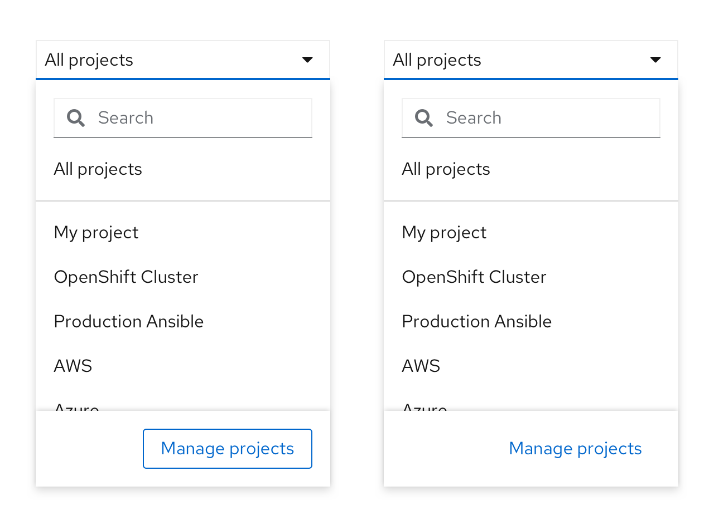
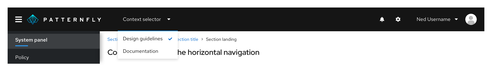
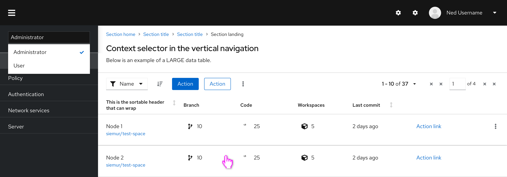
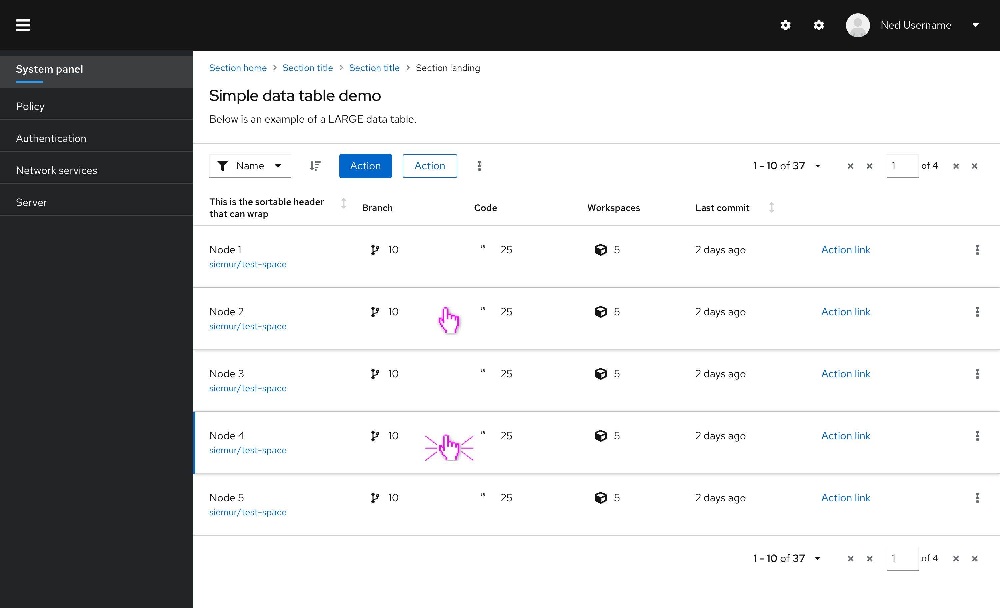

## Elements 

1. Dropdown
2. Menu 
3. Search (optional)
4. Footer/ action button (optional)

## Usage

Context selectors enable a user to switch between different application contexts. They can be placed at many levels of an application’s information architecture and may have different behavior expectations based on the level it is placed in. They can be placed in a page masthead, at the top of vertical navigations, or at the top of a page, depending on your website or product's navigation and preference.
 
Context selectors differ from filters in that a filter takes an overall set of content and reduces it to a subset of content.  In comparison, a context selector takes a set of content and changes it to a different set of content.

### Using actions in a context selector
If your context selector has a lot of options, you may opt to add a search bar at the top of the menu, divided by a separator.

### Using footers in context selector
If you have more actions you would like to add to a context selector, you may add a footer with actions at the bottom of the menu. The menu list inside it will be scrollable, while the footer will remain fixed so that the action is always visible. For the actions inside the footer, you may use a secondary or link button.

## Variations
* [Application-wide impact](#application-wide-impact)
* [Navigation-level impact](#navigation-level-impact)
* [Page-level impact](#page-level-impact)

###  Application-wide impact
When a context selector has an application-wide impact the user is expected to choose a context that will set the content of the entire application.  The list of choices inside the selector's menu can be dynamic and long, but the navigation for any of those choices should not change.
 
#### When to use
Some common use cases for using a context selector with an application-wide impact include:
* Switching between applications or tools that are part of a product suite where the list of choices is known, and is not dynamic.
* Setting the content scope of the entire application, and all navigation areas within the application now following the content scope.

#### Placement
It is recommended that a context selector that has an application-wide impact be placed in the masthead, above the main navigation. This creates an effect that the entire application is changing, rather than just changing the views or navigation within an application.  

### Navigation-level impact
When a context selector has a navigation-level impact, the user is expected to use the main navigation to get to the area of the overall application that they expect to work with, and then choose a context for that working area. The list of choices can be dynamic and long, but the navigation affected for any of those choices should not change.

#### When to use
Some common use cases for using context selectors with a navigation-wide impact include: 
* To change the set of navigation items seen by the user, based on the context selected (for example, switching between an administrator and user view).
* To set the content scope of certain parts of the navigation.
* To set the context of the pages across all navigation items.

#### Placement
It is recommended that a context selector with navigation-level impact, be placed at the top of navigation if it affects all navigation options so that it is tightly coupled with the navigation to show change/effect.

### Page-level impact
In this case, the user is expected to choose a context that will set the content of the entire page.  The list of choices can be static or dynamic. If it is static and below about 8 options, tabs or another tertiary navigation pattern should be considered.

#### When to use
A common use case for using a page-level context selector is as a means for users to view the same information from different angles. For example, if you have a page of “Projects”, having a context selector would allow users to view different project types within the same page, without changing where they are in the main navigation.

#### Placement
It is recommended that a page-level context selector be placed at the top of the page or page section that the context selector controls.

