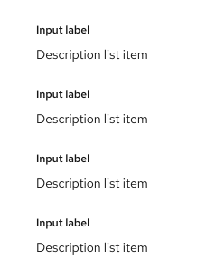

import '../components.css';

## Usage

Use a description list when you have a set of terms and definitions related to a single item. The content within the definitions is not limited to only plain text. This component can be extremely useful in context of Detail pages for a certain resource or item.

## Variations

### Default
By default, the description list will be formatted so that the term stacks vertically above the description.

### Horizontal
Description lists can also be horizontally formatted so that the term and description sit inline and the term comes before the description. 

### Using columns
Columns can be applied in both vertical and horizontal formats. By default, there will be 24px gutters within the column grid.

### Term help text
To provide help text about a term in the description list, you may add popovers indicated by a dotted underline on the label. This is recommended in detailed lists where you have many popovers and using a blue link or icon would clutter the page.

