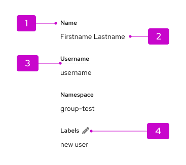

import '../components.css';

## Elements

1. **Term:** The label for the list item.
1. **Description:** The descriptive value for a term.
1. **Contextual help (optional):** When clicked, will trigger a popover that offers more details or definition for a term. Marked by a dotted underline.
1. **Editable item (optional):** Using an [inline edit component](/components/inline-edit), allows users to edit the description linked to a term. For more guidance, refer to [term help text](#term-help-text).

## Usage

Use a description list when you have a set of terms and definitions related to a single topic. Definitions can be plain text or links.

This is particularly useful in context of detail pages, for a certain resource or item:

## Variations

### Default
By default, the description list will be formatted so that the term stacks vertically above the description.

### Horizontal
Description lists can also be formatted horizontally, so that the term and description sit inline, with the term placed before the description. 

### Using columns
Columns can be applied in both vertical and horizontal formats. By default, there will be a 2xl spacer of gutters within the column grid.

### Term help text
To provide help text about a term in the description list, you can add popovers indicated by a dotted underline on the label. This is recommended in detailed lists where you have many popovers and using a blue link or icon would clutter the page.

