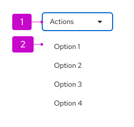

import '../components.css';

## Elements
A basic dropdown consists of a toggle control to open and close a menu of actions or links.

1. **Toggle:** Used to open and close the dropdown menu. It takes on all of the behaviors of a [button](/components/button). The toggle label is used to name the menu and should describe the actions that it contains. If no unique descriptive name applies, default to using “Actions”.

2. **Menu:** Contains a list of options, which could be actions or links. Menus should optimally contain 7 items for fewer to enable better scannability. For longer menus, items can be grouped. For more guidance on supported options in menus (use of icons, grouping, and descriptions) refer to the [menu component guidelines](/components/menus/menu/design-guidelines).

## Variations
In addition to the basic dropdown toggle, you can use the following dropdown toggle variants.

### Primary toggle
The primary toggle should be used in the same way as you would use a primary button. If you want to draw the user’s attention to a dropdown menu as the primary place to take action on a page, consider using a dropdown with primary styling.

### Secondary toggle
The secondary toggle is a variation of the primary toggle. It has less visual prominence than the primary toggle, but more visual prominence than the basic toggle and other toggle variations. 

Use a secondary toggle when the actions in the dropdown are the secondary actions you’d want a user to take. You can also use a secondary toggle when other toggle variations would appear visually inconsistent, or lack the sufficient prominence needed to create a visual hierarchy.

### Plain toggle
Plain styling removes the border from a dropdown toggle, which is useful when the default border treatment might make your layout feel visually cluttered or crowded. 

Use a plain toggle when further action hierarchy needs to be established and you already have primary or secondary action toggle on the page.

### Icon toggle
When there is not enough space for a labeled button, use an icon toggle instead. Icon toggles are most effective when you use a common icon with a well-understood meaning, like the vertical ellipses (kebab) icon.

### Split button
A split button can be used when you want to combine an action button or other control with a dropdown menu. Use a split button action dropdown when you have multiple actions to show that are related to each other, but one action is more likely or important than the rest.

There are 2 types of split buttons: split buttons with checkboxes and split buttons with actions.

#### Split button with checkbox

A split button with a checkbox can be used in bulk selection use cases for a list, table, or card grid. Here, the checkbox provides immediate access to bulk selection, and the user can also open the dropdown menu to expose other actions. Text can also be added within the toggle to reflect current state.

#### Split button with actions

A split button with actions is useful when you want to expose a default action with a single click, but also allow access to other actions via the dropdown menu. This can be thought of as providing a shortcut to the most recent or frequently used item in the menu. A split button with actions can contain a labeled action or an icon in place of the label for use when there is limited space.

#### Example 

In this case, the user can either click on the primary button, or on the caret to open/view the rest of the related options. When a user clicks on an action&mdash;either the surfaced action or one from inside the menu&mdash;the action will be selected and applied immediately. 

