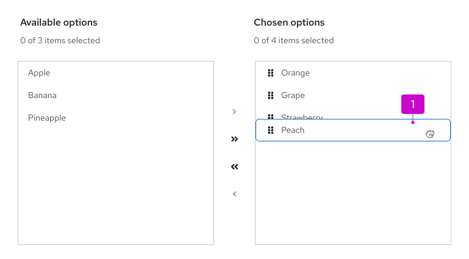
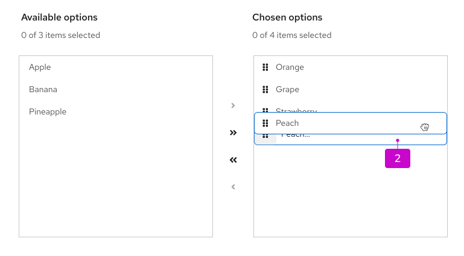
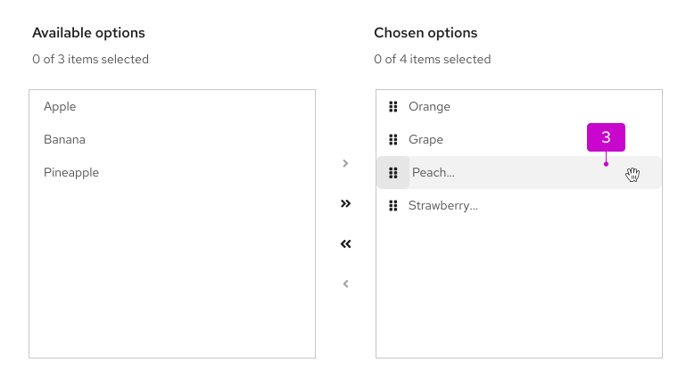
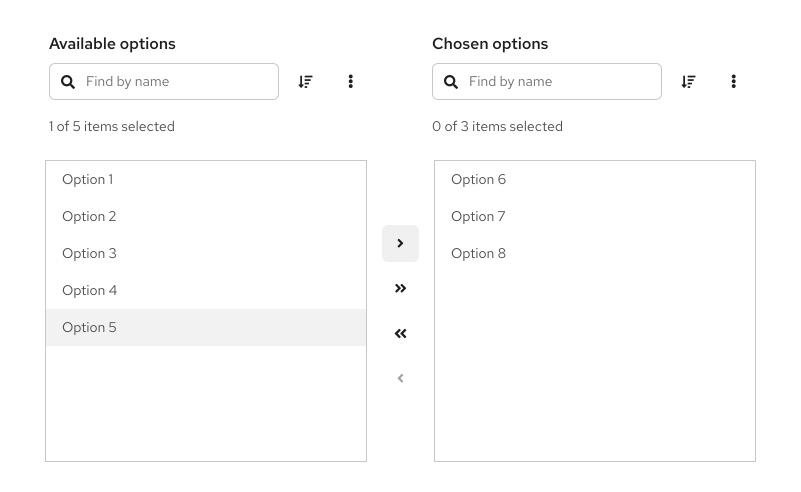

import '../components.css';

## Elements 

The following image is a basic dual list selector. For details about the elements for expandable dual lists, refer to [the variations section](#variations).

1. **List labels:** Distinguish between the list of available options and the list of chosen options. You can change these for your use case, but they should remain clear and concise. 
2. **Available options:** List of items that users can choose from. This list can have a single level or multiple levels. 
3. **Chosen options:** List of items that users have selected from the available options list. 
4. **Selected item:** A visual state for items selected by a user.
5. **Arrows:** Buttons that allow users to move items between lists. These buttons are enabled and disabled based on user selections. Single arrows only move selected items, while double arrows move everything in one list to the other&mdash;in the direction of the arrow.
6. **Number of items:** Indicator of the number of selected items compared to the total available items.
7. **Filter:** Search field that allows users to filter the list of items.
8. **Sorting (optional):** Enables users to sort the list of items for easier scanning.
9. **More actions (optional):** Stores additional actions, such as Export.

## Usage
Dual list selectors are useful when there are a large set of options for users to choose from, which would be more difficult to understand in a menu. They’re useful in forms, wizards, and modals as a way for users to make selections from a list of options.

### When to use

* You have a long list of items for users to pick from.
* You want to distinguish the available items from the chosen items.
* You want the ability to group the list of items.
* Users can select a large number of items, and it would be helpful to distinguish selections from available options.

### When not to use
* Users have a list of actions to choose from. Instead, use a dropdown menu or tree view. 
* The list of items to choose from has fewer than 20 items. Instead, use a select menu.

## Behavior
Users can select 1 or more items from the available options, using the arrows to move these items to the chosen options list. Users can filter down the items by using the search input field.

In an expandable dual list, when users move an item to the chosen list, the item still appears in its original group structure. For example, if the item Broccoli in the group Vegetables is moved from the available list to the chosen list, the Broccoli item will appear in the chosen list under the Vegetable group. It won’t appear as a stand-alone, single-level item.

### Drag and drop functionality 
Drag and drop functionality allows users to customize the order of items in the chosen options. The fa-grip icon at the start of the item row indicates that an item is draggable.

1. **Ghost item:** Upon click and hold, a duplicate "ghost" item with a  `--pf-v6-global--active-color--100` border will appear "on top" of the list. This ghost item represents the initial item being moved.

2. **onDrag event:** While a ghost item is being dragged, the original item will move its position in the list to align with the hovered position.

3. **postDrag event:** Once dropped, the ghost item will become an item in the list, which will be reordered based on the user’s action. 

## Variations
There are 2 types of dual list selectors: basic dual lists and expandable dual lists.

### Basic dual list 
A basic dual list contains a flat list of items for the user to choose from. 

### Expandable dual list
An expandable dual list contains a multi-leveled list of items for users to choose from. Items can be nested in a hierarchical tree to show different groupings or categories, and the list can have up to 3 levels.

1. **Number of items:** Indicates the number of selected items out of the total available. In expandable lists, only non-folder items are included in the item count.
2. **Folder:** Group of items that can be moved between lists. When a folder has a mix of selected and unselected items, the checkbox should have a mixed state. When all items in a folder are selected, the folder checkbox should have a selected state.
3. **Selected item:** A visual state for items selected by a user.
4. **Selectable item:** Item within a folder that can be selected and moved.
5. **Badge (optional):** Indicated the number of items inside a folder.
