## Elements
This is an example of a large, full-page empty state with all empty state elements. Other empty state variations contain the same elements and differ only in spacing and text sizes. 

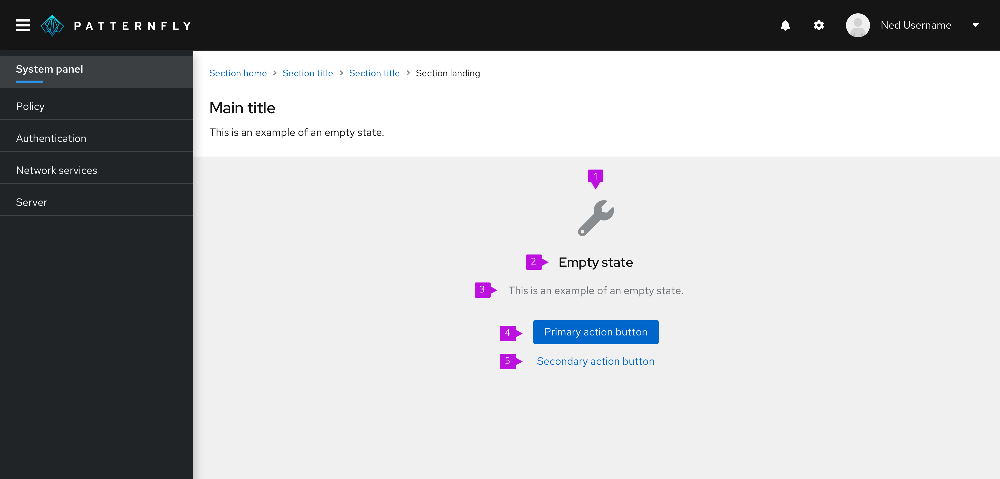

1. **Icon**: The icon presents a visual component for easier recognition of the empty state’s message.
2. **Heading**: The title provides a concise description of the empty state’s purpose.
3. **Body**: The body provides additional information to help the user understand why the space is empty, what they can do to move forward, and how they can benefit from taking the next step.
4. **Primary button**: The primary button enables the user to take either the next step or a more general action, such as returning to the home page. 
5. **Secondary buttons**: Secondary buttons enable the user to take alternative actions, such as accessing additional resources. 

**Note**: Don't include toolbars or filters in a full-page empty state because the user doesn't have any items to search or filter. 

## Usage  
There are several common use cases for this component
### Getting started 
Getting started empty states appear when features haven’t been used yet. In your empty state message, explain why the feature is beneficial to the user and provide a next step so that they can get started.   

Use the [extra large empty state](#extra-large-empty-state) variation for getting started empty states. 

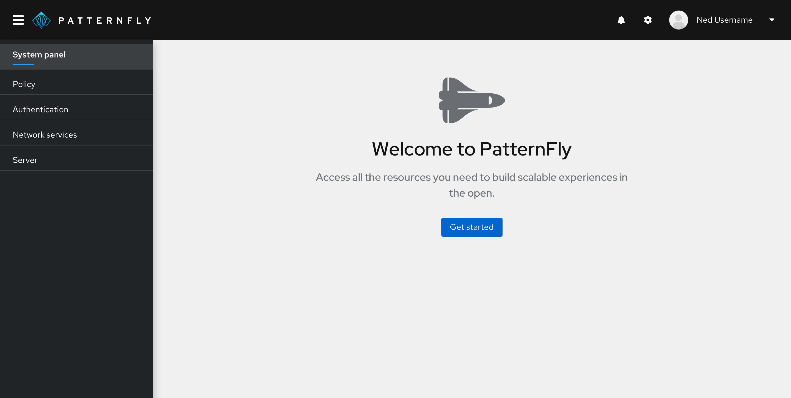  

**Heading**: Welcome the user to the product. Keep in mind that the user might be a bit nervous, so avoid exclamation points or other writing mechanics that make your tone sound excited.

| **Do**                      | **Don't**                  |
|:-------------------------------:|:--------------------------:|
| Welcome to PatternFly | Welcome to PatternFly! |

**Body**: Explain how the product or feature delivers value to the user. State what the user can do with the product instead of what the product enables them to do. This way, you give power to the user.

| **Do**                      | **Don't**                  |
|:-------------------------------:|:--------------------------:|
| Access all the resources you need to build scalable experiences in the open. | PatternFly enables you to build scalable experiences in the open. |

**Button**: Give the user the ability to easily get started with the product.  

| **Do**                      | **Don't**                  |
|:-------------------------------:|:--------------------------:|
| Get started | Exit |

### No results 
No results empty states appear when the system doesn’t find any data to show, such as when a user’s search criteria doesn’t yield any results.  

In your empty state, explain that nothing was found and give the user a next step so that they can continue their search.  

Use the [small empty state](#small-empty-state) variation for no results empty states. 

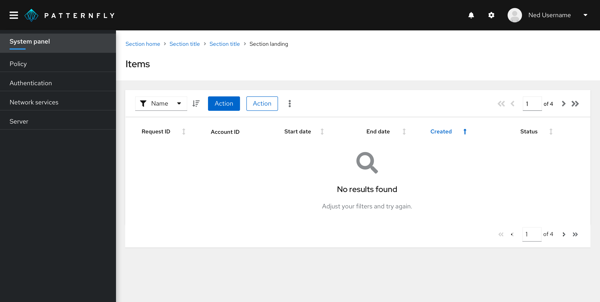    

**Heading**: Briefly state that no results were found.

| **Do**                      | **Don't**                  |
|:-------------------------------:|:--------------------------:|
| No results found | Your search did not yield any results |

**Body**: Explain what the user should do next so that they can continue searching for what they need.

| **Do**                      | **Don't**                  |
|:-------------------------------:|:--------------------------:|
| Adjust your filters and try again. | We did not find any results that matched your filters. |

### Required configuration 
Required configuration empty states appear when the user needs to configure, connect, or enable something before using a feature.  

Use the [large empty state](#large-empty-state) variation for required configuration empty states.

  

**Heading**: State what needs to be done instead of what hasn’t been done yet. 

| **Do**                      | **Don't**                  |
|:-------------------------------:|:--------------------------:|
| Configure your system | You haven’t configured your system |

**Body text**: Explain what the user needs to do to complete the task. 

| **Do**                      | **Don't**                  |
|:-------------------------------:|:--------------------------:|
| Start the configuration process and follow the on-screen instructions. | You cannot continue until you complete the configuration. |

**Button**: Give the user the ability to quickly take action on the task. 

| **Do**                      | **Don't**                  |
|:-------------------------------:|:--------------------------:|
| Start configuration process | Exit |

### No access
No access empty states appear when the user doesn’t have the entitlements or access permissions to view a certain feature or product area.  

Use the [large empty state](#large-empty-state) variation for no access empty states.

 

**Heading**: State what the user needs to access the page instead of what they don’t have or can’t do. 

| **Do**                      | **Don't**                  |
|:-------------------------------:|:--------------------------:|
| Access permissions needed | Access denied |

 

**Body**: Explain what action the user must take to reach their goal of accessing the page.

| **Do**                      | **Don't**                  |
|:-------------------------------:|:--------------------------:|
| To access PatternFly, ask your administrator to adjust your permissions. | You don’t have access to PatternFly. |

**Button**: Give the user the ability to easily leave the page and return to the dashboard, home page, or another main area of the product. 

| **Do**                      | **Don't**                  |
|:-------------------------------:|:--------------------------:|
| Return to dashboard | OK |

### Back-end failure 
Back-end failure empty states appear when an error occurs that prevents the system from displaying the page content.  

Use the [large empty state](#large-empty-state) variation for back-end failure empty states.

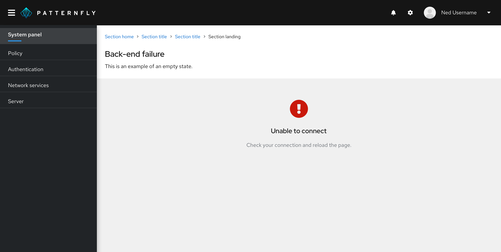 

**Heading**: State what the error is in plain language so that the user can easily understand what the error means.  

| **Do**                      | **Don't**                  |
|:-------------------------------:|:--------------------------:|
| Unable to connect | Failure #121212: Connection error |

  

**Body**: Explain how the user can resolve the error. 

| **Do**                      | **Don't**                  |
|:-------------------------------:|:--------------------------:|
| Check your connection and reload the page. | We’re sorry. Something is wrong. |

### Success 
Success empty states appear when the user successfully completes a process, such as a tutorial or a setup wizard. 

Use the standard empty state variation for success empty states in a table or wizard.

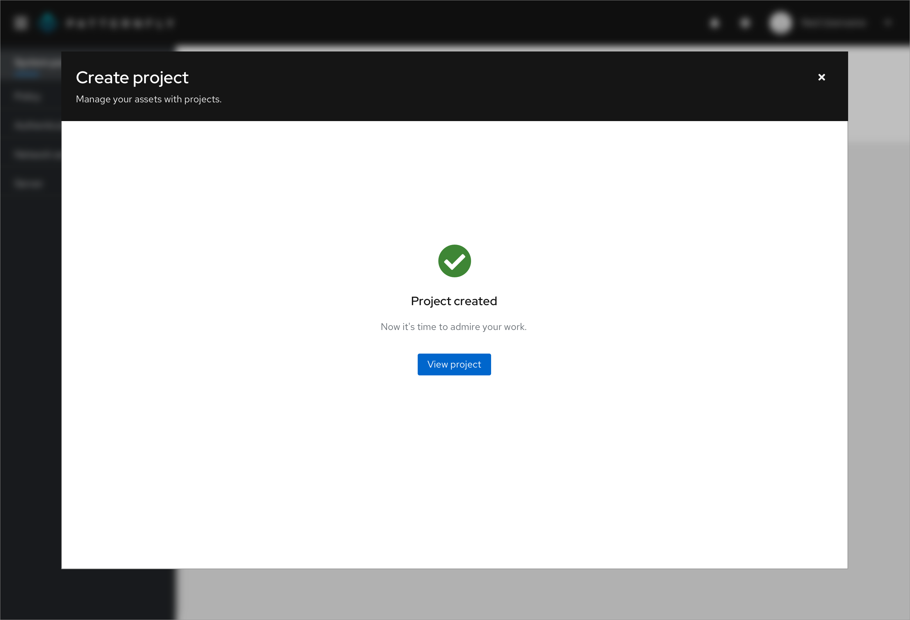  

Use the [extra large empty state](#extra-large-empty-state) variation for success empty states in a full page.

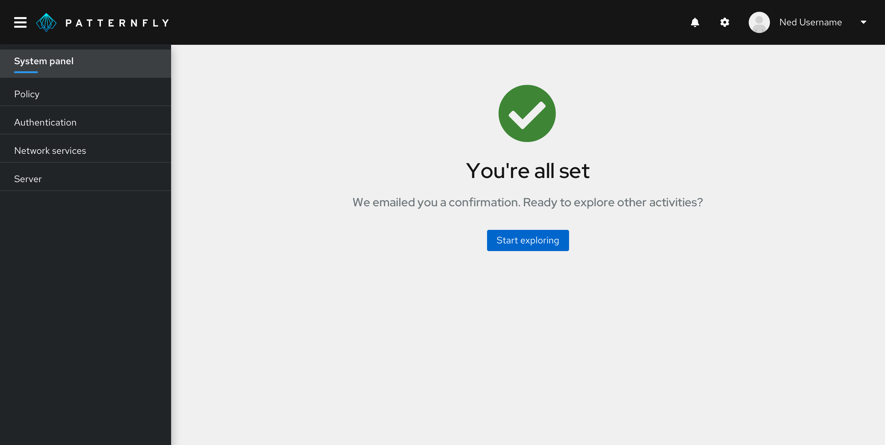 

**Heading**: Confirm the action is completed. Because this is a success message, it’s OK to congratulate the user and show some excitement. Avoid extraneous terms like “success” and “successfully.”

| **Do**                      | **Don't**                  |
|:-------------------------------:|:--------------------------:|
| You're all set | You have successfully registered |

**Body**: Give the user a next step so that they can continue using the product. If an additional confirmation is needed (such as a confirmation email), include that in the body, too. 

| **Do**                      | **Don't**                  |
|:-------------------------------:|:--------------------------:|
| We emailed you a confirmation. Ready to explore other activities? | You can now exit. |

**Button**: Give the user the ability to easily take the next step. 

| **Do**                      | **Don't**                  |
|:-------------------------------:|:--------------------------:|
| Start exploring | Exit |

### Creation 
Creation empty states appear when the user needs to add or create something to view associated information.  

Use the [large empty state](#large-empty-state) variation for creation empty states.

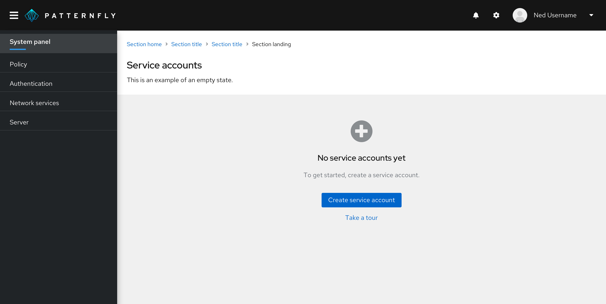  

**Heading**: State what hasn’t been created or added yet. Avoid saying that something hasn’t been found because the user might interpret that as a system error.

| **Do**                      | **Don't**                  |
|:-------------------------------:|:--------------------------:|
| No service accounts yet | No service accounts have been found |

**Body**: Explain what the user needs to do next.

| **Do**                      | **Don't**                  |
|:-------------------------------:|:--------------------------:|
| To get started, create a service account. | You have not created any service accounts. |

**Button**: Give the user the ability to easily take the next step.

| **Do**                      | **Don't**                  |
|:-------------------------------:|:--------------------------:|
| Create service account | Return to home page |

**Secondary button**: Give the user the ability to access additional resources that can help them through the creation process, such as a tour. 

You can also use the extra small empty state variation inside of a card to present the user with another way to add a new card to their view. Place the empty state card where a new card would be added, such as the first (or last) card in the view. Be sure to also include a primary button in the toolbar so that the user can still perform the action even if the empty state is out of view. 

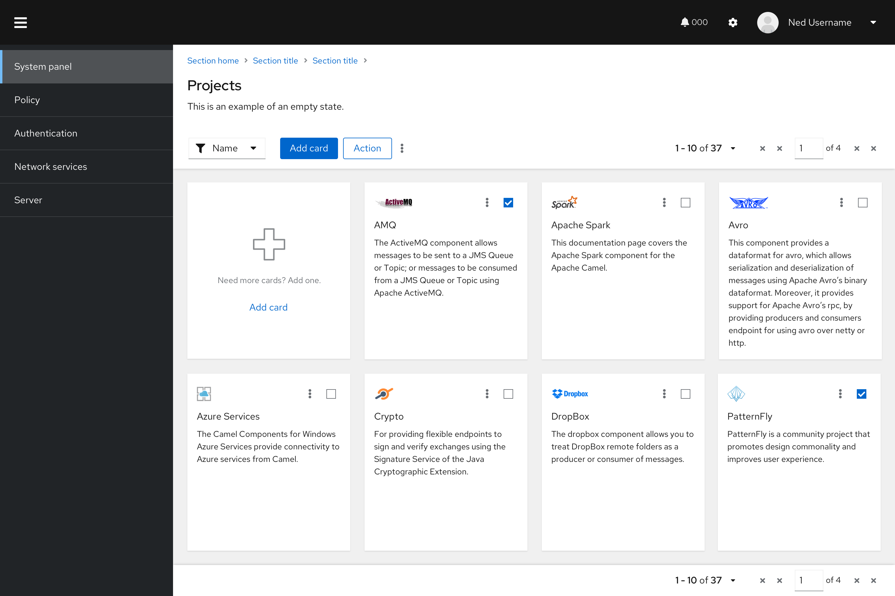 

## Variations

### Extra small empty state
Use an extra small empty state inside [cards](https://v4-archive.patternfly.org/v4/demos/card-view/design-guidelines/#action-card) or when there are space constraints. 

### Small empty state
Use a small empty state inside tables, wizards, or modals. 

### Large empty state
Use a large empty state as a [full page.](#full-page-empty-states)

### Extra large empty state
Use an extra large empty state for special instances only, such as [full-page success](#success) empty states or [getting started](#getting-started) empty states.

## Visual design 
Icons and colors can help enhance users’ visual understanding of empty state messaging.

### Icons
To maintain consistency, specific icons are mapped to specific empty state scenarios.

Here is when you should use each icon:

|       |Type |Color |Icon |Usage |
|---------------|------|-----|-----------|------------|
| <i class="fas fa-rocket" aria-hidden="true"></i> |First use or get started |Gray (#8A8D90) |fa-rocket | Use in getting started empty states. You can replace this icon if you already have an application-specific graphic that you want to use instead.
| <i class="fas fa-search" aria-hidden="true"></i> |Search |Gray (#8A8D90)|fa-search |Use when there is no data to show.
| <i class="fas fa-wrench" aria-hidden="true"></i>|Configuration |Gray (#8A8D90) |fa-wrench |Use when configuration is required or there is a configuration issue.
| <i class="fas fa-lock" aria-hidden="true"></i> |No access |Gray (#8A8D90) |fa-lock | Use when the user is not entitled or the user role does not have access.
| <i class="fas fa-exclamation-circle" aria-hidden="true"></i>|Error  |Red (#C9190B) |fa-exclamation-circle |Use when there is an inability to get data, there is backend failure, or an error has occurred.
| <i class="fas fa-check-circle" aria-hidden="true"></i> |Success |Green (#486b00) |fa-check-circle |Use to indicate that a task or process has been completed successfully.
| <i class="fas fa-plus-circle" aria-hidden="true"></i> |Addition or creation |Gray (#8A8D90) |fa-plus-circle |Use when something needs to be added or created.

### Colors 
Use color intentionally. If you’re not using a custom icon for a specific use case, an icon should be gray by default (except when it’s used as a status icon).

## Content considerations
Content varies depending on the type of empty state. For specific information on what content to use  for each empty state type, see the earlier [Usage](#usage) section. 

Regardless of empty state variation and type, all empty states should have a specific level of detail, consistent capitalization and punctuation, and an intentional voice and tone.  

### Level of detail  
State what isn't there, and then give the user a next step. Empty states should not describe in detail how to use the page—the design should be intuitive enough without extensive written explanation.    

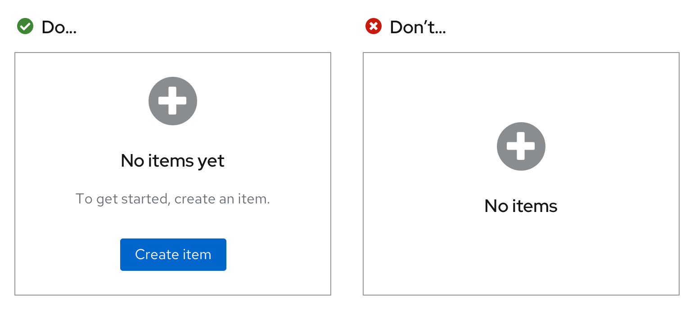 

### Capitalization and punctuation 
Use [sentence case](/ux-writing/capitalization) in your empty states: Capitalize only the first letter of the first word in the heading, body, buttons, or links. However, be sure to capitalize the first letter in all proper nouns, product names, acronyms, and initialisms, regardless of where they appear in the heading, body, buttons, or links.

Add a period at the end of full sentences in the body, but do not add a period at the end of headings or buttons. 

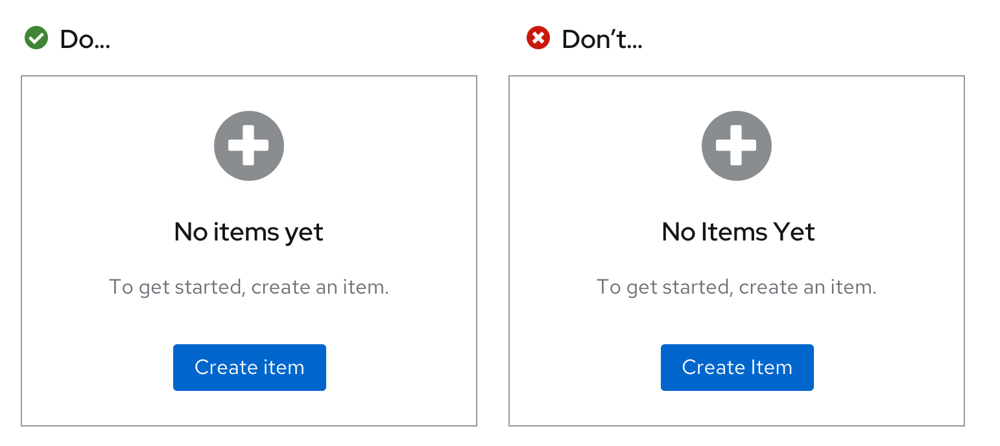 

### Voice and tone
Pay close attention to the [voice and tone](/ux-writing/brand-voice-and-tone) in your empty state. Your voice should align with your company’s unique brand voice. Your tone, on the other hand, should adjust depending on the context—consider the user’s emotions and adjust your approach accordingly. 

It’s OK to use “you” and “your,” but never assign blame to the user. Also, avoid using “please” in an empty state. It’s extraneous and can make your message sound too formal.  

### Buttons and links
Use buttons and links in empty states to highlight calls to action for the user. There are multiple ways to do this.

### One primary call to action
If you have one primary call to action, you can present it as a primary button or as a link in the body text.

**Example: Call to action as a primary button** 

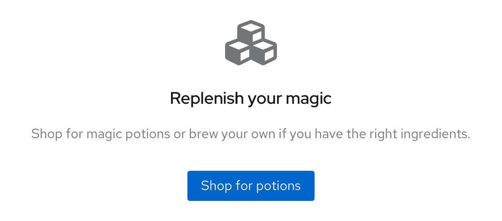   

**Example: Call to action as a link in the body text** 

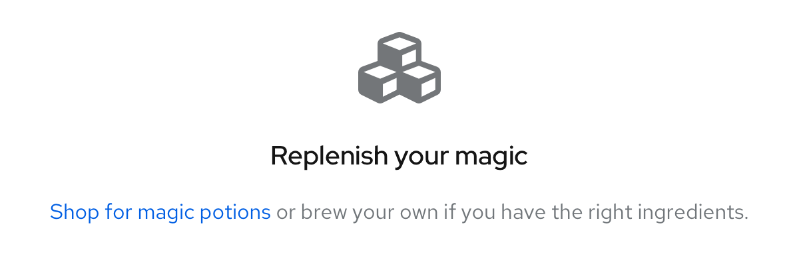  

### Multiple calls to action
If your primary call to action is presented as a primary button, your secondary call to action can be presented as a secondary button beneath the primary button.  

**Example: Secondary call to action as a secondary button beneath the primary button** 
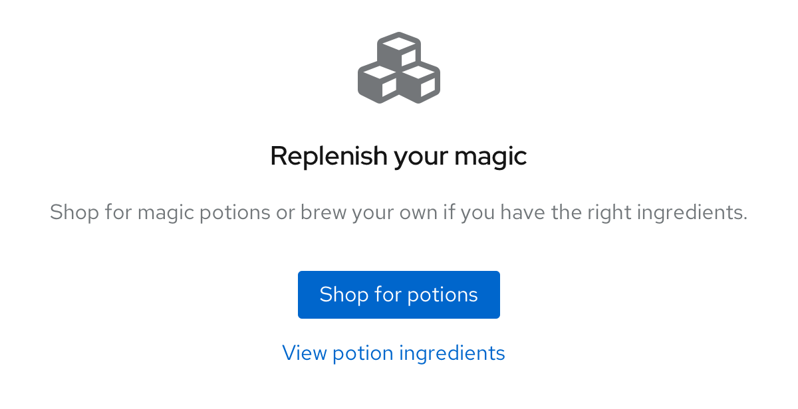  

If your primary call to action is presented as a link in the body text, your secondary call to action can be presented as a secondary button beneath the body text.  

**Example: Secondary call to action as a secondary button beneath the body text**  
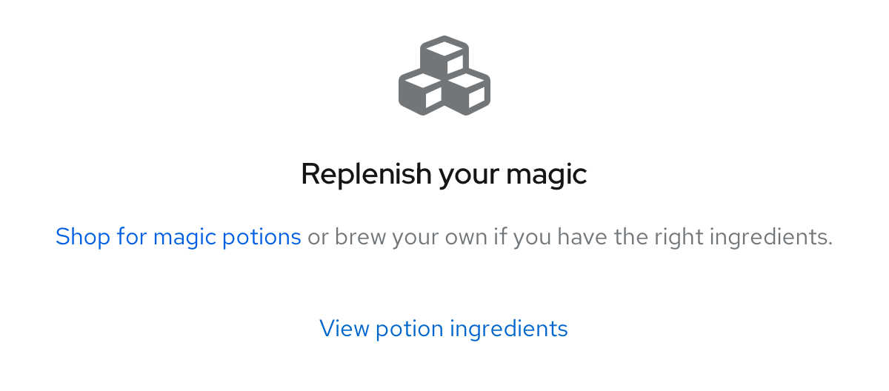   

### One secondary call to action
For a filtering or search situation, you can use a stand-alone secondary button (with nothing linked in the body).

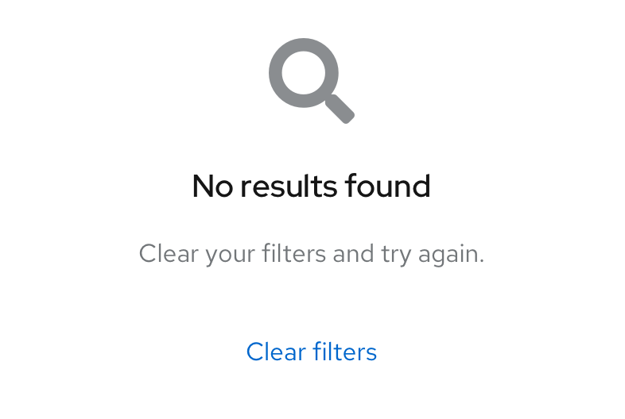  

### Alignment 
Empty states can be a full page, or they can be included inside of other components on the page. 

### Full-page empty states 
On a desktop, a full-page empty state should be 64px away from the top and horizontally centered with a minimum padding of 24px on all remaining sides.

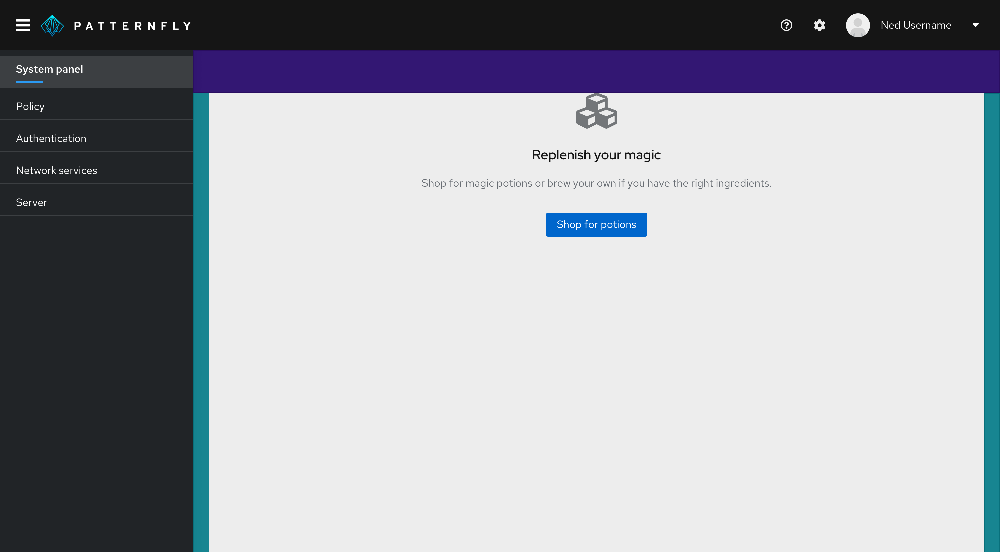   

On a mobile device, a full-page empty state should be 48px away from the top with a minimum of 16px padding on all remaining sides.  

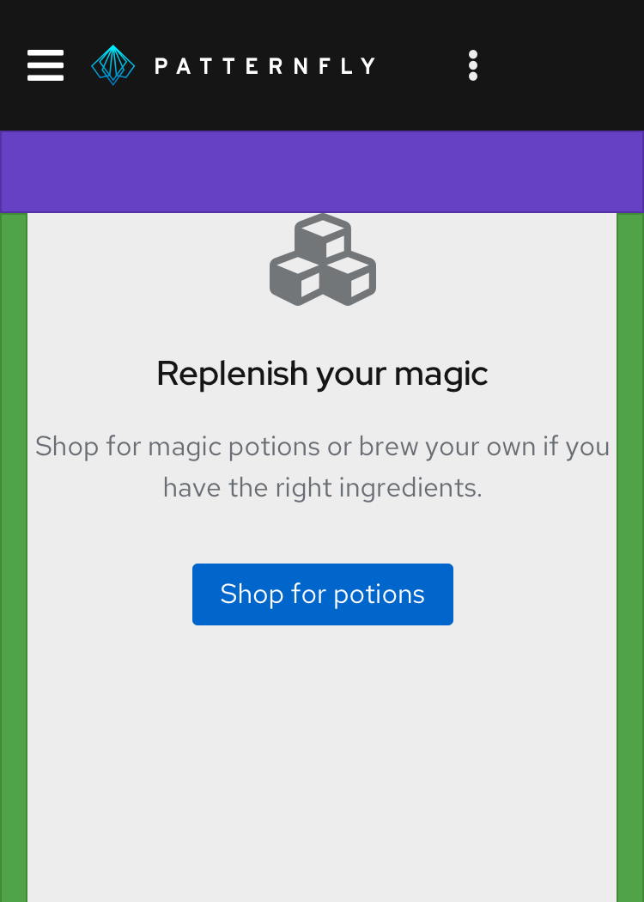   

### Empty states inside tables, cards, or wizards
Empty states inside a table, card, or wizard should always be horizontally and vertically centered on their background. Outside padding on all remaining sides should be 24px. 

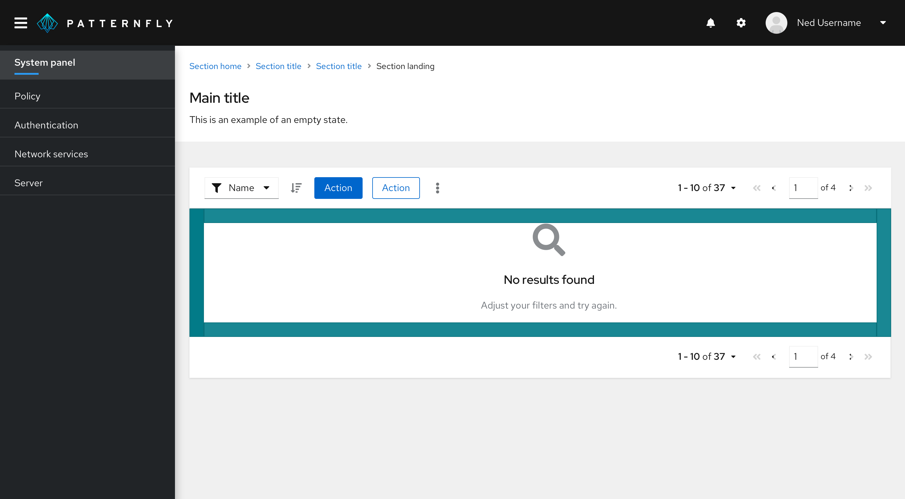  
