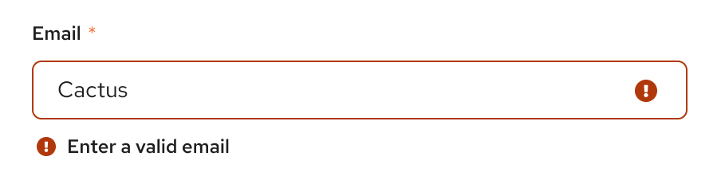
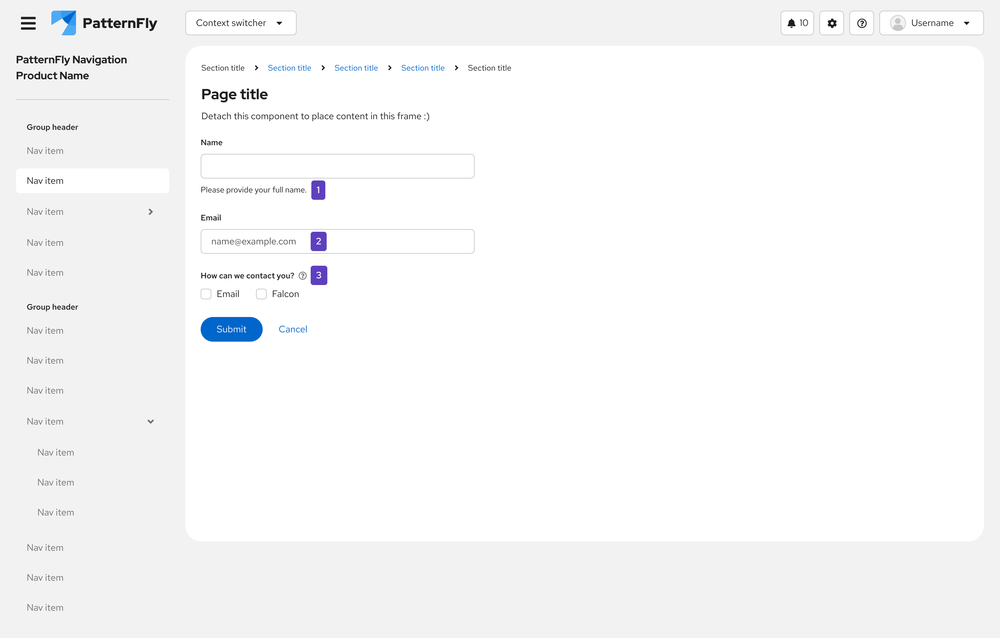

## Usage
Helper text is most commonly used in conjunction with form elements to provide additional hints and information for the user. It can also be used to explain why certain information is being requested, how to use a specific input, or to suggest helpful hints. Helper text should always be visible and appear as a subheading (unlike [popovers](https://www.patternfly.org/components/popover/design-guidelines/), which display content in a new window).
 
### When to use helper text
* Use helper text to provide imperative information regarding an input, such as character limits, password expectations, and more.  
* Use status icons with helper text to convey the status of a user's input. For example, if a user has met the character requirements, display the success icon with helper text to show success. Similarly, if a user has not met a password requirement, display the error icon with helper text failure/error.  

### When not to use helper text
* Do not use helper text to explain what a form field is, or to provide additional form context. Instead, use a popover to convey any additional, non-imperative information to a user. Popover content is displayed in a new window after the user clicks or toggles over the popover icon. Its content consists of longer descriptions, formatted text, and complete sentences. 
 

* Do not use helper text to provide formatting examples within a text box. Instead, use placeholder text to temporarily showcase what content should appear in a field before the user inputs information. 

 

For information regarding other forms of on-screen help, see [popovers](https://www.patternfly.org/components/popover/design-guidelines/) and [tooltips](https://www.patternfly.org/components/tooltip/design-guidelines).

### Example

 
    1. Standard helper text
    2. Placeholder text
    3. Popover icon

## Content considerations
* Should appear on 1 line (if possible) and be visible to the user
* Should consist of clear, simple language 
* Can be written in complete sentences or as a statement
* Use helper text for information critical to a user completing a task, such as password requirements, character requirements, invalid text alerts, etc. 

## Accessibility 
For information regarding accessibility, visit the [helper text accessibility](/components/helper-text/accessibility) tab. 
