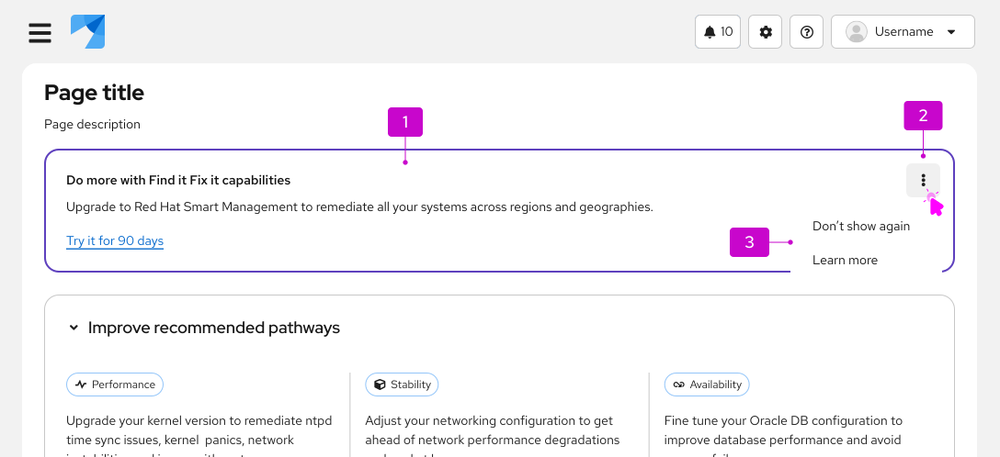

import '../components.css';

For information on other forms of on-screen help, see [Tooltip](/components/tooltip/design-guidelines) and [Popover](/components/popover/design-guidelines).

## Usage

Use hints to share information about an interaction or prerequisite step that might not be immediately obvious to the user.

## Content considerations 
Use full sentences with punctuation.
Include relevant links to documentation when necessary.
