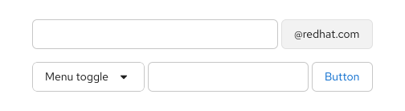

import '../components.css';

## Usage

Input groups can combine multiple elements. For example you could add buttons to 1 or both sides of a text input, like in a search field or an email input field. 

### When to use
Use an input group when the elements are directly connected to each other. Examples include an action button to act on the text, a mandatory and fixed piece of text, a class of text when in a filter, a unit of currency, and more.

### When not to use
Do not use an input group when you're performing different actions on the item, such as a text entry and a remove action.

View more examples in the [input group react tab](https://v4-archive.patternfly.org/v4/components/input-group#examples).
