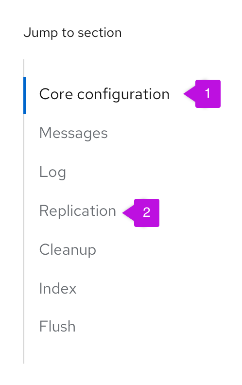
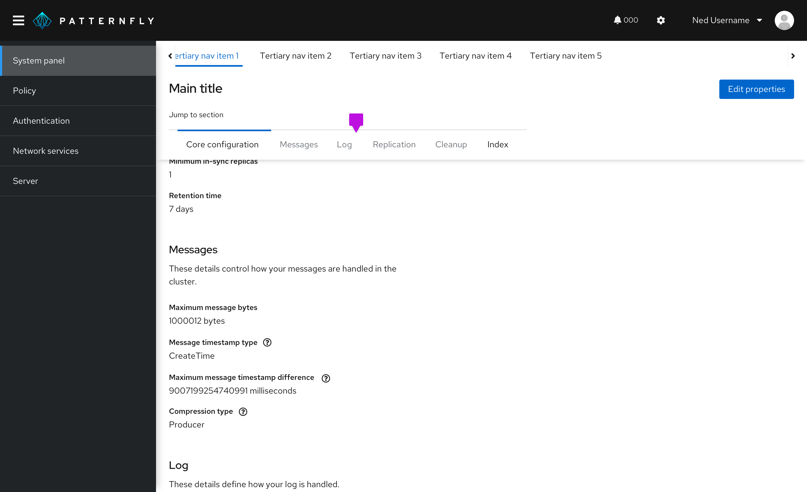

## Elements

1. **Active section:** current section of the page the user is on.

2. **Inactive section:** other sections of the page that the user is not currently on. Clicking on an inactive section will bring the user to the selected section and make the section active.

## Usage
Jump links provide a way to navigate through section headings on a page without scrolling. The highlighted active section changes as the user scrolls to the next section.

### Placement
Vertical jump links can be placed either to the left or the right of the content on the page. It is recommended to place the jump links on the left side of the content and remain consistent with the application you are working on. Only use jump links on the right when space allows and when there is an extensive nav on the left; otherwise, consider reverting to the left of the page. In both placements, the visual system is identical, including jump links with subsections. So use either according to your application’s needs.

### Jump links on mobile
On smaller screen sizes, jump links collapse into an expandable component that is shown above the content. This component can be expanded to display the jump links. 

## Variations
Jump links can be displayed either horizontally or vertically. They can include optional subsections.

### Vertical jump links 
As the user scrolls down the page, the active sections are highlighted from top to bottom. This is the recommended variation. 

### Horizontal jump links
As the user scrolls down the page, the active sections are highlighted from left to right. A jump link can be displayed left aligned or center aligned and with an optional label. 

### Jump links with subsections
If the page has subsections, they are shown as indented jump links under the parent section. Subsections can be individually selected. 

## Accessibility 
For information regarding accessibility, visit the [jump links accessibility](/components/jump-links/accessibility) tab.
