import '../components.css';

## Labels

### Elements
You can customize labels by adjusting their visual styling or adding functionality to let users click, edit, or remove labels.

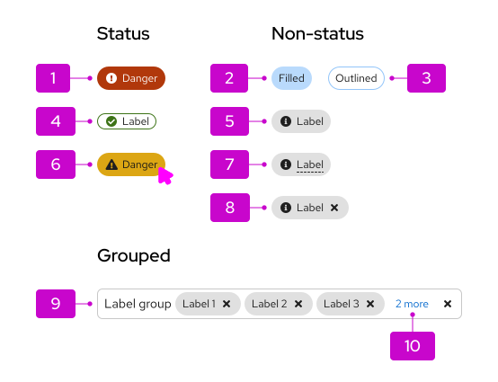

1. **Status label:** Combines color and an icon to communicate a status, like danger, warning, or success.
1. **Filled label:** Can be used for additional emphasis.
1. **Outlined label:** Can be used as a less prominent label style.
1. **Compact label:** Takes up less space than the default label.
1. **Label with icon:** Can utilize a recognizable icon to make the label more clear and identifiable. 
1. **Clickable label:** Is identified by the inclusion of a hover state (as shown in the example image).
1. **Editable label:** Is identified by a dashed underline.
1. **Dismissible label:** Can be removed or dismissed by clicking on the "x" close icon.
1. **Label group:** Contains multiple labels at once.
1. **Overflow label** Contains additional labels that don't fit within the main space of the label group.

### Usage

Labels are useful in a few scenarios: 
- When you want to highlight an element on a page to draw attention to it or make it more searchable. 
- To tag items of the same category. If you want to show a count, use a [badge](/components/badge) instead.
- For use in [filtering](/patterns/filters) to indicate user selections, similar to the now deprecated [chip](/components/chip) component.

There are 2 label sizes:

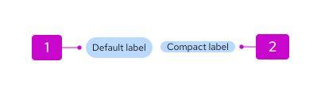

1. **Default labels:** Use by default when needing a label.
2. **Compact labels:** Use when confronted by space limitations and a smaller label is required (for example, in a table).

Labels can be used almost anywhere in a UI. They are commonly used in tables, card views, and filters.

#### Labels in tables

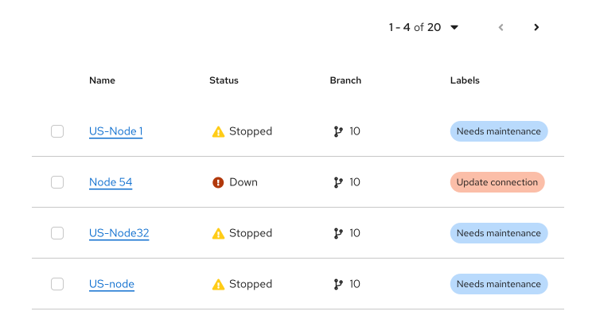

#### Labels in card views

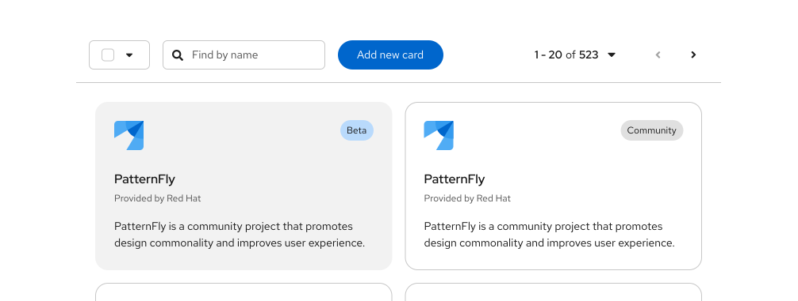

#### Filter labels

Labels are typically used in filter and selection use cases to indicate what selections a user has made. They utilize [label groups](#label-groups) to organize selections by category for added clarity. When there are multiple filter labels within a group, any data that matches one or more of the labels will be filtered. It is not required for all filter labels to be applied in order to match a filtered item.

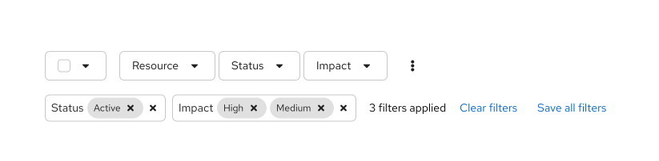

#### Color considerations

Labels can utilize both our [status](/design-foundations/colors#status-and-state-colors)  and [nonstatus](/design-foundations/colors#nonstatus-colors) color palettes.

While you may use other colors for your labels, we recommend using the ones provided as they have been carefully selected to be accessible with the PatternFly library. If you choose to use other colors, be mindful of picking [accessible text color and icon color](/accessibility/testing-your-accessibility) to go with the label background.

The colors you should use differs for status and nonstatus labels:

##### Status labels

Status colors can be used to indicate danger, warning, success, info, or custom statuses. 

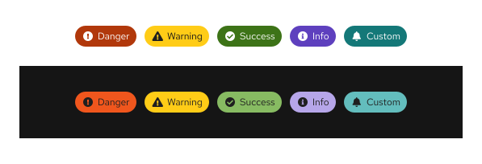

##### Nonstatus labels

We offer a nonstatus color palette, which you can use to color code labels that don't correspond to any status level, including red, orange, orange red, gold, green, cyan, blue, purple, and gray. 

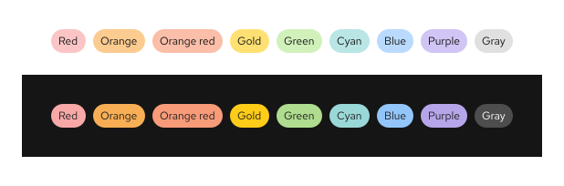

**Note:** We recommend you avoid using red, unless you're indicating danger or an error state.

### Variations
- [Filled or unfilled labels](#when-to-use-filled-or-unfilled-labels)
- [Labels with icons](#when-to-use-labels-with-icons)
- [Editable labels](#when-to-use-editable-labels)
- [dismissible labels](#when-to-use-dismissible-labels)
- [Clickable labels](#when-to-use-clickable-labels)

#### When to use filled or unfilled labels

Use the filled option to add more visual prominence to a label. If your use case requires a mix of clickable and non-clickable labels, consider using 1 type for clickable and another for non-clickable. Whatever convention you choose, be sure to maintain consistency through your UI.

Both status and nonstatus labels can be filled or unfilled.

##### Filled

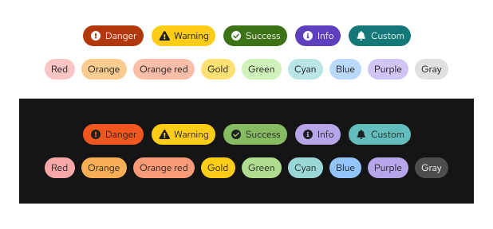

##### Unfilled

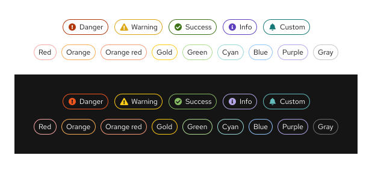

#### When to use labels with icons

While status labels will automatically contain an appropriate icon, you can also add an icon to nonstatus labels, when additional visual information would be helpful. 

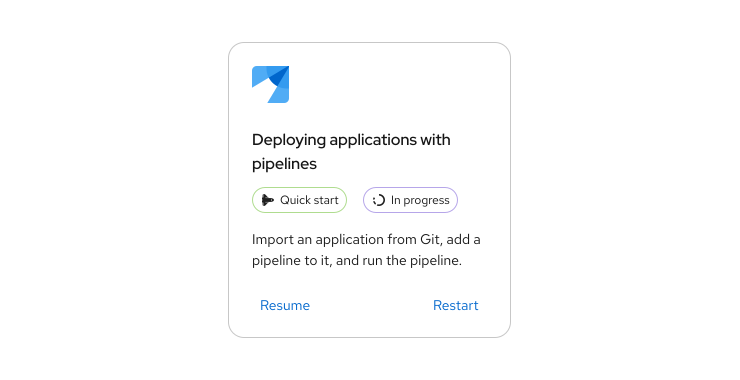

Icons can also help distinguish labels of the same color.

#### When to use editable labels
Use editable labels when you want to allow users to organize and select resources manually. Adding editable labels enables the user to query for objects that have similar, dissimilar, or overlapping labels.

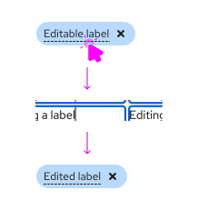

#### When to use dismissible labels

Use a dismissible label for labels that can be easily removed. Editable labels are often dismissible as well.

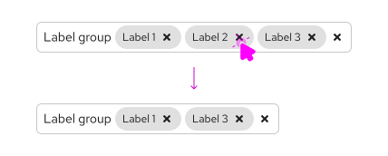

#### When to use clickable labels
Use a clickable label for labels that trigger actions or link to new pages. Clickable labels include a hover state as shown in the following image.

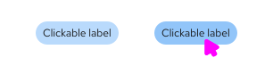

## Label groups

Label groups are used to display multiple labels at once. 

### Elements
Label groups have a number of components to them.

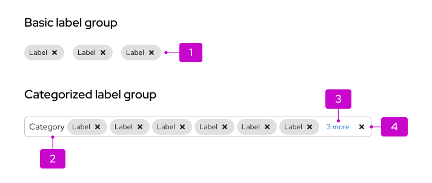

1. **Label:** Indicates the labels applied.
1. **Group label (optional):** Indicates the group category or name.
1. **Overflow:** Indicates if there are more labels to show.
1. **Group close (optional):** Deletes the entire label group.

You can build custom label groups using various combinations of these features.

### Usage
Label groups should be used when there are multiple labels assigned to a component. They can be used almost anywhere in a UI, but are commonly used in table views and description lists. Label groups can be oriented either horizontally or vertically and can optionally be named and be dismissible. You may also make the label group editable to allow users to edit an existing label or add a new label.

#### Label groups in a table

In a table, basic label groups can be used to display all labels associated with a data source.

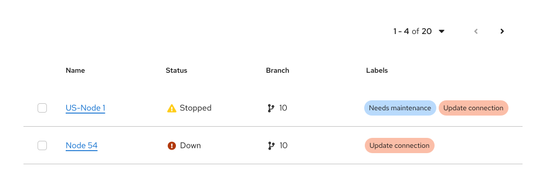

#### Label groups in a table popover

When there are many labels assigned to a table, you can use a popover as a container. 

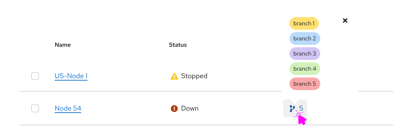

#### Label groups in a description list

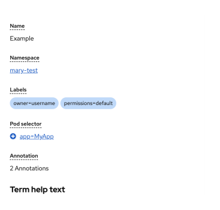

### Variations

#### Editable label group

##### Adding a new label to a group

This pattern can be followed to let users add a new label or edit an existing label within a group.

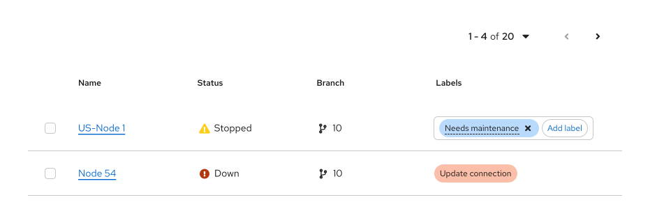

When a user selects the **Add label** button, a new label is added to the beginning of the group. Once the new label is added, they can overwrite the default value by double clicking the label.

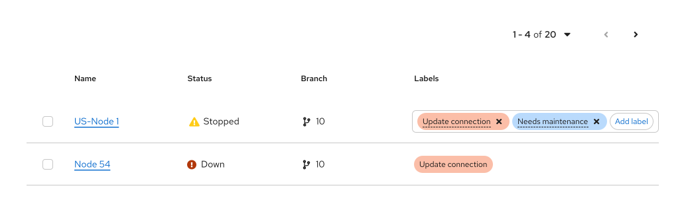

##### Adding a new label to a group from a list of preselected labels

You can provide users with a fixed set of label options to add to a group. 

When a user selects the **Add label** button, display a menu of available label options. They can select a new label from the values in the menu.

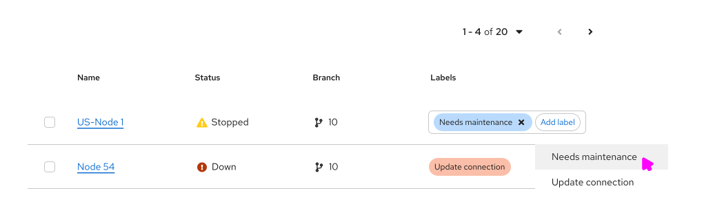

The new label is added with the selected value and can not be edited. 
##### Adding a new custom label to a label groupgit 

You can allow users to customize the labels they add to a group. 

When a user selects the **Add label** button, it opens up a modal, where they can select the attributes for their new label, including the label type, text, color, icon, and the ability to dismiss or edit. Customize these options to fit your needs.

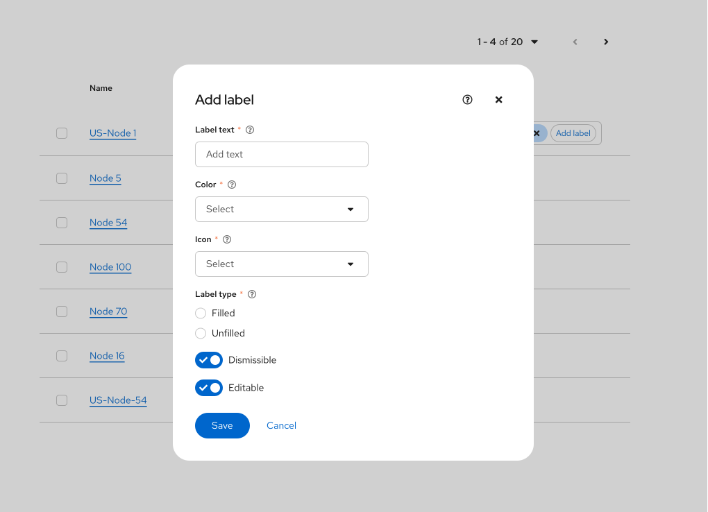

Once the new label is created, it cannot be edited. Users will need to add a new label if they want to make changes.
## Accessibility
For information regarding accessibility, visit the [labels accessibility](/components/label/accessibility) tab.