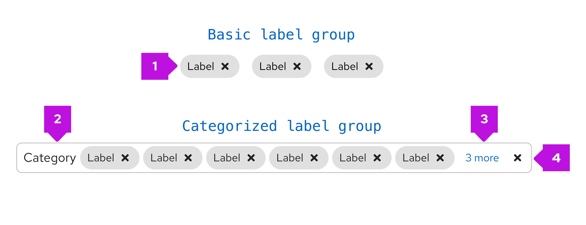

## Labels

### Elements
You can further customize labels by making them filled or unfilled, dismissable, adding icons, or making them clickable links. You can use any combination of these elements in a single label.

1. **Fill/Unfilled labels:** Offer customization for emphasis.
2. **Dismissible label:** Can be dismissed by clicking on the “x”.
3. **Label with icon:** Can be used to further clarify the label.
4. **Clickable labels:** Has a hover state to show interactiveness.
5. **Editable labels:** Has a dashed underline to communicate editability.

### Usage

Use a **label** when you want to highlight an element on a page to draw attention to it or make it more searchable. Labels can also be used to tag items of the same category. If you want to show a count, use a [badge](/components/badge) instead.

There are 2 specific label types:

1. **Default labels:** Use by default when needing a label.
2. **Compact labels:** Use when confronted by space limitations and a smaller label is required (for example, in a table).

Labels can be used almost anywhere in a UI, but are commonly used in table views and catalogs as shown below. 

#### Color considerations
Both default and compact labels come in the following default colors: gray, blue, green, orange, red, purple, and cyan. We offer a wide array of colors to allow for color coding labels within UIs. Label colors can be used to indicate status if desired, but do not have to. Regardless, we recommend you avoid using the red label unless it indicates danger or an error state.

While you may use other colors for your labels, we recommend using the ones provided as they have been carefully selected to be accessible with the PatternFly library. If you choose to use other colors, be mindful of picking [accessible text color and icon color](/accessibility/testing-your-accessibility) to go with the label background.

### Variations
* [Unfilled](#when-to-use-filled-or-unfilled-labels)
* [Filled](#when-to-use-filled-or-unfilled-labels)
* [Dismissable](#when-to-use-dismissable-labels)
* [With icons](#when-to-use-labels-with-icons)
* [Clickable](#when-to-use-clickable-labels)
* [Editable](#when-to-use-editable-labels)

#### When to use filled or unfilled labels

Use the filled option to add more visual prominence to a label. If your use case requires a mix of clickable and non-clickable labels, consider using one type for clickable and another for non-clickable. Whatever convention you choose, be sure to maintain consistency through your UI.

1. Unfilled

2. Filled

Use the filled option to add more visual prominence to a label.

#### When to use dismissable labels

Use a dismissable label for labels that are easily removed. A common use case for dismissable labels is when users can edit labels.

#### When to use labels with icons
Add an icon to your label in cases where additional visual information is helpful. You can also use them to distinguish labels of the same color if needed.

#### When to use clickable labels
Use a clickable label for actionable labels. A common use case for clickable labels is when a user may want to filter by a specific label. You can also use label links to redirect users to a new page.

#### When to use editable labels
Use editable labels when you want to allow users to organize and select resources manually. Adding editable labels enables the user to query for objects that have similar, dissimilar, or overlapping labels.

## Label groups

Label groups are used to display multiple labels at once. 

### Elements
Label groups have a number of components to them.

1. **Group category (optional):** indicates the group category
2. **Label:** indicates the labels applied.
3. **Overflow:** indicates if there are more labels to show.
4. **Group close (optional):** deletes the entire label group.

Label groups can use various combinations of these features to build custom label groups.

### Usage
Label groups should be used when there are multiple labels assigned to a component. They can be used almost anywhere in a UI, but are commonly used in table views and description lists. Label groups can be oriented either horizontally or vertically and can optionally be named and be dismissable. You may also make the label group editable to allow users to edit an existing label or add a new label.

#### Label groups in a table

#### Label groups in a table popover

#### Label groups in a description list

### Variations

#### Editable label group

##### Adding a new label to a group, without a group label
This variation can be used when there is a need to add a new label or edit an existing label within a label group, and the label group does not have a group label.

When the user selects the ‘Add label’ button, a new label is added as the first label in the group. Once the new label is added, the user can overwrite the default value by double clicking the label.

##### Adding a new label to a group, with a group label
This variation can be used when there is a need to add a new label within the label group, and the label group has a group label. 

When the user selects the ‘Add label’ button, a new label is added as the first label in the group. Once the new label is added, the user can overwrite the default value by double clicking the label.

##### Adding a new label to a label group from a list of preselected labels
This variation can be used when only a fixed set of labels can be added to a label group. 

When the user selects the ‘Add label’ button, a drop list is displayed with the existing list of values. User selects a new label from the values in the drop list.

The new label is added with the selected value and can not be changed. 

##### Adding a new custom label to a label group
This variation can be used when you want to allow users to customize the labels they add to a label group. 

When the user selects the ‘Add label’ button, it opens up a modal from which they can select the attributes for the new label. These include label text, color, icon, filled vs outlined, ability to dismiss, and editability. The options shown can be customized to fit your use cases.

The new label is created based on the attributes selected by the user and it can not be changed.

## Accessibility
For information regarding accessibility, visit the [labels accessbility](components/jump-links/accessibility) tab.