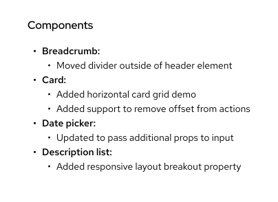
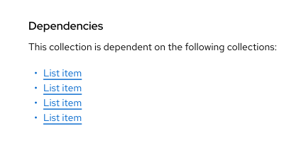
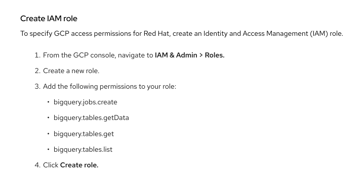
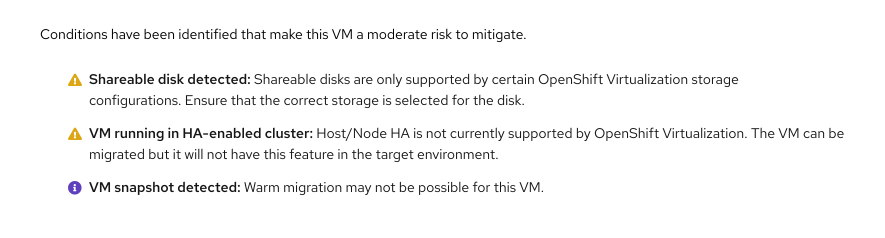

import '../components.css';

## Usage

Use lists to organize information in a digestible format. Lists can be very useful when you have a lot of text on a page.

## Variations

There are many different types of lists, including [unordered](#unordered), [ordered](#ordered), and [with icons](#with-icons).

### Unordered
By default, you should use bullets when displaying an unordered list. Use an unordered list when you want to break up related content, but list items are not sequential. You may also choose to present an unordered list without the bullets, or with horizontal rules between each list item.

### Ordered
Use ordered lists to convey a sequence of events or steps in a process. An example of an ordered list is a numbered list.

### With icons
Use icons to call out useful information about list elements. In the example below, each list item is a condition with a respective status icon. The object's overall status is an aggregation of the list items' statuses. Lists with icons can use small icons or big icons.

