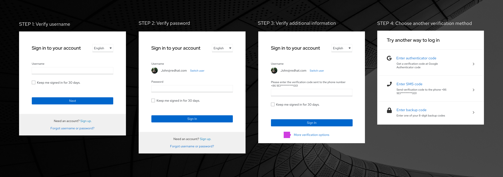
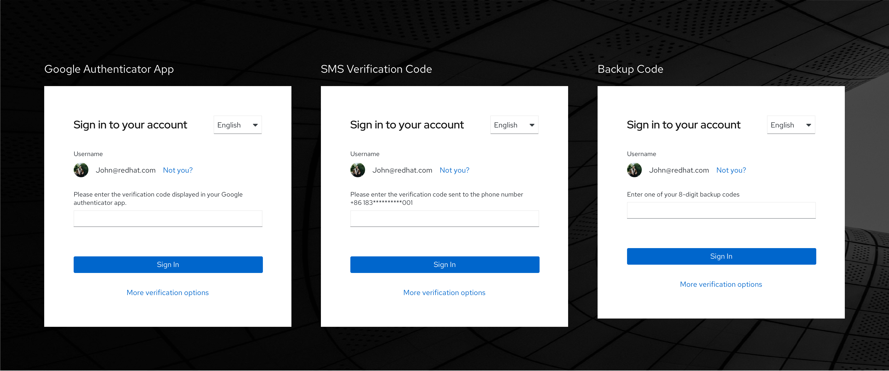
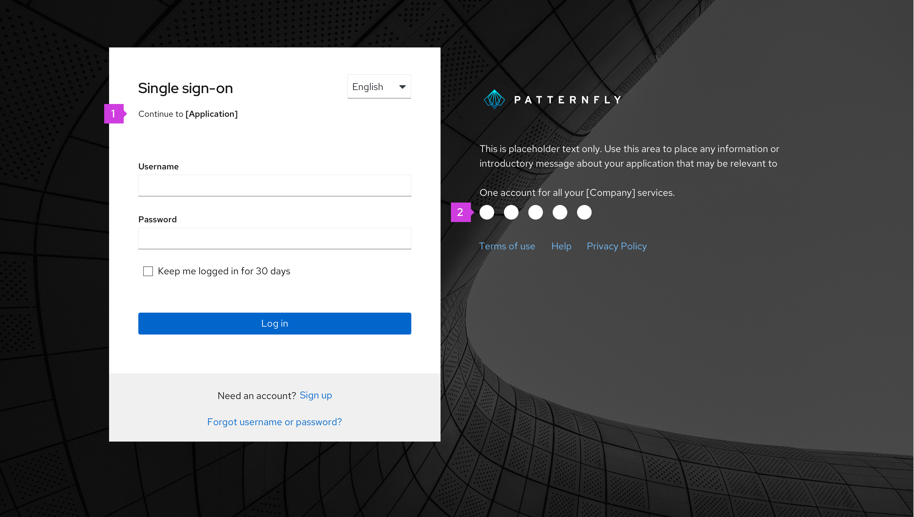
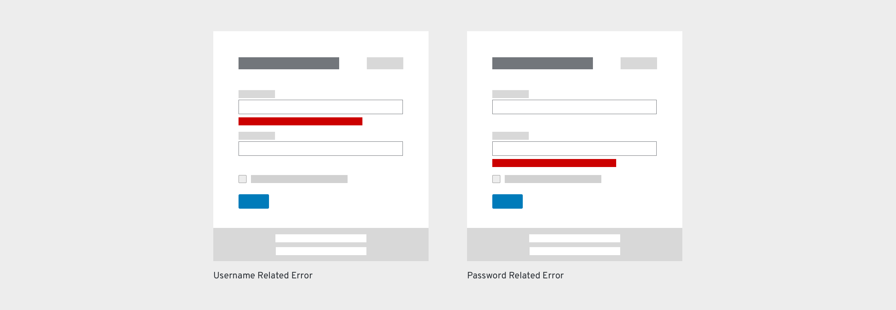
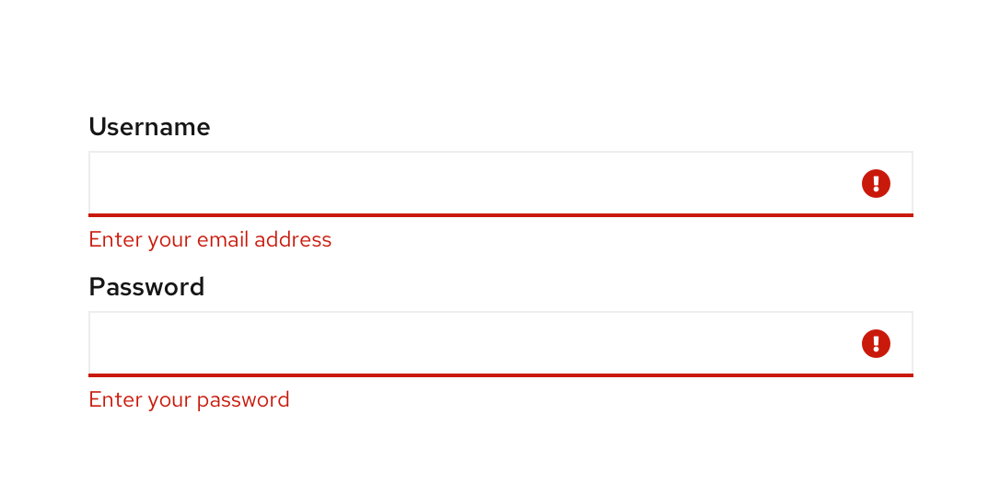
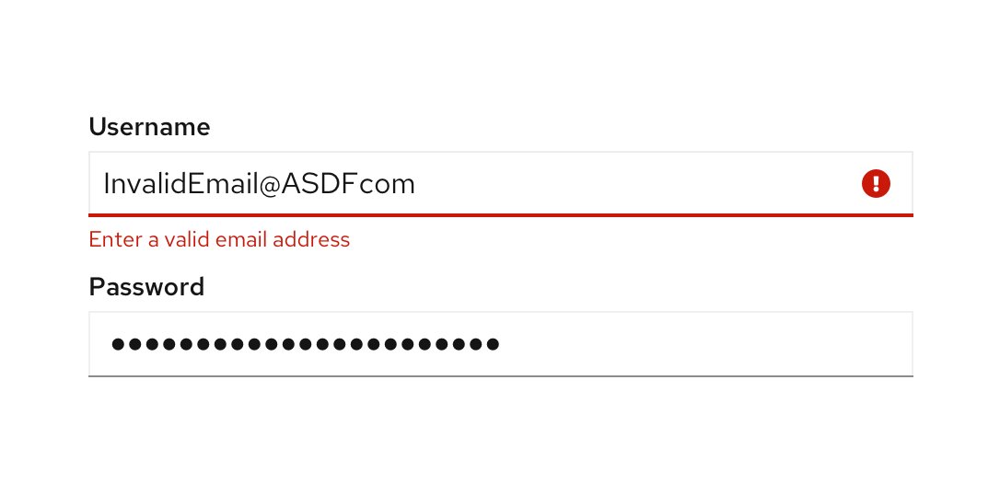
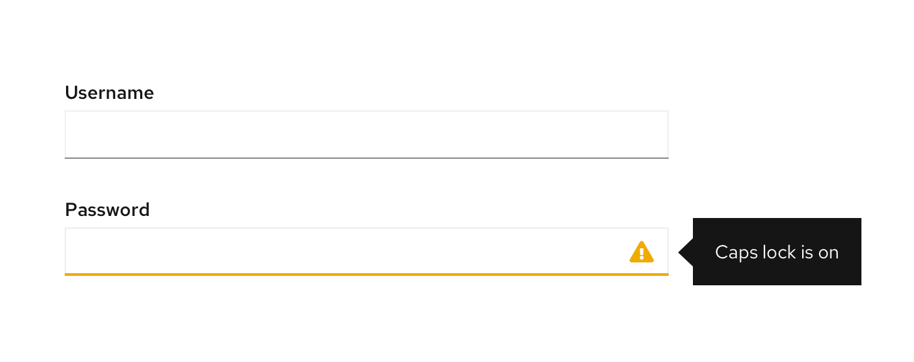
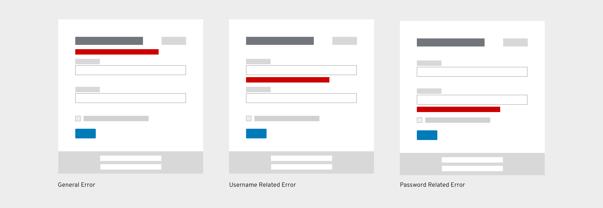
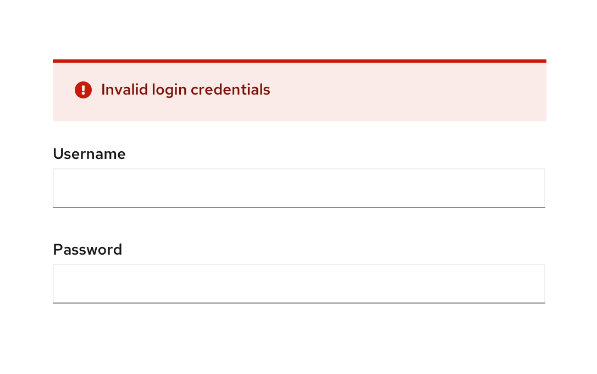
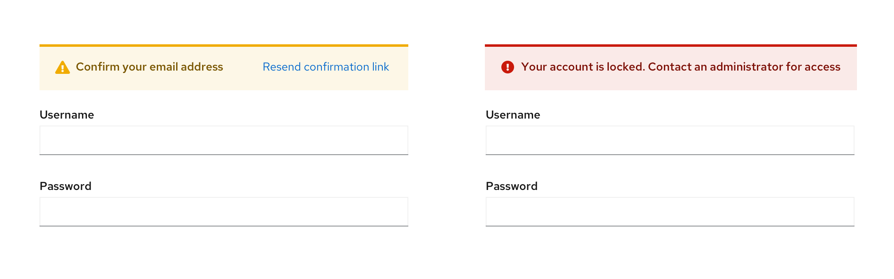

## Elements

1. **Title:** Located at the top of the login card. The title can be the product name or any other term that makes sense for your application. If the text is longer than the space allowed, it should wrap to the next line.

2. **Language selector (optional)**

3. **Required fields:** Username and password are both required fields. Some applications may require additional fields like a specific server or geo-location. When additional fields are required, they should be placed directly below the password field. The login card will expand to accommodate additional fields. Try to limit the total number of additional fields to three or less. Also, you may use [progressive disclosure](/components/forms/form/design-guidelines#use-progressive-disclosure) if the field value has dependency on the previous relevant field.

4. **Show/Hide password (optional):** Allows users to view and hide passwords on password fields.

5. **Checkbox (optional):** Located under the required (and any additional) fields, and labeled based on the needs of the application.

6. **Login button:** The button label should be “Log in.”

7. **Social media buttons:** Displays available social login methods in the order from most frequently used to least frequently used. Logos that take up more than one line can wrap to a second line. Each logo should have a tooltip label on hover that states the application name.

8. **Sign up (optional):** Takes user to the sign up flow.

9. **Forgot password/username link (optional):** Takes users to a page where they can recover their password and/or username.

10. **[Background image](/components/background-image):** Any background image can be used for your application; it will automatically have a gradient applied to it to aid readability.

11. **Logotype:** Provides an area for product logo.

12. **Description (optional):** Provides a description of the website or application.

13. **Links (optional):** Provides an area for additional links to pages where the user can get more information or access help.

## Usage

There are 3 main usage scenarios related to the login page:

1. A user wants to gain access to an application.

2. A user is automatically logged out due to inactivity and is redirected to the login page.
    * If this happens, signing in should redirect the user back to the page they were on prior to being logged out.

3. A user has forgotten their username and/or password. A link is available to reset the username and/or password.
   * The login page should be replaced by the fields used to recover their username and/or password.
   

### Authentication methods

#### Standard login
The standard login is shown in the example above and provides a commonly used pattern where both the username and password input fields are displayed at the same time. This is commonly used by applications that don’t require additional types of authentication.

#### Multi-factor login
The multi-factor login allows a user to gain access to an application by entering their authentication information progressively. For example, a user enters only their username and then clicks next. The system validates the username before providing a field for the user to enter their password. Using this progressive process allows the application to validate information at each step and allows for an automatic redirect to an external identity provider (IdP) when the user is linked to an external IdP.

When you need more security, you can incorporate additional authentication methods into the login process. This example shows both password and verification code methods:

**Enabling users to select their verification method (optional):**
Once a user has provided a valid password, the system hides the gray bar at the bottom of the modal and displays the link text “More verification options." Clicking the link allows users to select an alternate verification type if they can’t use the default method.

Examples of additional multi-factor authentication that could be used include authentication codes, SMS codes or backup codes.

#### Single sign-on (SSO)
Single sign-on (SSO) allows a user to log in once and access multiple applications within the same organization. This type of login supports displaying both single and multi-factor login.

**Additional SSO elements**

1. **Title**

2. **Supported services:** Provides a logo for all supported services logos.

#### Social Login
Some users may prefer to log in with their social networks or IdPs accounts. A social login can utilize  standard, multi-factor, or SSO logins, depending on security requirements. When users click a social logo, they will be redirected to the social account’s login page. Once they successfully log in, they will be directed back to your application.

Please refer to branding guidelines when using logos for social login page. Examples of branding guidelines include:

* [Facebook brand guidelines](https://en.facebookbrand.com/guidelines/brand)
* [X brand guidelines](https://about.x.com/en_us/company/brand-resources.html)
* [GitHub brand guidelines](https://github.com/logos)
* [Stack Exchange brand guidelines](https://stackexchange.com/legal/trademark-guidance)
* [Google brand guidelines](https://developers.google.com/identity/branding-guidelines)
* [LinkedIn brand guidelines](https://brand.linkedin.com/)
* [OpenID brand guidelines](http://openid.net/add-openid/logos/)
* [Instagram brand guidelines](https://about.meta.com/brand/resources/instagram/instagram-brand/)

### Error states

Always present error states on the login screen if a login field submission results in an error, and use inline errors whenever possible. The error state you use will depend on whether the validation happens on loss of focus (the client's end) or submission (the server's end).

#### Client-side errors

Client-side validation can be performed when a field is clicked away from or loses focus. It allows you to use inline validation to present errors or issues before the login is submitted. In most cases, client-side validations are performed as inline validations for each field. Some common examples are shown below.

##### Empty field(s)

An error message should be displayed below any required field that is empty once the field loses focus or an action button (Log in/Next) is clicked. Once the field is filled, the error message should disappear. The following error messages are suggested for use:

| Situation     | Error message
| ------------- |-------------|
| Username field is empty | Enter your email, phone number, or username|
| Password field is empty      | Enter your password |

##### Invalid characters

An error message should be displayed when there is an invalid character in the username. Once the field has been modified, the error message should disappear. The following error messages are suggested for use:

| Situation     | Error message
| ------------- |--------------|
| Invalid email address or phone number   | Enter a valid email address  |
| Invalid custom username                 | Invalid characters           |
| Invalid character in an email address/phone number | Enter a valid email address or phone number |

##### Caps lock is on

A warning message should be displayed when caps lock is on so users avoid making a mistake when typing a case-sensitive password. The warning message should be displayed in a popover when a user clicks into the input field. Once caps lock has been turned off, the warning message should disappear. The following warning message is suggested for use:

| Situation     | Error message|
| ------------- |-------------|
| Caps lock is on   | Caps lock is on  |

#### Server-side errors

If there are validation errors when users submit a form, the entire page is reloaded. At the same time, the password field should be cleared to provide additional security. Error messages display as inline errors below each field and/or as inline alerts below the header/description. If there are multiple messages, each message appears on its own line; spacing between fields should be enough so that the form doesn’t jump to fit the messages.

##### Account doesn’t exist/password is wrong

An error message should be displayed when the user types an incorrect username or password. The most secure approach is to provide a generic message that the username or password is incorrect without specifying which is incorrect. This way, the identity of a valid user is protected. If your application doesn’t require this level of security, additional messages  can be used. Once the field has been modified, the error message should disappear. The following error messages are suggested for use.

| Situation | Error message |
| ----------- | ----------- |
| Incorrect username or password (most secure error message) | Incorrect login credentials |
| Username does not exist | This account does not exist. Try again or [sign up](). |
| Password is wrong | Incorrect password, try again |
| User inputs an old password | Incorrect password. Your password was modified in the last 2 days. |

##### General warning messages

Another form of error state message is a warning message. These messages are triggered by system level events or if a user is timed out of the application. Notifications should be displayed until the user attempts a new login. These messages should be displayed above the username field. The following are examples of general error messages.

| Situation | Error message |
| --------- | ------------- |
| New account created and needs to verify email address | Confirm your email address. [Resend confirmation link](). |
| Too many unsuccessful attempts to log in | Your account is now locked. Contact your administrator for access. |
| Session timed out | Your session has expired. Please log back in.

## Content considerations

* Use “log in” to describe the verb of signing or logging in an account. Note, it is “log in” and not “log into”. 
* Use “login” as an adjective to describe something related to the act of logging in to an application, like a page. The noun Login can also be used as an alternative for Username, but Username is recommended.
