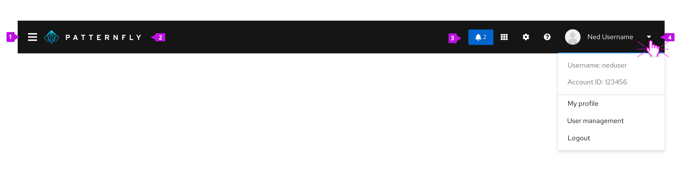

## Elements

**1. Show/hide menu:**  The `fa-bars` icon at the left of the masthead provides a way for users to show or hide the vertical navigation. It is not included when horizontal navigation is being used. At large viewport (desktop) sizes, navigation is shown, by default, and the user can click this icon to hide it and expand the content area. Once hidden, the user can click the icon again to reveal it. At small viewport (tablet and phone) sizes, the vertical navigation will be hidden by default and the user must use this control to open the menu.

**2. Logotype:** The logotype area should clearly display the application name and the application logo if applicable. It is common to link the logotype to the application’s homepage. It is recommended to have the application name in .svg format for better performance.

**3. Utility items:** Place any items in the utility area that you want to have accessible from all pages in the application. Utility items are right aligned and placed to the left of the user menu. The following are common items ordered from left to right. All items are optional depending on the needs of your application.

* **Notification badge:** Display a [notification badge](/components/notification-badge) to alert the user to incoming notifications. Clicking on the badge should open a [notification drawer](/components/notification-drawer), if used, or take the user to another view where they can review recent notifications. If used, the notification badge should always be the leftmost item in the utility area.

* **Application specific item(s):** Applications may include additional utility items in the masthead. These items should expose tasks or information that are meaningful to users at a global level.  

* **Application launcher:** When switching between applications is supported, an [application launcher](/components/menus/application-launcher) component can be inserted in the masthead to provide that capability.

* **Settings:**  The settings menu contains ways to configure and customize an application. Interacting with settings either takes users to a settings area or reveals a dropdown menu with more options. The settings menu is represented by the `fa-cog` icon.

* **Help:** The help item reveals a dropdown menu. The menu items may include documentation links available to users, links to customer support resources, and/or instructions on how to get support. If the application has an [about modal](/components/about-modal), it should also be accessed here. The help menu is represented by the `far fa-question-circle` icon.

**4. User menu:** The user menu is always the right-most item in the masthead. It includes an [avatar](/components/avatar) and the username of the currently logged in user. The dropdown items may vary based on user settings and permissions available. Common items to include are: User name, Account ID or Account management. This section should always include a Log out option at the bottom of the dropdown list. If there is a need to allow users to change application display language, it should appear in this dropdown menu as well.
