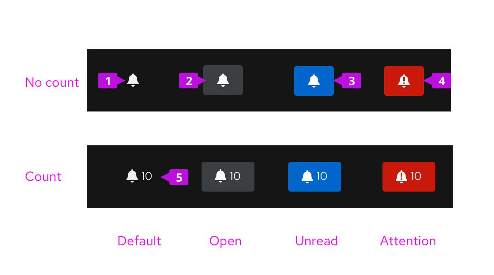

## Elements

1. **Icon:** The notification badge will be located in the masthead and display the 'fa-bell' icon in it's default state. Clicking the icon (or anywhere within the badge) will toggle the notification drawer open and closed.

2. **Background:** In the default state, the background will change color to indicate that the notification drawer is opened. Optionally the background color can also convey status.

3. **Unread status (optional):** Setting the background color to blue will indicate that one or more unread notifications are present in the drawer.

4. **Attention status (optional):** Setting the background color to red will indicate that one or more notifications are present in the drawer that require immediate attention. In the attention state the icon also changes from 'fa-bell' to 'pf-icon-attention-bell'.

5. **Count (optional):** When used, the count field will indicate the number of notifications in the notification drawer.

## Usage
Always use a notification badge when a notification drawer is present. Dependent on the capabilities and needs of your application, best practices for using the badge are as follows:

* Report the **Unread state in the badge only when it's possible to mark notifications as read in the drawer and when arriving notifications are relatively infrequent. If unread notifications will be present most of the time, alerting the user in this way looses its effect and is potentially distracting.

* Reporting a count of notifications is useful in most cases to give the user an indication of the volume of notifications present. This is especially helpful if unread status is not reported as it gives some indication of new arrivals.

* The Attention state will typically be used to report critical errors, in other words notifications with a severity set to 'error'. Again, this should only be used when such conditions are infrequent and truly indicate that immediate attention is required.
