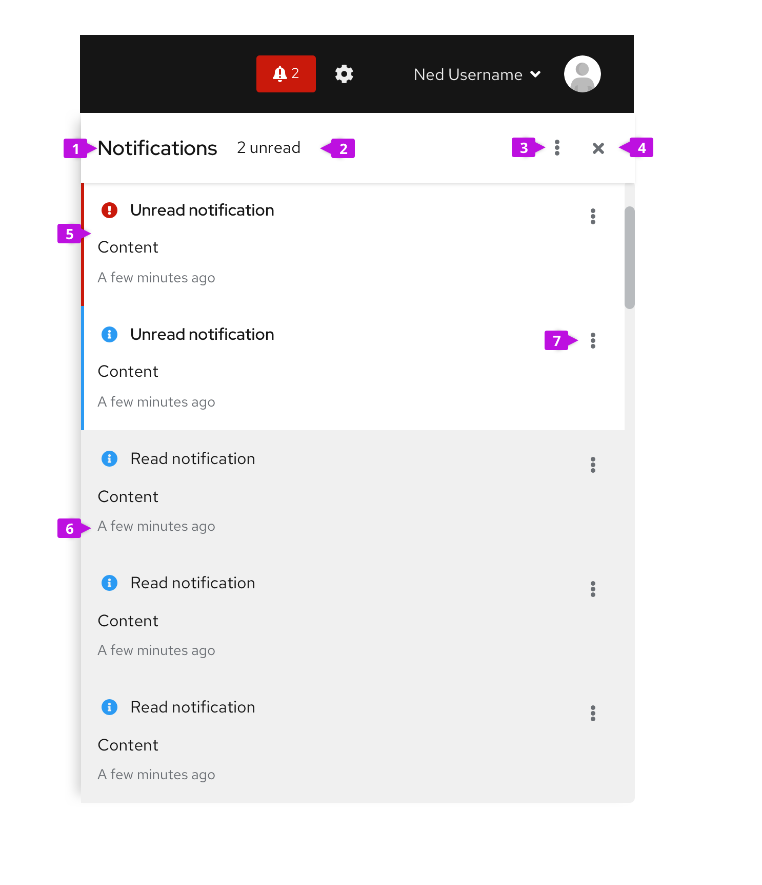
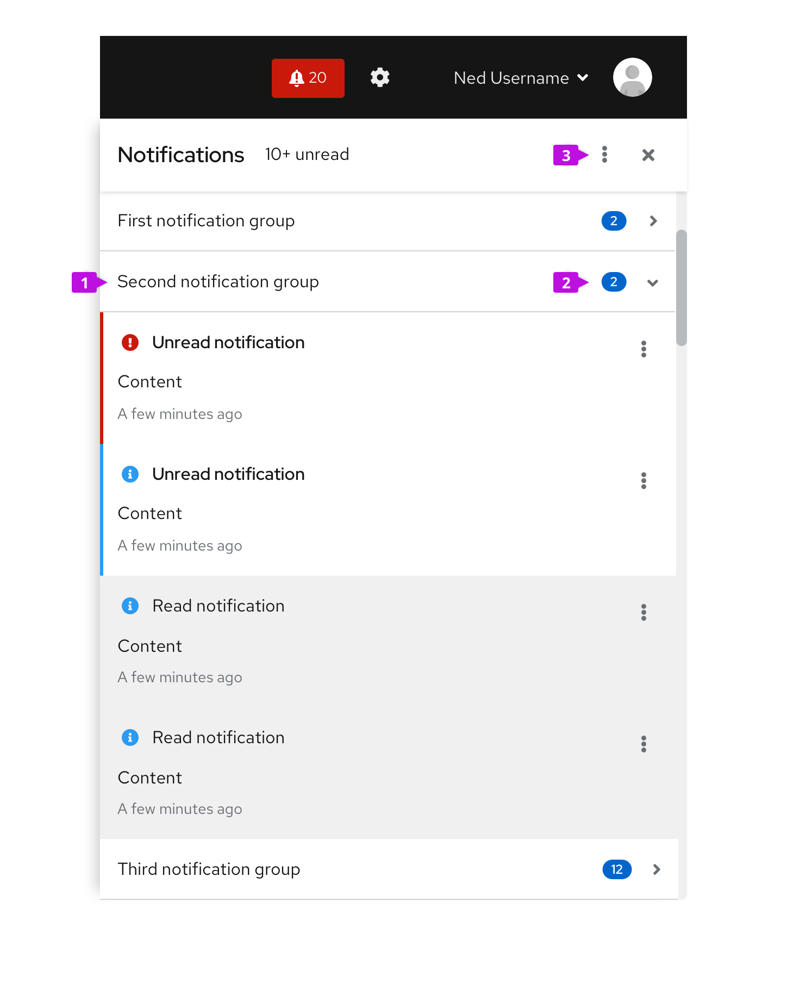
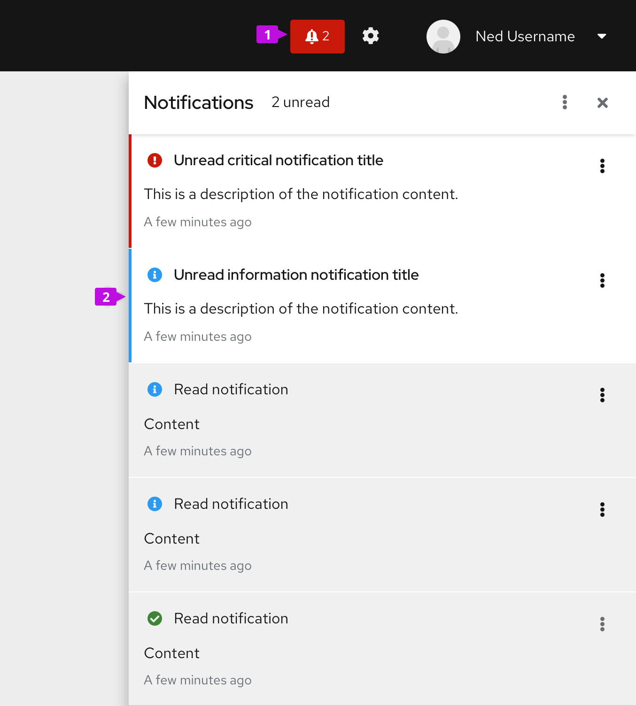

## Elements

### Basic notification drawer

1. **Header:** The header contains the title of the drawer (default to “Notifications”).

2. **Unread count (optional):** If unread notifications exist, report the number of unread notifications. Otherwise leave blank.

3. **Global actions (optional):** This menu contains actions that can be applied against all notifications in the drawer. The following are standard menu items. This menu may be added according to the needs of your application.
    - **Mark all read**: Marks all notifications in the drawer as read.
    - **Clear all**: Clears all notifications from the drawer.
    - **Unclear last**: Unclears that last cleared or set of cleared notifications (if supported).
    - **Settings**: Opens notification settings.

4. **Close button:** Closes the drawer.

5. **Notification:** Each notification has a status icon, message text, and is time stamped. The message text may include embedded links. Unread messages are displayed in bold-faced type. Single clicking a notification (or selecting the **Mark as read** action from the menu) marks it as read.

6. **Time stamp:** Time stamps can be displayed either in relative or absolute time. Relative time is good for events that are more recent. We recommend that any notification less than an hour old have a relative time stamp, for example 20 seconds ago, 5 minutes ago, etc., and that older events switch to absolute time for better precision, June 20 2019 12:45 PM, for example. The switchover point between relative and absolute time may be tuned to your application.

7. **Inline actions (optional):** Actions that apply to the current notification, only. Standard actions include **Mark as read** and **Clear**. This menu may be customized as required by the application.

### Grouped notification drawer
If you want to sort notifications by category, collapsible headers may be used to group content. The grouped notification drawer utilizes an accordion pattern where only one category will be opened at a time. By default, the first category will be opened, although if the drawer is closed and reopened, the prior state should persist.

1. **Notification group:** Notifications can be grouped by category. You may have any number of categories, however more than 3-4 categories is not recommended. Each category header will have a name. Clicking on the header will expand the category (and collapse the current category).

2. **Unread badge (optional):** A badge will report the number of unread notifications in each category. If there are no unread notifications, the badge is hidden.

3. **Global actions (optional):** For the grouped drawer, the global actions menu should further clarify what content the actions apply to. Standard menu items include (the menu may be customized according to the needs of your application):

    - **Mark all read**: Marks all notifications in the drawer as read.
    - **Clear all**: Clears all notifications from the drawer.
    - **Mark current category read**: Marks all notifications in the currently opened category as read.
    - **Clear current category**: Clears all notifications from the currently opened category.
    - **Unclear last**: Unclears that last cleared or set of cleared notifications (if supported).
    - **Settings**: Opens notification settings.

## Usage

### When to use
Use the notification drawer when you want a place for the user to easily access a history of notifications from any place within the application.

### When not to use
Do not use the notification drawer as the sole place to notify users about events requiring immediate action. In these cases, a modal message dialog is the preferred choice.

### How to use
The notification drawer provides a flexible container where users can view and manage notifications. When using the notification drawer in an application, consider the following questions:

- What notifications are important keep in the drawer?
- How many or how long will notifications be kept in the drawer?
- Will it help to sort notifications into categories?
- What does it mean to clear a notification from the drawer?

When the notification drawer is being used, notifications will undergo the following life-cycle:

1. New notifications should be added to the drawer according to policies established by the application. If the application can track new/unread notifications, then Notification badge will be set to reflect that new/unread notifications have been added to the drawer.

2. Notifications are always listed in reverse chronological order - newest to oldest.

3. If supported, notifications are considered unread until a user takes action to mark them as read.

4. Notifications will remain in the drawer until either the user takes an action to clear them or they expire based on policies established by the application.

5. Clearing a notification removes it from the drawer but does not delete it from the system. Depending on application requirements, notifications may be retained in an audit log or similar location after they have been removed from the drawer. Applications may consider supporting an Unclear action to restore the last cleared notification.

In cases where it makes sense to immediately notify the user about a change in state or other condition requiring attention, a [toast alert](/components/alert/design-guidelines#toast-alerts) may be displayed at the same time as notifications are added to the drawer. The drawer has the advantage of preserving a history of notifications after they have been read where toast alerts cannot be recovered once they are dismissed. As part of your alerting design, you should consider what types of notifications may be generated by the system, whether there is benefit from immediately displaying them to the user, and whether it's important to preserve them.  

## Placement

1. **Notification badge:** Whenever the notification drawer is used, a [notification badge](/components/notification-badge) must be placed in the masthead. Clicking on the badge will toggle the drawer open or closed. Depending on options supported in the application, the badge can also be used to display the number of notifications in the drawer and whether there are unread or critical notifications needing attention. See the [notification badge](/components/notification-badge) usage guidelines for more information about these options.

2. **Drawer:** The notification drawer lives in slide-out panel that overlays page content and is anchored to the right-hand edge of the viewport.
