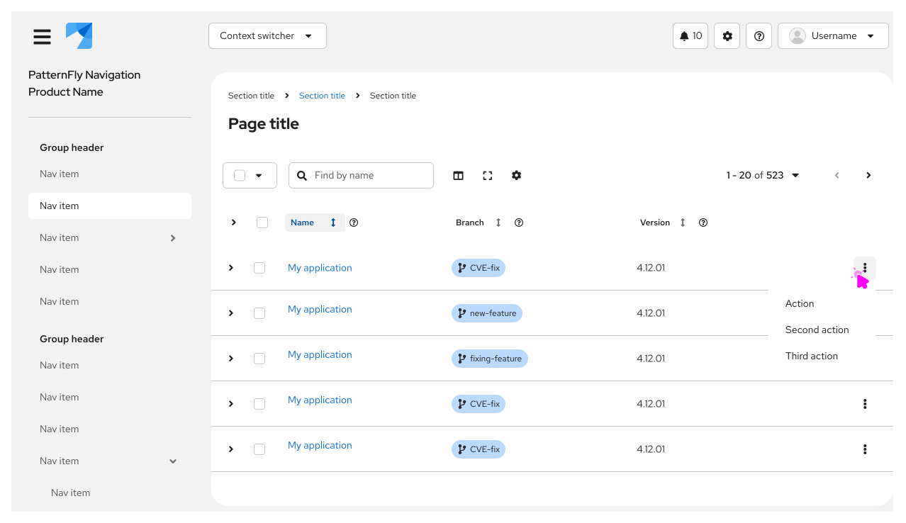

import '../components.css';

## Usage 
Use an overflow menu when a space constraint makes it impossible to display all additional options in a horizontal layout, like a toolbar or table row. Overflow menus are commonly used when a UI switches from a desktop to a mobile device. 

### When to use

#### Cards

- Use an overflow menu within a card component to present additional menu options or provide action links.
 
 

<iframe style="border: 1px solid rgba(0, 0, 0, 0.1);" width="800" height="450" src="https://embed.figma.com/design/sgafF2ibAiGVW5X2EPEW9T/PatternFly-6--Design-guidelines-assets?node-id=1566-10683&m=dev&embed-host=share" allowfullscreen></iframe>

#### Toolbars

**Toolbar overflow in desktop view**

- Use overflow menus in desktop toolbars to contain additional, less primary actions that can't be displayed within the available horizontal space.

**Toolbar overflow in mobile view**

- Use overflow menus in mobile toolbars to contain all additional actions, including primary actions that would typically be visible in desktop views. This doesn't include filtering or sorting, which should remain available as buttons in the toolbar.

#### Tables

- Use an overflow menu in a table toolbar to group a number of actions and create visual space. Avoid having more than 3 actions fully displayed within a toolbar.

**Table overflow in desktop view**

**Table overflow in mobile view**

### When not to use
* Do not use an overflow menu when there are 2 or fewer actions available to the user. 
* Do not use in conjunction with label groups when there isn’t enough space to display each label. Instead, use a [label group with overflow](/components/label#label-group-with-overflow).
* Do not use an overflow menu to hide additional content that you don't want to be seen by default, instead use an [expandable section](/components/expandable-section).  

## Behavior
Overflow menus are represented by a button with a kebab icon (fa-ellipsis-v), which opens a horizontal list with additional options when selected. 

## Content considerations
* Text should be short and direct so users can quickly scan and decide on an action.
* Text  should be written in sentence case.
* Overflow menus should be placed on the right side of the container. 

