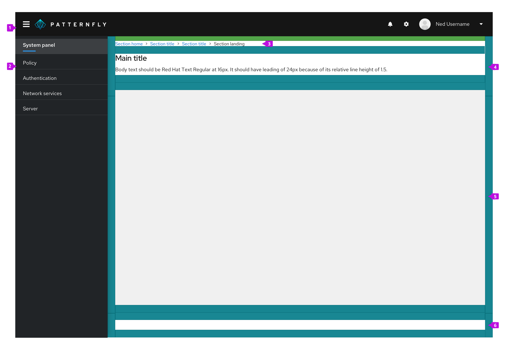
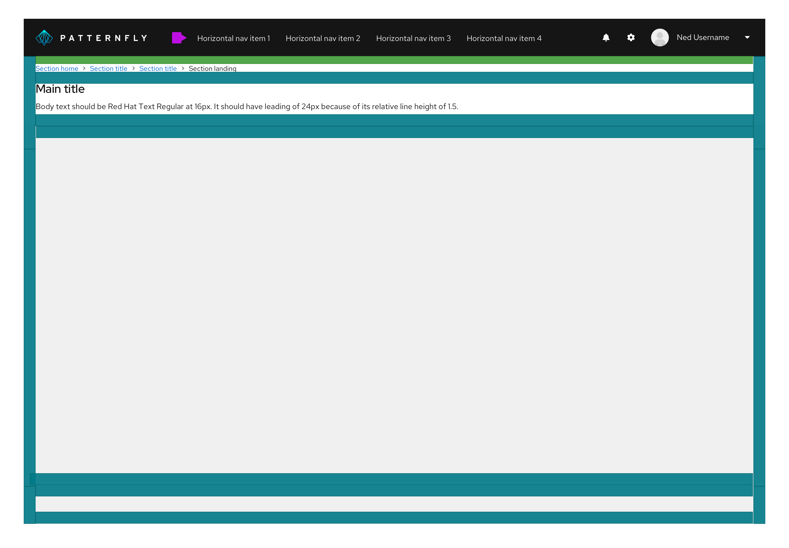

## Elements
The basic layout of a page differs depending on whether your application uses vertical or horizontal primary navigation as illustrated below.

### Page with vertical navigation

**1. Masthead:** The masthead provides a consistent header for every page in your application. See the [masthead design guidelines](/components/masthead/design-guidelines) for more details.

**2. Navigation:** This is your primary navigation. It should be consistent across pages. See the [navigation design guidelines](/components/navigation/design-guidelines) for more information about navigation options and usage.

**3. Breadcrumb (optional):** When breadcrumbs are included, they should be the topmost element in the header section. When breadcrumbs are included on a page, the top padding is reduced from 24px to 16px. See the [breadcrumb design guidelines](/components/breadcrumb/design-guidelines) for more information about breadcrumb usage.

**4. Page header:** All pages should have a header section. The height of the header will vary to fit the content. We recommend keeping information in the header area brief to consume as little space as possible. The page header should contain the page title to help orient the user and an optional description to describe the contents of the page. You may optionally apply the `pf-m-sticky-top` modifier to the header section to create a sticky page header and prevent its content from scrolling off the page. A sticky page header should have a drop shadow.

**5. Body section:** Your main page content goes here. The body section can have a light gray `--pf-v6-global--BackgroundColor--200` or white background depending on the content it will contain. The default padding all around the page body should be 24px in all directions.

**6. Footer section (optional):** You can optionally define a footer section for a page. You may optionally apply the `pf-m-sticky-bottom` modifier to the footer section to create a sticky page footer and prevent its content from scrolling off the page. A sticky page footer should have a drop shadow.

### Page with horizontal navigation

When using a horizontal primary navigation, the left-hand sidebar is removed and the navigation is placed inline with other masthead elements. All other page elements remain the same.

## Usage
PatternFly includes a flexible layout system for defining pages. Page layouts are defined using page sections as explained below. While the layout system is flexible, you should adhere to the guidelines for common elements like the masthead and page header to maintain consistency across applications.

### Page sections
Page sections allow you to define areas on a page to group content. The header, body, and footer on a page are examples of page sections. Page sections have 24px padding on left and right edges or no padding to allow the contents to extend to the edge of a page. At screen sizes smaller than 1200px, the left/right padding is reduced to 16px to create a tighter layout. Page sections can also be made sticky such that they will remain visible at the top or bottom of the viewport when the page scrolls. This is useful for creating sticky headers, footers, or other elements.

