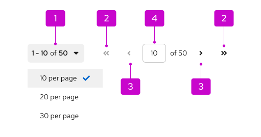

import '../components.css';

## Usage
Pagination allows users to conveniently navigate through content-dense components or page elements.

1. **Top pagination:** Placed above the component it controls and aligned to the right.

2. **Bottom pagination:** Placed below the component it controls. Right-aligned for desktop views and center-aligned for mobile. If you want bottom pagination to be sticky so that it remains in view as users scroll through long content, place it directly after the component it controls and refer to the [React sticky pagination](/components/pagination#sticky) or [HTML sticky pagination](/components/pagination/html#bottom-sticky) examples for implementation guidance.

## Variations 

There are 3 pagination variations you can choose from, depending on your use case:
- [Full pagination:](#full-pagination) The default component to use for most desktop views when space is not a major constraint. 
- [Compact pagination:](#compact-pagination) Used for narrow spaces or as the primary control for mobile views.
- [Indeterminate pagination:](#indeterminate-pagination) Used when the total number of items is unknown.

### Full pagination

1. **Per-page selector:** Used to choose the number of items displayed on a single page at once.
2. **First page/last page:** Used to jump to the first or last page of content.
3. **Previous page/next page:** Used to navigate back or forward one page of content at a time.
4. **Current page (interactive):** Displays the current location and the total number of pages of content. Users can also manually type in a page number to jump to a desired location.

Full pagination contains a variety of controls that can be used to navigate the linked component, like a table or card view. This is the default recommendation, unless you're restricted in space or for use on mobile devices, in which case you should use [compact pagination](#compact-pagination) instead.

### Compact pagination

1. **Per-page selector:** Used to choose the number of items displayed on a single page at once.
2. **Previous page/next page:** Used to navigate back or forward one page of content at a time.

Compact pagination reduces visual crowding and saves space for additional actions in limited spaces, like toolbars. 

### Indeterminate pagination

When it's difficult to calculate the total number of items or page count upfront, you can use an indeterminate pagination, which replaces the total page number in the per-page selector with a general label of “many”. Users can still choose the number of items shown at once, and the indeterminate label can be used within both full and compact pagination components.

## Placement

### Desktop

For desktop views, place a full pagination component above the content it controls,  typically within a toolbar.

1. **Per-page selector:**  Used to choose the number of items displayed on a single page at once.

2. **Full pagination:** Supplies data navigation controls, including previous page and next page, first page and last page, and a manual option to type in a desired page number.

When used in a toolbar, pagination may leave limited room for other items like filters or bulk selectors. These additional items will automatically move into an [overflow menu](/components/toolbar/design-guidelines#overflow-menu) as needed.

For components with long, scrolling content (like a table), you can add a second full pagination component below the content to ensure that users can navigate without having to scroll back to the top.

### Mobile 

Mobile pagination is formatted differently in order to conserve space. On mobile, full pagination will collapse to a pagination summary with an item count. [Learn how to customize overflow menu breakpoints in our toolbar design guidelines](/components/toolbar/design-guidelines).

1. **Pagination summary:** A non-interactive count of items currently displayed. 

2. **Mobile pagination:** A type of compact pagination, with a previous page, next page, and a per-page selector, which allows users to choose the number of items shown at once. Mobile views use compact styling, which removes the first page and last page controls. 

When using pagination in mobile views, follow these best practices: 
- As shown in this example, place a pagination summary above the component it controls and a mobile pagination below the component. 
- Do not use full pagination in both the top and bottom toolbars.
- If you can't use bottom pagination, or if you can't use the compact pagination in the bottom toolbar for some reason, only then you can place the compact pagination in the top toolbar. 