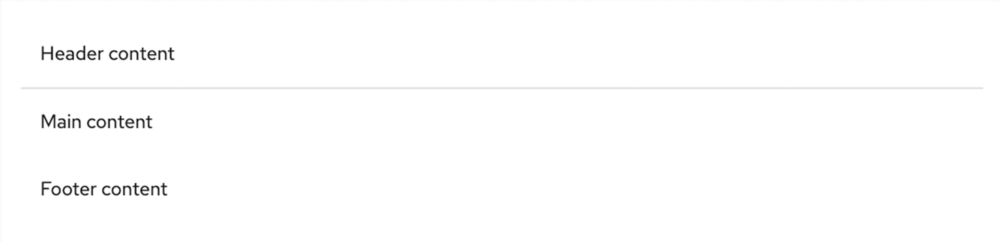
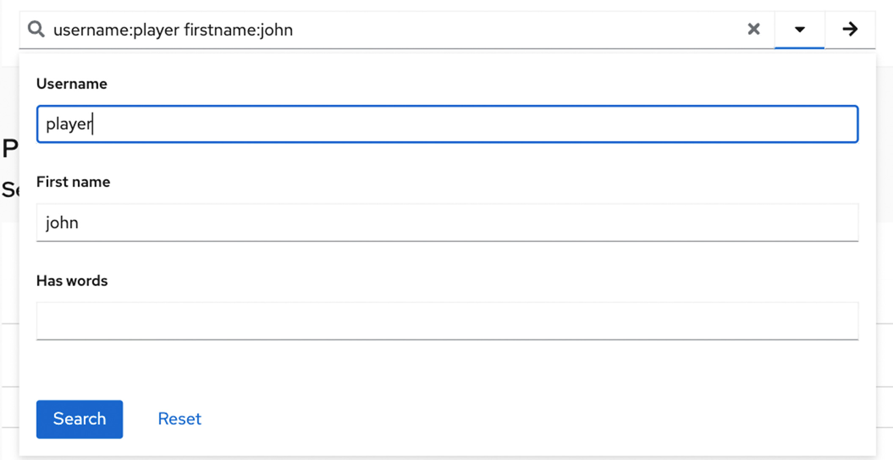

## Usage
Panels are commonly used:
- To provide more content structure through the UI.
- To group content and components on a blank canvas.

### Examples

The panel is used as a content block with a header, body, and footer. 
 

The panel is used a dropdown menu for <a href="https://v4-archive.patternfly.org/v4/components/search-input/react-demos/#composable-advanced-search">advanced search input</a>. 

