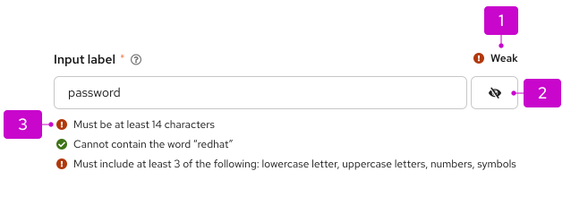
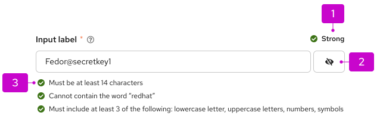

import '../components.css';

A **password strength indicator** is displayed to a user after they have entered a password in a field. It allows the user to understand the strength of a password after it has met the password requirements. The strength of the password is determined by a validation algorithm after the specific rules are met.  Using a password strength indicator allows users to create stronger passwords, offering better protection from breaches. 

## Elements

 

 

The password strength indicator is located on the top right corner of the input field. It displays the following strength types:
1. Weak
2. Strong

## Behavior

The password strength indicator:
- is displayed after the password has met all password requirements.
- icons and words are not editable after it is dispalyed.