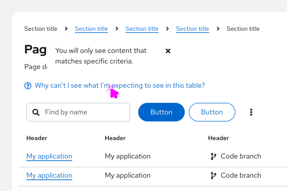

import '../components.css';

## Usage
Popovers are commonly used on form field labels, page titles or headings, or table column headings. Use popovers to:
- Anticipate and answer questions for the user.
- Help explain unfamiliar terms.
- Provide context around a task.    
 

 
When using a default popover to define a term or explain a concept, use a gray question-circle icon. Upon hover or click, the icon turns black.
 

 
To provide more information to a user without an accompanying UI element, you can add a popover to a linked question.
 

 
Use link button styling for the linked question, and add a blue question-circle icon before it. Clicking the link text triggers a popover, which answers the linked question.
 

 
To provide additional information about an alert, use an alert popover. The alert popover will open upon hover or click.
 
### When to use tooltips vs. popovers
Both [tooltips](/components/tooltip/design-guidelines) and popovers provide more information in context for users. However, they’re different in a few ways:
 
- Tooltips are used for identification purposes, while popovers are used for added description or information in context. 
- Tooltips contain short descriptions or labels, while popovers contain longer descriptions, formatted text, and optional images or links.
- Tooltips appear on hover, while popovers appear on click.  
 
For information on other forms of on-screen help, see [Tooltip](/components/tooltip/design-guidelines) and [Hint](/components/hint/design-guidelines).
 
## Behavior

Popovers are triggered when a user clicks on the popover icon and are dismissed in one of the following ways:
1. The user clicks the exit icon.
2. The user clicks anywhere on the screen outside the popover.
3. The user clicks an action button inside the popover. (Note: This won't always close the popover; it depends on the action button.)

## Variations
 
### Default popovers
These popovers are plain-text and do not include icons. They are used to convey additional, non-imperative information to the user.
 
### Alert popovers
These popover are similar to default popovers, the key difference being the inclusion of status-like headers for the following alert types: default, info, success, warning, and danger.
 

## Content considerations
- Popover copy is longer than tooltip copy, but it should still be concise. Aim for 1–3 sentences. 
- Write in full sentences with punctuation.
- Include relevant links to documentation when necessary.   
- Use popovers for additional information. Don’t use popovers for information critical to a user completing a task, such as password character requirements. 
