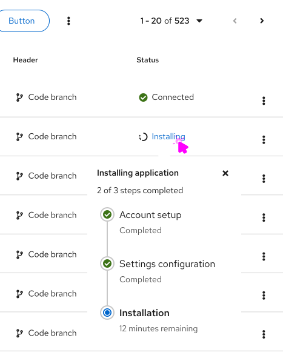

import '../components.css';

A **progress stepper** displays progress through a sequence of linear steps and highlights what step the user is currently on.

## Elements

1. **Progress title:** Describes the task or process underway.
2. **Progress description (optional):** Provides additional information on the task or process.
3. **Completed status:** Informs the user of a successfully completed step.
4. **In progress status:** Informs the user what step they are on.
5. **Failure status:** Informs the user of a failure or error in the step.
6. **Warning status:** Informs the user of a non-critical error in a step.
7. **Pending step:** Upcoming steps needed to complete the task or process.

## Usage
Use a progress stepper to convey the number of steps required to complete a task or process. Similar to the [progress component](/components/progress), the progress stepper can help keep users informed about how much effort or time a task or process will take to complete. An advantage of the progress stepper is that the total number of steps is displayed at all times, which informs users about where they are in a process and how much is left until completion. 

### When to use
- For multi-step processes within a card.

- To show progression through a workflow in a table or card.

- To display the status of a process, like an installation, in a popover.

### When to use progress stepper vs. wizard

Use a progress stepper:
- To indicate to the user where they are in a step-by-step linear process on a single page. 
- When the steps in the process could be completed by the user or could happen automatically in the background. 

Use a [wizard](/components/wizard):
- To guide the user through a multi-step flow where they must complete specific tasks in order. 
- When the steps are complex enough to be broken up into smaller, more manageable steps, that require navigating between different screens.

### When to use progress bar vs. progress stepper

Use a progress stepper:
- To indicate to a user where they are in a step-by-step linear process on a single page. 

Use a [progress bar](/components/progress): 
- To indicate to a user that the system is progressing through a task.
- To let users monitor background tasks.

## Variations
There are a few variations of the progress stepper that can be used for different use cases. All variations can be displayed horizontally or vertically, and the text on each step can be left-aligned or centered.

### Basic progress stepper
A basic progress stepper can be used when just the title of the step is enough to inform the user.

### Basic with descriptions
If more description is needed, you can use a basic progress stepper with descriptions, which allows for more context for each step.

### Vertical progress stepper
A vertical progress stepper can be used in pages with a split view, where one side contains the progress stepper and the other side contains each step’s content. These can also be used to display progress in a popover.

### Compact progress stepper
In areas with less space, like table rows, the compact progress stepper can be used. Compact progress steppers will not display as much information&mdash;like each step’s title or description&mdash;and will be smaller in size. The compact progress stepper also accounts for the alignment variations.

### Progress stepper with icons
Custom icons can also be used for each step of the progress stepper based on the use case and  product needs.

### Progress stepper with help popover
If additional help information or help text is needed and there is not enough space for a description, a popover on each step’s title can be used.

## Content considerations
Progress steppers should be self-explanatory and therefore include minimal written content: A title and an optional description.

Keep the title and description short and specific, between 1-3 words for the title and a few words for the description. Use verbs that clearly communicate each step of the process. There is no need to punctuate the title or description as they are fragments and not full sentences.

Use verb tenses to communicate the state of a process: In progress, failed, or complete.
 
For **in progress** steps, write your progress stepper title with present participles (—ing) to share that a process is underway. Avoid passive voice by starting each title with the present participle ("-ing") form of your task’s verb.

| **Don't**                      | **Do**                  |
|:-------------------------------:|:--------------------------:|
| Cluster is installing | Installing cluster | 
| Cluster creation in progress | Creating cache  | 

For **failed** steps, write your progress stepper title in past tense. Avoid telling users a process “failed” in favor of providing a more specific description.

| **Don't**                      | **Do**                  |
|:-------------------------------:|:--------------------------:|
| Cluster installation failed | Could not install cluster | 
| Account validation unsuccessful | Could not validate account credentials | 

For **complete** steps, write your progress stepper title in past tense. Use this brief line to confirm that a process or task succeeded. Avoid using adverbs like “successfully” by simply stating the action happened.

| **Don't**                      | **Do**                  |
|:-------------------------------:|:--------------------------:|
| Installation is complete | Cluster installed | 
| Successfully validated account credentials | Validated account credentials | 

## Accessibility
For information regarding accessibility, visit the progress stepper [accessibility tab](/components/progress-stepper/accessibility).