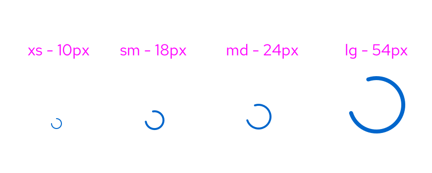
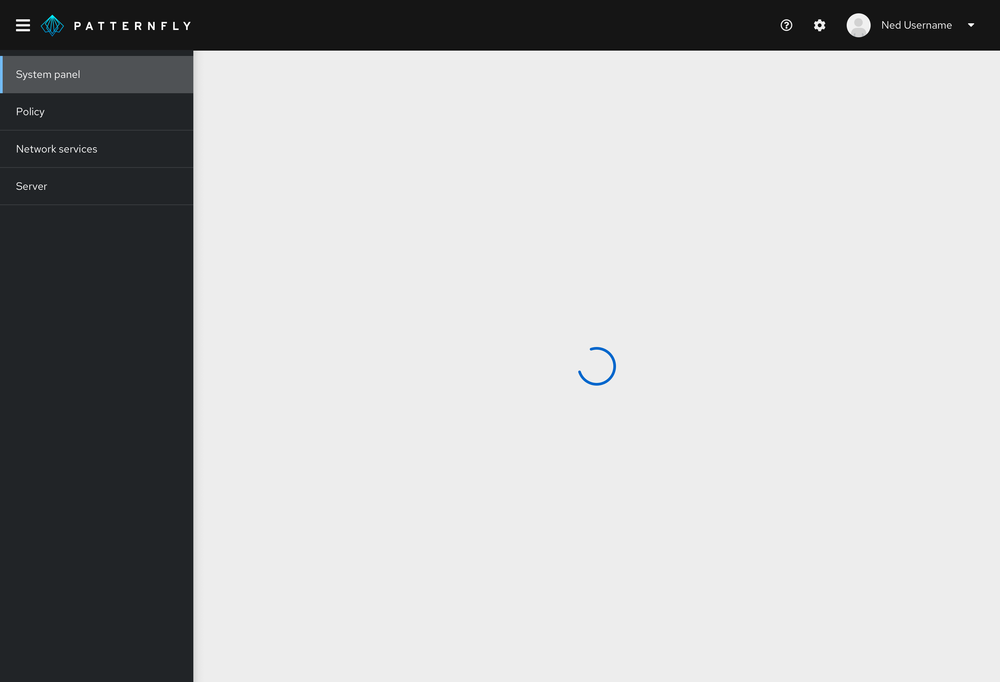
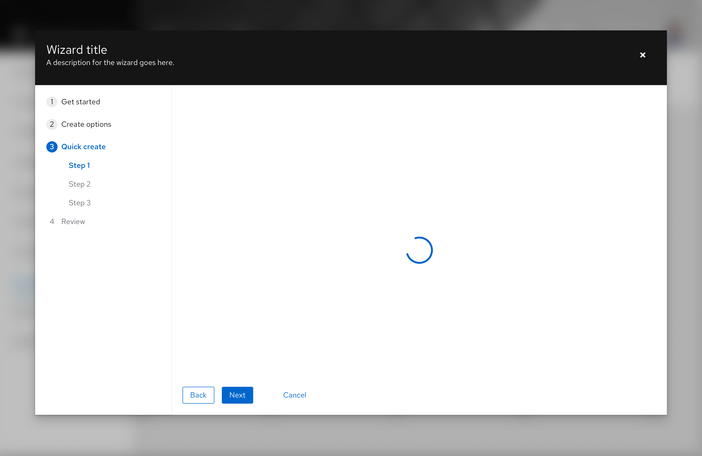
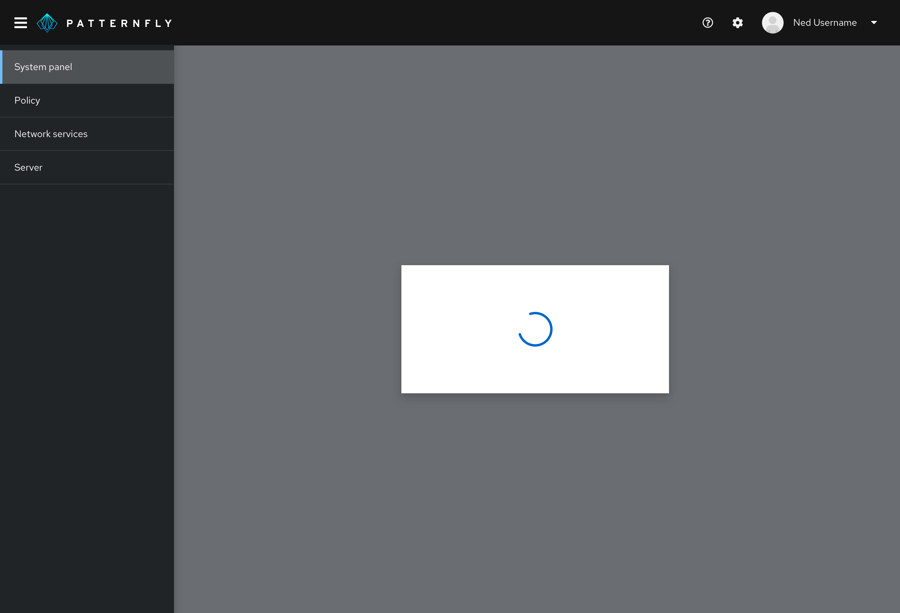
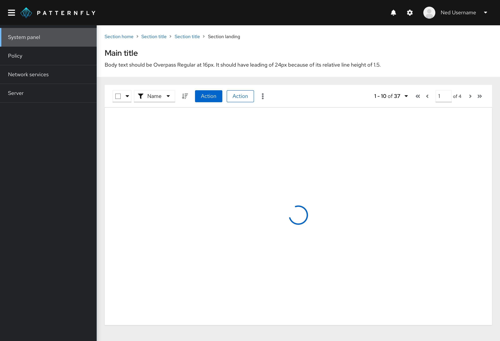

## Usage

Spinners are used to demonstrate data loading. Spinners are offered in different sizes that follow the sizing of our icons. These sizes include extra small, small, medium and large. Depending on the size of information you are loading and the space you are dealing with, we recommend using the spinner size that generally matches.

## Placement

Position the spinner in the center of the element that is loading. To ensure proper background contrast, use a white or light background.

### When to use
Use a spinner:
- When the user is advancing to a new page or step where the structure has not been loaded in yet.
- When the data you are dealing with is unknown in both quantity and shape. 
- When the expected wait time is between 1-5 seconds. 

### When not to use
Don't use a spinner:
- To replace a [progress bar](/components/progress). 
- If the loading process is less than 1 second. For experiences longer than 5 seconds, use a progress bar.
- In components that load on top of the page, for example in cards or dropdowns. In this case use a [skeleton](/components/skeleton) to reflect the structure of the data.
- When a loading screen does not have any data, use an [empty state screen or failed outcome](/components/empty-state) instead.

### Spinner in context

Spinners are centered within the container AND the viewport by default in all use cases.

### Spinner in a wizard

### Spinner in a full page

### Spinner in a modal window

### Spinner in a data list or table (large)

### When to use a loading spinner vs. a skeleton

**Use a spinner when:**
- You do not know what the populated data may look like. For example, if you are loading a form (as they are not all structured the same).
- Loading will likely fail or show an empty state while waiting for actions to complete.

**Use a [skeleton](/components/skeleton) when:**
- You know what the populated data is going to look like (even if it results in an empty state).
- The structure of the data has fully loaded and can be displayed.
