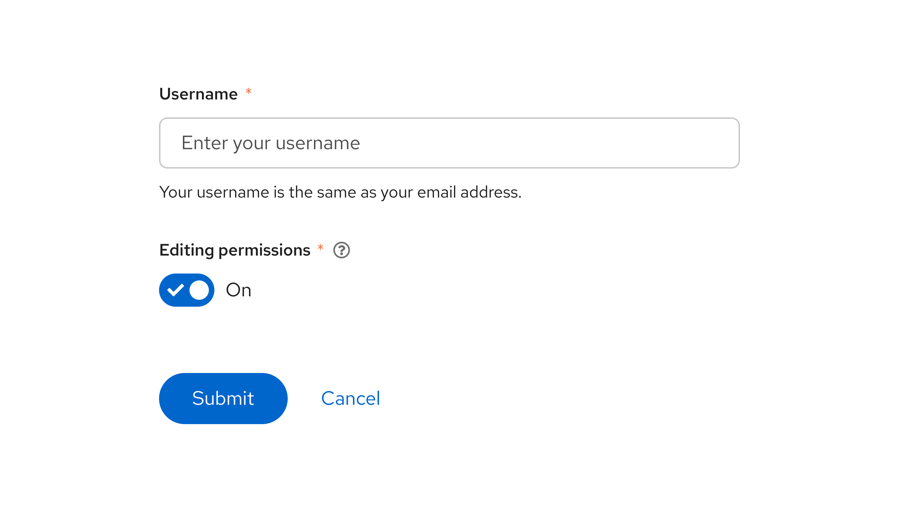

## Elements

1. **Switch:** The switch itself, which uses active primary colors when turned "on" and inactive colors when turned "off". When a switch is disabled, it will use disabled colors.
1. **Switch label:** The text label that represents the "on" state for a switch. This may simply be "On" (as long as it's paired with other meaningful text within a context, like a form label), or it may be something more descriptive, like "Allow edits." By default, the label is placed to the right of the switch, but this layout can be [swapped to the left](/components/switch#reversed-layout) if needed.
1. **Switch checkmark:** A checkmark, which can be used to further signify that a switch is turned on. When you use a switch label, a checkmark is optional. If you do not use a switch label, then a checkmark is required, to help users understand the status of a switch.

## Usage 

Use a switch to allow users to toggle a setting on and off. When a user toggles a switch, the change should save automatically without the need for additional action (like clicking a "Save" button).

Switches are most often used in forms, as a way of allowing users to turn on settings as they desire. The form label should specify what setting a switch turns on or off, such as "Bluetooth" or "Editing permissions":

### When to use a switch vs. a radio button 

- If the available options represent anything other than “on” or “off”, use a [radio button](/components/forms/radio/design-guidelines) instead of a switch. 

### When to use a switch vs. a checkbox

- Use checkboxes when additional action is required to save a user's selections. A switch should change and save an option simultaneously, while checkboxes should not. For example, the following image requires users to click the **Save** button:

- Use checkboxes for intermediate states, where you can select all, none, or some actions:

- Use switches when a series of one or more independent options can be turned on or off:

## Variations 

### Labeled switch 

A [basic switch](/components/switch#basic) uses a label to communicate its purpose to users.

- Do not include the switch state in a label ("On" or "Off") if you're using a labeled switch with a checkmark. 
- To be accessible, the label for a switch must never dynamically change. For example, don't have one label for an "on" state and another label for an "off" state. Doing so can be confusing since the context for each label changes with the switch state. 

### Unlabeled switch

Use a labeled switch by default. If space is limited, use an [unlabeled switch.](/components/switch#without-label) When you use an unlabeled switch, ensure that there is other meaningful text to provide context, like a descriptive form label.

## Placement 

If a switch controls site-wide settings, place it in the masthead:

## Content considerations
### Switch labels

It is typically best for a switch label to simply be "On", so that the design of the switch's toggle state effectively communicates the status of a setting. 

However, if you're presenting a user with multiple switches, you should be more specific about the setting that each switch is tied to. When adding a custom label, keep the message short and specific. Ensure that the message is clear when the switch is toggled to both the “on” and “off” position. 

| **Do** | **Don’t** |
|:------:|:---------:|
|Encrypt installed disks|Enabled encryption of installed disks| 
|Bluetooth|Turn on bluetooth|
|Notifications|Turn off notifications|
|Admin edit permission|Give admins edit permissions|

For example, “Enabled encryption of installed disks” implies that enabled encryption is on, despite what position the switch is in. When a user toggles the switch to “Off”, this label could make them second-guess whether or not encryption is actually enabled. “Encrypt installed disks” clearly identifies the purpose of the switch, and pairs well with the active and inactive styling of the switch to convey status.

#### Punctuation 
Do not use end-of-sentence punctuation, like question marks or exclamation points. 

| **Do** | **Don’t** |
|:------:|:---------:|
|Automatically refresh| Refresh automatically?|  
|Data collection| Allow data collection?| 
|Notifications| Turn off notifications.|

### Form field labels 
For form-based switches, make sure that you follow our [form field guidelines](/components/forms/form/design-guidelines#content-considerations) to effectively pair a form field label with its related switch. 