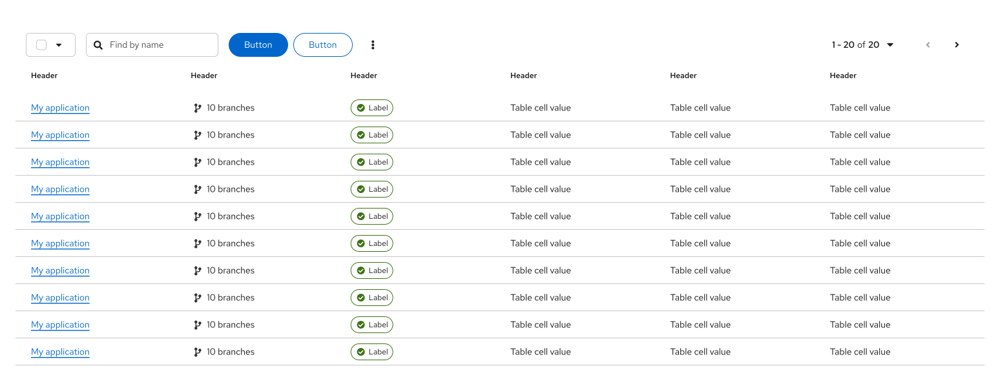
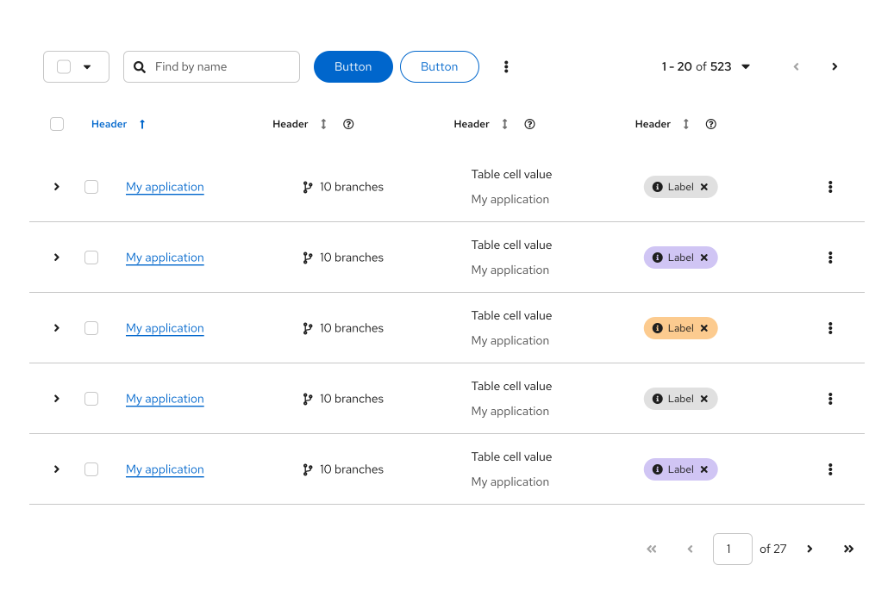

import '../components.css';

## Elements

1. **[Toolbar](/components/toolbar/design-guidelines):** Sits above the table and contains controls for manipulating table data, like filtering, sorting, and pagination.
2. **[Bulk selection](/patterns/bulk-selection):** Used to select all items in a table. If pagination is being used, bulk selection will only select items on the current page. 
3. **Global action buttons:** Actions that apply to all selected items.
4. **Expansion:** Used to expand all the rows in the table.
5. **Column headers:** Labels for each column, aligned with the content they contain. If users can sort the column, a sort icon is included. Table data can only be sorted on one column at a time. To sort, the first header click should sort the column's content and subsequent clicks will toggle the direction of the sort. For more information, refer to [sorting by columns](#sorting-by-columns).
6. **Inline actions:** Actions that apply only to the current row/item.
7. **Select checkbox:** Used to select a single row.
8. **Expanded panel:** Expanded table row content.
9. **Pagination footer:** When present, provides navigation to additional pages.

## Usage
When using tables, consider the structure of the data you want to display, and organize that information into columns. 
- Columns will typically have column headers. 
- Every row within a table must have a consistent format. For example, a cell's content must consistently align with the column's content type and text wrapping should be the same in each row.
- If a row includes actions (like an options menu), they should always be placed in the final column.

To learn more about table functionality within primary-detail views, refer to the [primary-detail pattern](/patterns/primary-detail/design-guidelines).

### When to use a table vs. a data list

There 2 components that can be used to display large data sets: tables and [data lists](/components/data-list/design-guidelines). While they satisfy similar use cases, choosing the correct component for your design depends on the type of data you need to display.

**Use a table when**:
* The information you want to display fits into a structured, tabular format (distinct rows and columns).

**Use a [data list](/components/data-list/design-guidelines) when**:
* The information you want to display cannot easily be organized into columns, or the data needs more formatting than traditional tables. 

### When to use accordions vs. tree tables vs. tree views

A [tree table](/components/table#tree-table) is a table variant that supports nested rows. Its structure resembles some of the elements found in accordions and tree views, but the use cases for each are different.

**Use tree tables:** 
- When you need to nest related information within a table, with a toolbar and related data controls.

**Use [accordions](/components/accordion):**
- When you have content that users should be able to hide and display as needed.
- When you need to make long content sections easier to navigate and parse through. 
- When your content only includes simple blocks of text or lists&mdash;not complex information, like tables. 

**Use [tree views](/components/tree-view):** 
- When you need to communicate a hierarchical structure.
- When you need to change content on a page, based on selection in a tree view.

### Overflow information in table cells

To show more information in a table cell than can fit in the row field, you can truncate the list and use an outlined, gray, non-status label that indicates the number of items left to view (for example, "3 more"). At least 1 item should be displayed in the cell, outside of those hidden in an overflow.

Depending on the number of items, clicking on the label should open a popover or modal:

* For **7 items or fewer**, contain overflow items in a [popover](/components/popover#basic).
  

* When you have **8 or more items**, contain overflow items in a searchable modal. You can choose how you organize the items within the modal based on your needs. For example, you can present a list of labels, a text list, a table, or a data list.

## Variations
There are 2 main types of tables:

1. **[Default table](#default-spacing):** Use by default when you have plenty of room on a page and can use pagination freely.
1. **[Compact table](#compact-spacing):** Use when you want to show as much data per page as possible.

For more usage and styling details, refer to [compact and default spacing](#compact-vs-default-spacing).

### Table capabilities
Both default and compact tables can be further enhanced and customized with a variety of features and functionalities: 
- [Tabular numerals](#tabular-numerals)
- [Row striping](#row-striping)
- [Expansion](#expansion)
- [Compound expansion](#compound-expansion)
- [Actionable tables](#actionable-tables)
- [Comparison](#comparison)
- [Sorting](#sorting)
- [Favoriting](#favoriting)

### Tabular numerals
To apply a tabular style to numerals in a table, we offer a font modifier `.pf-v6-m-tabular-nums`. [Learn more about tabular font styling.](/design-foundations/typography#tabular-font-styling)

### Row striping
Row striping can help improve legibility of a table by visually separating rows in large and dense data sets. With row striping enabled, table rows will alternate between `--pf-t--global--background--color--primary--default` and `--pf-t--global--background--color--secondary--default`.

#### When to use
* Tables with 5 or more columns.
* Virtualized tables (no pagination).
* Tables with horizontal scrolling.

### Expansion
Expansion lets you contain and compartmentalize detailed information within a table.

1. **Expand all (optional)**: Expands every row at the same time.
2. **Expansion:** Expands a single row.
3. **Expansion panel:** Contains details associated with a row.

#### When to use
* You have more information than what will comfortably fit inside a row.
* You want to provide a way for advanced users to access information that is not applicable to all users.

### Compound expansion
Compound expansion lets you support multiple expandable sections within a row, like expansion for each cell in a row.

1. **Expandable cell:** A cell that can be clicked to reveal more detail about an item. If the expansion for an item is already open, clicking on a different cell will close the current item and open a new one.
2. **Expansion panel:** Contains details associated with an expandable item.

#### When to use
* You want multiple expansion panels that relate to specific table columns.
* It would not make sense to combine all of this information into a single, simple expansion.

### Sorting
You can add column sorting to a table to enable users flexibility in interacting with the data and support easier scanning of table contents. 

1. **Sortable column:** A sort icon is placed to the right of a column header to indicate that sorting is supported. When a user selects the column header, sorting will become active and the icon's arrow will point upwards. Content will first be sorted in ascending order and will toggle between descending sorting upon subsequent icon clicks.
1. **Hovered sort:** To indicate that the sort icon is actionable, hovering over the icon will change the icon color from `--pf-t--global--icon--color--disabled` to `--pf-t--global--icon--color--subtle`.
1. **Sorted column:** When sorting is active, both the column header  and the sort icon will turn `--pf-t--global--text--color--brand--default` and `--pf-t--global--icon--color--brand--default` respectively, with the sort icon arrow representing the sort direction. 

#### When to use
The default sort order for a table should support the primary use case for the application. Not all columns in a table require sort functionality, so you can disable sorting on some columns and enable it on others.

#### Example
If a table contains 2 attributes (for example, System name and Last sync) you might want to show the most recently synced system at the top of the table, as the default sort column. This would be appropriate since the primary use case for this table is verifying connection success or troubleshooting the system’s connection.

If a table contains 3 attributes (for example, System name, Last sync, and Severity) you may want to show the system with the highest severity, since that is the concern a user should address first.

### Favoriting
You can add support for favoriting, which allows users to favorite a row by clicking a star icon. When a row is favorited, the star fills with `--pf-t--global--icon--color--favorite` and clicking the star again will unfavorite the item. If sorting is enabled, favoriting an item can also move a row to the top or bottom of the list of rows. 

1. **Favorites column**: Allows users to favorite and unfavorite rows in the table by clicking the associated star icon.
2. **Favorites column header (optional):** Allows users to sort by favorites.

#### When to use
* Users might want to easily access their most used or viewed items in a table.
* You have a long list of items and want to favorite items by default for discoverability.

### Actionable tables
Actionable tables include checkboxes or radio buttons that enable users to select 1 or more rows in a table. Users can then act on these selections using options in the [toolbar](/components/toolbar/design-guidelines), like global action buttons.

1. **[Bulk selection](/patterns/bulk-selection):** Lets users select all items using a single checkbox. If pagination is being used, this will only select items on the current page. 
1. **Checkbox**: Enables a user to select a row. Use when multiple rows can be selected at the same time.
1. **Radio button**: Enables a user to select a single row at a time. Use when only 1 row can be selected at a time.
1. **Global action buttons:** Actions that can be applied to all selected items. If an action is restricted to a single row or object, keep the action in the row's kebab/options menu, instead of in the toolbar.

#### When to use 
* You need to enable a user to select 1 or more items in the table. For example, to make selections in a wizard or to carry out actions in a full page table.

#### When not to use
* Users cannot take any actions on table items/rows.

### Comparison 
To support comparison, which allows users to compare different items against different parameters, use a custom table.

A comparison table differs from a standard table in the following ways:
* The items being compared should be shown as columns.
* The parameters should be a sticky column on the far left of the table, with each parameter having its own row.
* The table should contain both horizontal and vertical lines to separate items, aiding content scanning.
* The table should have a nested header for the items being compared to help visualize the data.
* (optional) The table can be striped to help scan and compare between the different parameters.
* (optional) If you choose to add actions, they should be at the individual cell level and not at the row level.

#### Actions in a comparison table

Actions in a comparison table could include:
* Adding or removing an item for comparison.
* Adding or removing a parameter row for comparison.
* Exporting the comparison table.

Although you could include the ability to remove certain parameters from inside the table (with a remove (X) button at the cell level) we recommend that broader table management be triggered from an action inside the table toolbar. For example, you could have an “Add to comparison” button in the toolbar that opens a modal where a user can select parameters they want to see or the items they want to compare.

## Spacing

### Compact spacing
If you need to make more rows visible at a time, or if you don't want to use pagination, you can make your table compact. Compact spacing is recommended for data with a simple structure.

**Use compact spacing when:**
* You need to show as much data as possible on a single page.
* You need to show data in a small space. For example, in a modal or wizard.
* You need to minimize paging.
* Readability is a secondary concern.

**Example:**

* You can see more data on a single page.
* You have a good overview of the structure of data.
* The structure of the data is simple, informative and there are fewer visual elements.

### Default spacing
If your table needs more space for many rows or for rich graphical data, use default spacing.

**Use default spacing when:**
* You don’t have to display a lot of data on a single page.
* You use many visual indicators that are placed in columns, such as icons or charts.
* You don't have to minimize paging.
* Readability is a primary concern.

**Example:**

* You can see less data on a page.
* You will need pagination to see more rows.
* The data structure includes many visual elements.

### Tables on mobile
The table component is designed to be fully responsive for both desktop and mobile screens. When columns no longer fit within the width of the viewport, they are stacked so that data in each row is displayed as sets of attribute-value pairs.

## Placement

Tables should be placed in the body of a page and the table width should be set by the containing element. For example, if a table is placed within a card, the card size decides the table width.

