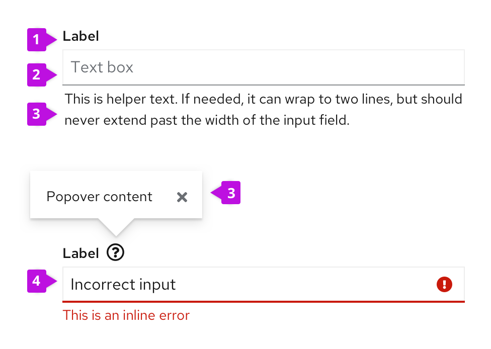
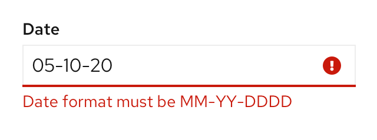

## Elements

1. **Label:** Indicates what you want the user to input in the text field.
2. **Input field:** Area for user to type in their text input.
3. **[Help](#help):** Provides contextual assistance like popovers, placeholder text, or helper text, in any area where the user might need additional information to provide the right input.
4. **[Errors and validation](#errors-and-validation):** Ensures that the correct information is collected before the form can be submitted to the system.

## Usage
* Be sure to size input fields appropriately to anticipate the longest likely value (if a maximum character length is known).
* When a value is too long to be fully displayed in a text field, use [truncation](/ux-writing/truncation).
* Provide a [text area](/components/text-area) for input anticipated to be longer than a single line.
* Pre-populate fields with known values when possible, like a default IP address, for example.

### Help
**Placeholder text**

[Placeholder text](/components/form/design-guidelines#placeholder-text) is text inside a form field that provides an example of the required or recommended format for text input. For example, placeholder text for a date might be "DD/MM/YYYY".

**Helper text**

[Helper text](/components/form/design-guidelines#helper-text) is text below a form field that helps a user provide the right information, like "Enter a unique name".

**Popovers**

[Popovers](/components/form/design-guidelines#popovers) provide context around a text or input field. Popovers are represented with an unfilled question mark con (fa-question-circle) and displayed when the user clicks on the icon.

For more information about how to provide help content, see  the [forms design guidelines](/components/form/design-guidelines#user-help).

### Errors and validation
Wherever possible, use inline errors to notify users where there is an issue with their input. Inline errors help should be short and help users quickly identify and understand what they need to fix and why.

For more information about how to provide errors and validation, see  the [forms design guidelines](/components/form/design-guidelines#errors-and-validation).

