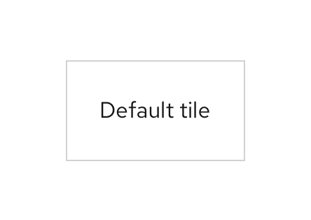

## Usage

### When to use
* The selection process would benefit from having the additional visual prominence that tiles provide.
* The selection includes additional information, like a brief description or an icon. 
* The selection consists of brief, static content. 
* There are few (typically 2-6) selections for the user to choose from.

### When not to use
* The option presented to the user includes an action link, button, or overflow menu. Instead, use a [card](https://v4-archive.patternfly.org/v4/components/card/design-guidelines).
* The option presented to the user requires more than 3 lines of content description. Instead, use a [card](https://v4-archive.patternfly.org/v4/components/card/design-guidelines).
*  The option opens an additional resource or triggers an action. Instead, use a [card](https://v4-archive.patternfly.org/v4/components/card/design-guidelines).

**Example**

 

## Behavior

As the user hovers over the tile component, the color will change insinuating its clickability. Once the user chooses the title, it will appear with a blue border showing it has been selected. 

  

## Variations 

### Basic

### Subtext

### Icon

