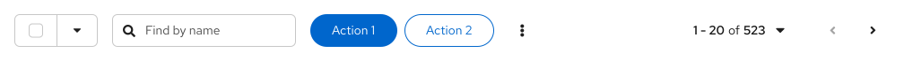
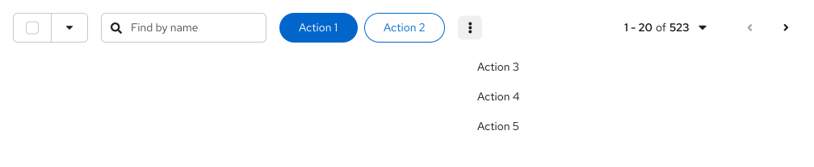
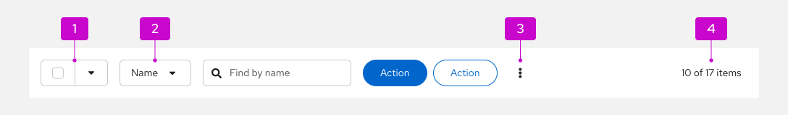
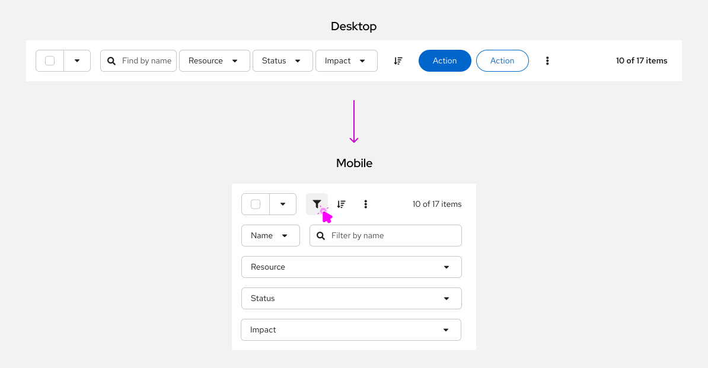

import '../components.css';

## Elements

A toolbar is a container for elements that can be used to manipulate data. A variety of components can be used in toolbars, like buttons, controls, or inputs. 

Within a toolbar, there can be items or groups of items: 
1. **Toolbar items:** Individual components within a toolbar, which operate independent of other toolbar elements. 
1. **Toolbar item groups:** Sets of associated components that respond to changes in viewport width together together. By default, there should be an md spacer between items and groups. 

## Usage
The toolbar component is designed to be very flexible and support a variety of combinations of items and groups. When laying out your toolbar, be sure to:

* Align bulk selection as the first element.
* Align filters and global actions to the right of bulk selection.
* Align pagination as the final element.
* If pagination isn't used, align the item count as the final element.

### Bulk selector

To let users select multiple items within a data view or page, use a [bulk selector](/patterns/bulk-selection/#bulk-selector). 

Bulk selectors enable users to select and deselect all items via a checkbox or select other application-specific options via a dropdown menu. When only a portion of items are selected, there's an indeterminate state that signals to users that some items aren't selected. 

Bulk selectors should always be the first element in a toolbar.

### Filter group

To let users filter data based on a few, related conditions, use a [filter group](/patterns/filters#mixed-select-filter-group) that combines multiple select filters within a single group. 

### Search filter

To let users filter their data based on text input, add a search filter and refer to guidance on using [text entry filters](/patterns/filters/design-guidelines#text-entry-filters).

### Button group

Include any global actions that apply to selected data items as buttons.

Be selective about which actions to surface on the toolbar, exposing no more than 2 buttons and reserving the rest for an [overflow menu](#overflow-menu) component to save space. 

Adhere to the following patterns for the number of actions you have.

#### 1 or 2 clickable actions

- Use a primary button for any call-to-action you want a user to take.
- If you don't want to emphasize an action, use a secondary button instead.

#### 3 clickable actions

- If you need to include 3 actions, add 1 to the toolbar and contain the remaining actions within an overflow menu. This will both prevent the toolbar from becoming too crowded, and also the overflow menu from containing just 1 item. 

#### More than 3 clickable actions

* Use a primary button to indicate the most important action within the table.
* Use a secondary button for an additional action you want to surface in the toolbar, if it is too important to place in an overflow menu.
* Any actions beyond your primary and secondary buttons should be contained within an overflow menu.

### Icon group

To save space, icon groups can be used to contain actions or settings that can be well-represented by button icons.

An icon group should always be placed between filters and global button actions.

### Overflow menu

An overflow menu groups together multiple actions, collapsing them into a menu with a kebab/options icon toggle. 

At smaller viewport sizes, any primary and secondary buttons that are located in the toolbar can also be collapsed into the overflow menu to save space. 

### Pagination

To let users navigate through multiple pages of data, add a pagination component, which will always be the final toolbar item. 

Compact pagination consumes less horizontal space and is the recommended choice, unless your application requires more precise control over paging options (like the ability to navigate to a specific page).

### Item count 

If pagination is not used, show the item count instead. 

For example, display “17 items” to represent the total number of items or “10 of 17 items” to indicate that 10 items were returned after filtering.

### Toolbar toggle groups
To collapse toolbar items into an overlay panel at a certain breakpoint, use a [toolbar toggle group](/components/toolbar/html#toggle-group). This allows complex toolbars with many items and groups to be responsive for mobile devices. 

For example, a toolbar toggle group is particularly useful for containing filter controls. When the toolbar adapts to a mobile viewport, the toggle group contents will collapse into an overlay panel that can be toggled via the filter icon.

**Note:** This is not the same as the [toggle group component](/components/toggle-group), which is used for selecting between options on a page.

### Vertical dividers
When you have a large toolbar containing many groups of items, use a vertical divider to further separate the groups visually.

### Basic toolbar
For most cases, you should use a basic toolbar with default spacing and, generally, the following toolbar items and groups.

1. [**Bulk selector:**](#bulk-selector) Used to select multiple items.
2. **Filter:** Any [filter](/patterns/filters) that best suits your use case. This example shows an attribute-value filter.
3. [**Overflow menu:**](#overflow-menu) Contains additional actions that don't fit in the toolbar.
4. [**Item count**:](#item-count) The amount of items in the associated data set. You can also use [pagination](#pagination) instead.

### Custom toolbar

The toolbar component is extremely flexible. You can create custom toolbar layouts using items, groups, and spacers.

For example, in this image, a custom toolbar with 3 labeled filters is created by pairing a text label and a select component. To better group filters with related labels, a lg spacer is used in place of the default md spacer.

### Mobile toolbars

Toolbars adapt to smaller viewport sizes by collapsing or hiding elements that take significant space, including filters and actions. When used on mobile devices, pagination will be available in the footer of the data view, instead of within the toolbar. 

To create responsive toolbar designs: 

- Place filter controls in a [toggle group](#toolbar-toggle-groups) so they will be hidden in a collapsible panel at mobile breakpoints.
- Use an [overflow menu](#overflow-menu) to collapse actions into a kebab/options menu.

For example, this image contains a complex toolbar that's been optimized for mobile. The search filter and filter group (containing 3 drop-down filters) are placed in a toggle group, which is collapsed at mobile screen sizes. The 2 action buttons are collapsed into an overflow menu. The bulk selector and sort icon button remain visible at all breakpoints.

## Placement 

Toolbars should be placed as close as possible to the content they control. They should stretch the full width of their enclosing container, with their elements aligned in a horizontal row. Don't place additional spacers before the first or after the last items; the toolbar component provides its own padding.

For pages like card views, the toolbar should be placed inside of the page header. This arrangement is also recommended if the user can switch between views, like choosing between a card view and list view. You may optionally apply the `pf-m-sticky-top` modifier to the header section to create a sticky toolbar and prevent it from scrolling off the page.

For lists or table views that are placed inside of a card, the toolbar should always be placed inside the card and above the data set to which it applies.

