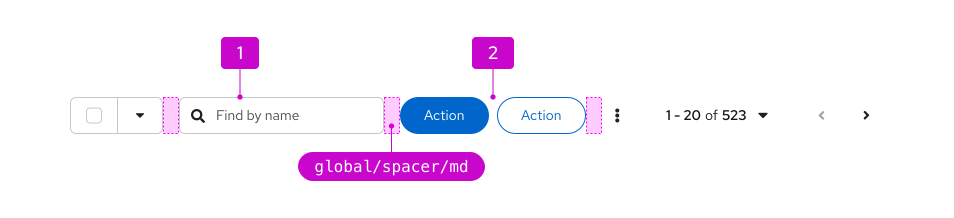
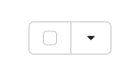
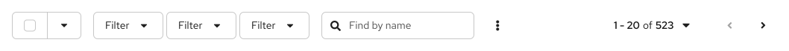
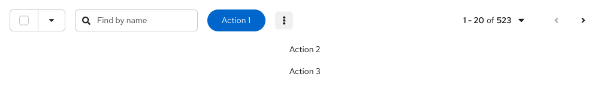
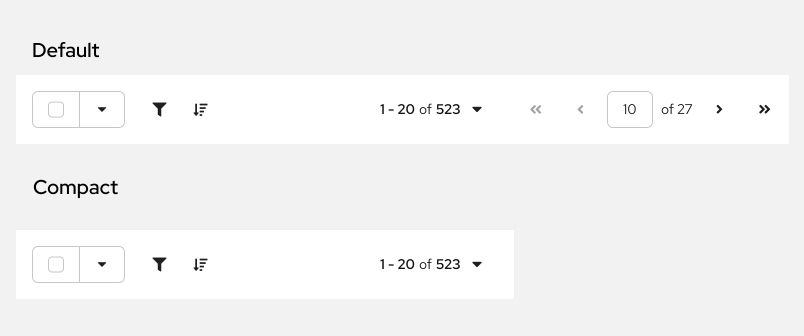
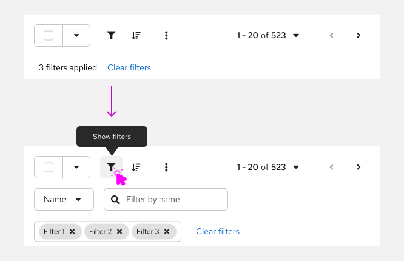
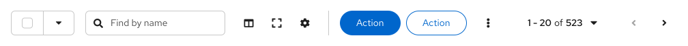
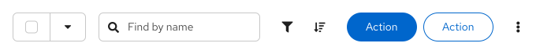

import '../components.css';

## Elements

A toolbar is a container for holding a variety of elements (toolbar items and groups) that are used to manipulate a set of data. All items should be centered vertically within a toolbar.

Toolbar items are individual components that can be placed inside of a toolbar. Often, it makes sense to group sets of like items to create desired associations and to enable items to respond together to changes in viewport width. By default, there should be an md spacer between items and groups. The following are some toolbar items and groups that come with special spacing considerations.

### Bulk selector

A [bulk selector]([/patterns/bulk-selection/#bulk-selector](https://www.patternfly.org/patterns/bulk-selection/#bulk-selector) can be added to let users select multiple items within a page. Besides allowing the user to select and deselect all items on a page, other application specific options can be added in the dropdown. Bulk selection allows the user to select or deselect all items on a page and provide an indeterminate state that notifies the user when only some items are selected. Bulk selectors should always be the left-most element in a toolbar.

### Filter group

A filter group combines multiple select filters into a single group. See [filters](/patterns/filters) for more information about using filter groups.

### Search filter

Add a search filter when you want to display a single search field alongside other filters. For more information about using search input filters, refer to [the filters pattern](/patterns/filters/design-guidelines#text-entry-filters.

### Icon button group

 Actions or settings that are represented by icons can be added in an icon button group.

### Button group

Include any global actions that apply to selected data items as buttons. Be selective about which actions to surface on the toolbar, exposing no more than 2 buttons and reserving the rest for an [overflow menu](#overflow-menu) component to save space.

**One or two clickable actions**

* Use a primary button for any call to action you want a user to take
* In the case that using the action represented should not be encouraged, opt for a secondary button

**Three clickable actions**

* In the specific case where three actions are needed, the suggested guidance is to opt for an overflow menu with two items. This will prevent the toolbar from becoming too crowded, and also prevent the overflow menu from containing just one item. 

**More than three clickable actions**

* Use a primary button to indicate the most important action within the table
* Use a secondary button for a second action you want to surface in the toolbar, if it is too important to place in an overflow menu
* Except for a primary button, and a secondary button in cases where absolutely necessary, put all other actions in an overflow menu

### Overflow menu

An overflow menu is a component that can be used in a toolbar (or elsewhere) to group a number of actions that should be collapsed into a kebab at a certain breakpoint. In the toolbar, the overflow menu will commonly be used to group a set of actions that are intended to collapse into the kebab at smaller viewport sizes.

### Pagination

 When pagination is supported, a pagination component will be included. Pagination will always be right aligned in the toolbar. If pagination is not used, substitute the item count for pagination control. For example, report “17 items” to represent the total number of items or “10 of 17 items” to indicate that 10 items were returned as the result of a filter event.

### Toolbar toggle groups
A [toolbar toggle group](/components/toolbar/html#toggle-group) can be used when you want to collapse a set of items into an overlay panel at a certain breakpoint for mobile applications. This allows complex toolbars with multiple items and groups of items to be responsive. A toolbar toggle group is useful for containing filter controls, for example. When the toolbar responds to adapt to a mobile viewport, the contents contained in a toggle group will collapse into an overlay panel that can be toggled by clicking the filter icon.

Note: this should not be confused with the [toggle group component](/components/toggle-group) that is used for selecting between options on a page.

### Vertical dividers
When you have a large toolbar containing many groups of items, use a vertical divider to further separate the groups visually.

## Usage
The PatternFly toolbar is designed to be very flexible and allow a variety of combinations of items and groups as outlined above. When laying out your toolbar, be sure to:

* Align bulk selection as the left-most element, if used.
* Align filters and global actions to the right of bulk selection, if used.
* Align pagination as the right-most element, if used.
* Align the item count as the right-most element, if pagination isn't used.

### Examples
**Basic toolbar**

The basic toolbar is sufficient for most cases. The example above shows the toolbar with default spacing. It includes the following elements:
1. **Bulk selector:** The bulk selector supports selection of multiple items in a list, table, or card grid. It is always the leftmost item.
2. **Filter:** The example shows an attribute-value filter, but any supported filter can be used here. See [filters](/patterns/filters) usage guidelines for more information.
3. **Overflow menu:** In this example an overflow menu is used to hold global actions. But a simple button group could also be used here if you have two or less actions.
4. **Item count**: When a filter is applied, the item count will be updated to represent the filtered subset of items. For example, “10 of 17 items.” The item count should be the right-most element.

**Toolbar with pagination**

When pagination is used, the pagination component replaces the item count. It should be the right-most element. Here, the toolbar is shown with both full and compact pagination options. Compact pagination consumes less horizontal space and is the recommended choice unless your application requires more precise control over paging options (like the ability to navigate to a specific page).

**Toolbar with an icon group**

To save space, you may represent some actions as icons. Use an icon group to provide the proper spacing between icons. Here, sort and export actions are represented as icons. The icon group should always be placed after the filters and before any global actions represented by buttons, if they exist.

**Custom toolbar**

The Toolbar component is extremely flexible and you can create custom toolbar layouts by working with items, groups, and spacers. Here, a custom toolbar with three labeled filters is created by paring a text label and a Select component. Items are spaced by 16px by default but here the spacing to the right of each Select filter has been modified to 24px to help better group each filter with its related label.

### The toolbar on mobile

The toolbar adapts to smaller viewport sizes by collapsing or hiding elements that take significant space, including filters and actions. On mobile devices, when used, pagination will be available from the footer, only. When designing toolbars to be responsive:

* Place filter controls in a [toggle group](#toggle-groups) so they will be hidden in a collapsible panel at mobile breakpoints.
* Use an [overflow menu](#overflow-menu) to collapse actions into a kabob menu.

The following is an example of a complex toolbar optimized for mobile.

Here, the search filter and filter group containing three drop-down filters are placed in a toggle group that collapsed when the screen shrinks to mobile size. The two action buttons are part of an overflow menu that collapses to a single kabob menu. The bulk selector and sort icon button are implemented as toolbar items that remain visible at all breakpoints.

## Placement 

The toolbar should live as close to possible to the content it controls. For a card view or similar views, the toolbar should be placed inside of the page header. This arrangement is also recommended if the user may switch between views (e.g. view as cards or as a list). You may optionally apply the `pf-m-sticky-top` modifier to the header section to create a sticky toolbar and prevent it from scrolling off the page.

For list and table views that are placed inside of an enclosing card, the toolbar should always be placed inside the card and above the data set to which it applies.

Toolbars should stretch to the width of the enclosing container, with the elements aligned in a horizontal row. There should be no spacers on the left and right edges of the toolbar as the toolbar provides its own padding.