## Elements
Except where noted, modal and in-page wizards have the same elements and behaviors. For the sake of simplicity, all screens here show the modal wizard.

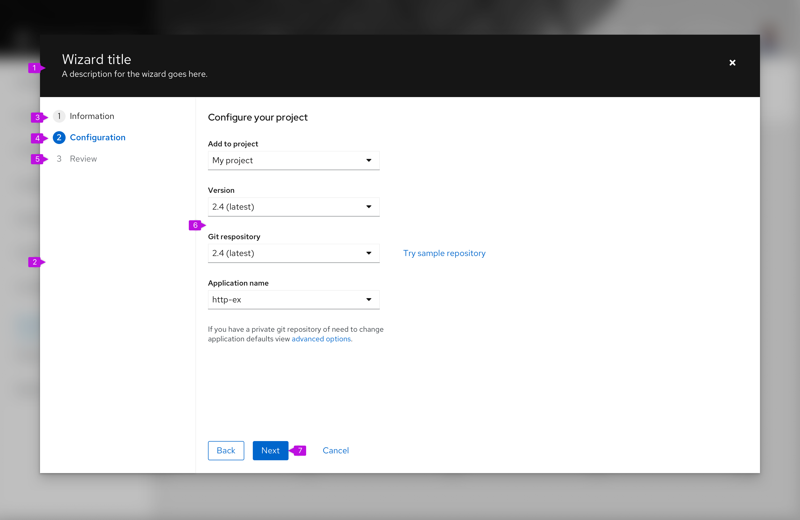

1. **Header (modal wizard only):** Modal wizards always have a header area that minimally contains the wizard title and a close button. The title should be action oriented and reflect the intended outcome of the wizard, such as "Create resource." You may optionally also include a description below the wizard title.
2. **Steps sidebar:** Enumerated steps are displayed in the sidebar. Steps can be fixed or updated as the user proceeds through the process (see progressive wizard).
3. **Visited step:** A step that has been already visited. In most cases users can click this step to return to a prior point in the flow.
4. **Current step:** The current step is always highlighted.
5. **Disabled step:** Steps that follow the current step are usually disabled to enforce the sequential flow.
6. **Step title:** The Step title is unique to each step, and should reinforce the outcome of the individual step. It may match the Current step indicated in the steps sidebar, or as in the example image, it may be more verbose.
7. **Body:** The contents of a step itself. Any valid form elements can be incorporated within the body. The size of the modal that contains the wizard can be adjusted based on the contents of the body section. If the height of the body section causes the bottom of the modal to push beyond the height of the viewport, a vertical scrollbar will appear. However it is recommended to break your workflow into small enough steps so that scrolling is not necessary on typical monitor sizes.
8. **Button footer:** Buttons control the wizard flow. Default buttons are "Next," "Back," and "Cancel." You may optionally add other actions, such as "Skip to finish" or "Start over." There should only be one primary action in the footer and it should be the farthest left action.

## Usage
### When to use
* The task is long/complex and benefits from being broken into smaller more manageable steps. This allows the user to focus on smaller tasks and not feel overwhelmed.
* There is a known step by step order of tasks, and these steps can be broken up into clearly defined categories/sections which can be indicated via labels on the steps.
* This process is prescriptive. The actions a user takes in one step influence downstream steps.
* A simple form is not sufficient to aid a user in completing a task.

### When not to use
* Avoid using a wizard for simple data entry tasks in which a basic form would suffice.

## Behavior 
In a standard wizard the user moves through the wizard sequentially, a step at a time. The Next button is always used to advance the wizard. In addition:

* The "Back" button is disabled on the first page of the wizard.
* To abandon the wizard, the user selects "Cancel" in the button footer or the "Close" button in the header. Closing the wizard will discard current changes, so it may be appropriate to insert a confirmation message before executing this operation.
* Wizard steps are skippable if the user configures them to be.
* The user can jump to steps directly if the user clicks on a step in the nav (if the step is not disabled).

### Mobile considerations
When viewing a wizard on a mobile device, the steps sidebar will be hidden and collapse into a drop down menu panel as shown below.

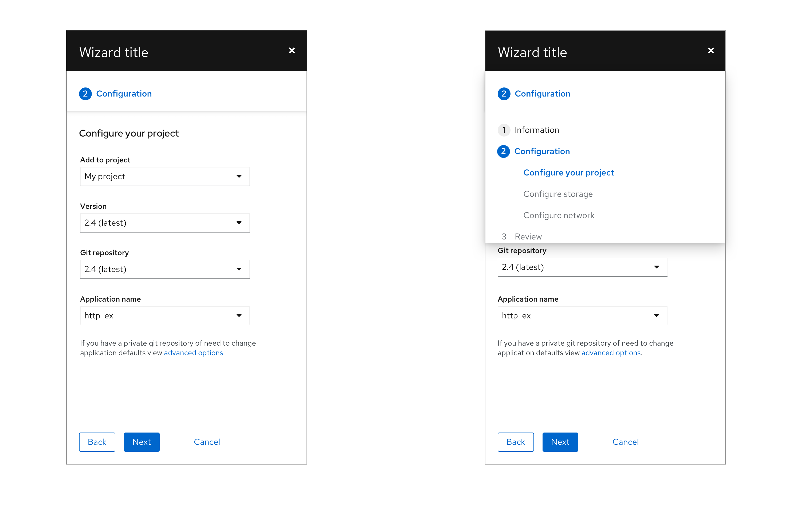

## Variations
Wizards can be modal or placed within the content area of a page. Behavior may change depending on variation. 
* [In-page wizard](#in-page-wizard)
* [Progressive wizard](#progressive-wizard)
* [Modal wizard](#modal-wizards)
* [With sub-steps](#wizard-with-sub-steps)
* [With optional steps](#wizard-with-optional-steps)
* [With a drawer](#wizard-with-a-drawer)

### In-page wizard
A wizard may be embedded in a page as shown below.

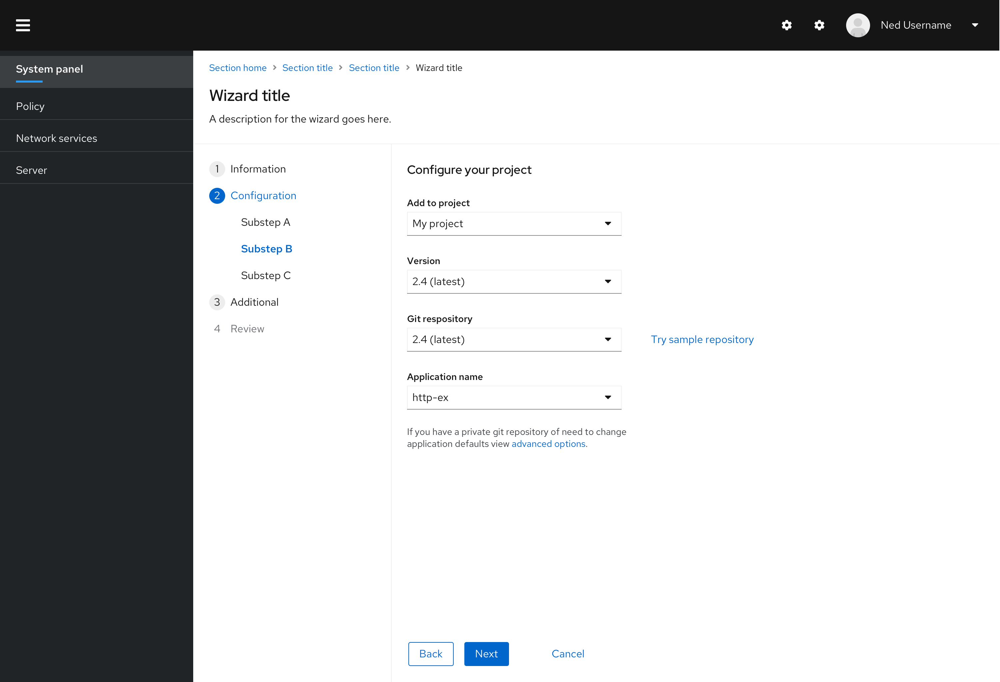

Wizards can also be added to the content area of a page. This will allow greater flexibility in navigating to other locations in your application while within a wizard flow, but it also places greater responsibility on the system to manage state.

Note that when a wizard is embedded into a page, the wizard title and description are placed within the page header. The same standards that were defined for usage of the title and description for modal wizards should be applied here.

When a wizard is placed in the context of a page, it allows some freedom that is not available using the standard modal approach.

* Modals may be opened from the wizard to examine required information or perform subtask that are related to, but not part of, the wizard workflow.
* User can navigate away from the wizard to look up information or perform some prerequisite task.

Be aware that anytime the user navigates aways from the wizard, there is a risk that any information entered up until that point will be lost. At a minimum, we recommend opening a modal alert when the user tries to do this warning of potential data loss and confirming that they want to leave the wizard. Optionally you should consider including a "Save as draft" feature that will allow work in progress to be saved and recalled upon returning to the wizard.

### Progressive wizard
A progressive wizard takes the same form as the standard wizard or wizard with sub-steps above but accommodates a situation where the exact number of steps is not known when the wizard is first loaded. Steps in the sidebar can be changed or added as the user progresses through the wizard.

A walk-through of a progressive wizard might look like this:

**Step 1**: The user is presented with a Get started screen where they can specify what they want to do.

**Step 2**: Based on their choice to create a new object, a user is presented with a second set of options. But the remaining steps are still unknown.

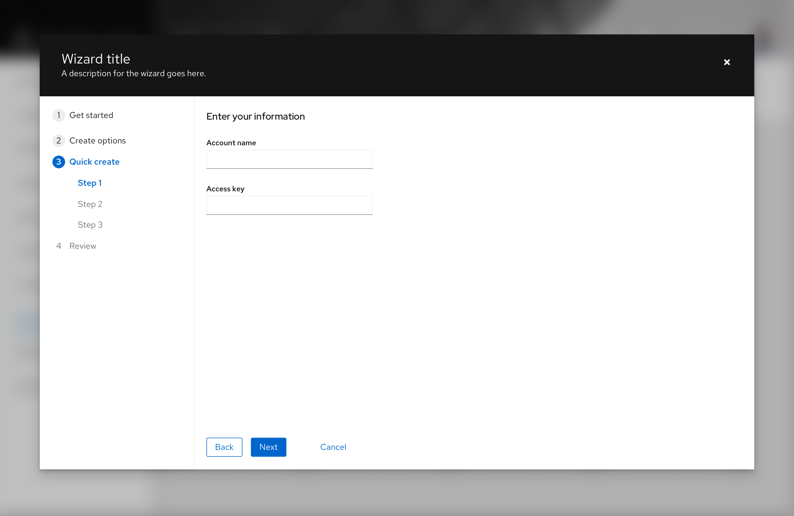

**Step 3**: After the user chooses “Quick create” and clicks "Next," they can now be presented with a full set of steps. It should be possible to revisit either of the first two steps making different choices and steps shown should update accordingly.

### Modal wizards

The modal wizard lives in a modal dialog. If necessary, the default width and height of the modal can be overridden to increase that available content area. In most cases, the modal wizard is recommended as it will keep users focused on the task at hand. Users must either complete all of the steps of the wizard or cancel before navigating elsewhere within an application.

### Wizard with sub-steps
Sub-steps can be added to the sidebar. Use sub-steps when there is a hierarchical relationship between a group of steps, if a primary step contains too much content to be displayed on one page, or when there is a set of optional settings that make sense to group together where the user need not visit each page.

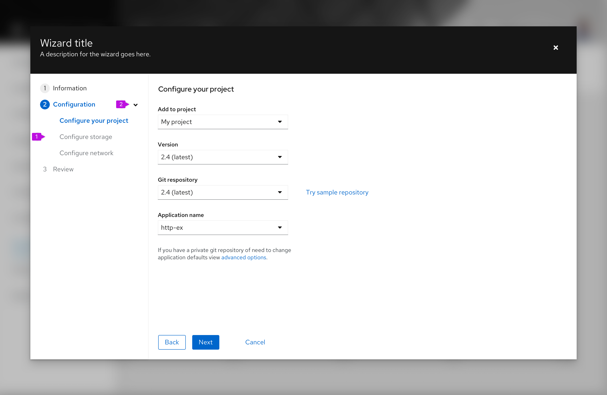

1. **Sub-steps:** Sub-steps are always nested inside of a major step.
2. **Expansion (optional):** Sub-steps may be shown or hidden using the caret next to the parent step.

#### Behavior

* You may force the user to execute sub-steps in order by disabling future steps. Or enable all steps if the user should be able to click freely between sub-steps.

* Clicking "Next" or "Back" should navigate through the sub-steps as it would for the major steps.

* If an expansion is used, sub-steps are hidden unless the user expands the parent step or has naturally arrived at the first of the sub-steps.

* Parent steps are automatically closed once they are complete. However, the user can manually expand the parent back open at any time to see the sub-steps again while staying in context of their current step.

### Wizard with optional steps
Optional steps can be added to the wizard. Make steps optional when they do not need to be filled out to complete the wizard.

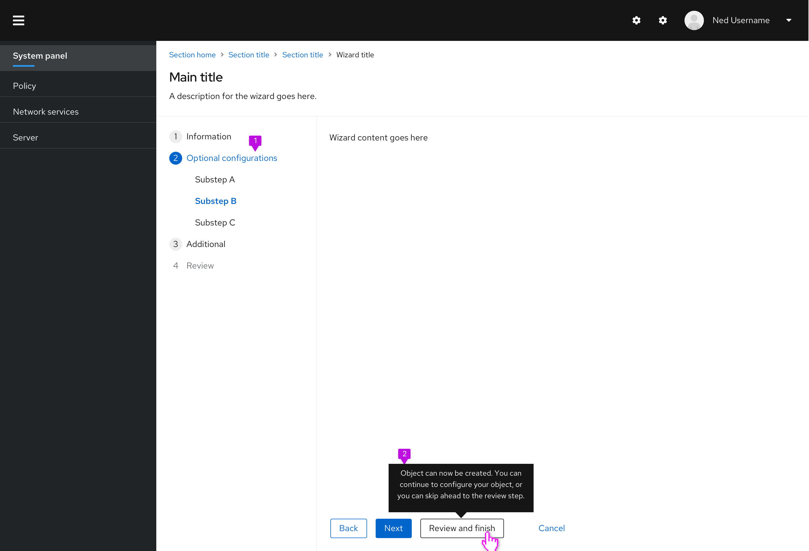

1. **Optional steps:** It's recommended to group all optional steps under one parent step.
2. **Tooltip (optional):** This tooltip is optional, but recommended. It would help explain that the following steps in the wizard are not required and would give more context to the new "Review and finish" button. 

#### Behavior

* The review step is enabled once all required steps have been filled out.

* Once required steps have been filled, a tertiary button would appear to the right of the next/back buttons. Once clicked, this button would jump users ahead to the final review step. 
 
### Wizard with a drawer

The drawer inside a wizard is useful in situations where you need to show more information while keeping the user in the context of the wizard. When opened, the drawer overlays the data, rather than pushing it to the side. There are two types of drawers: dismissable and non-dismissible. For opening and closing a drawer, use a link button or a link button with an icon.

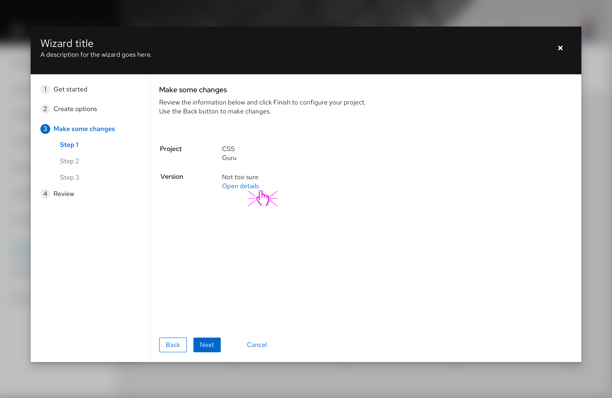
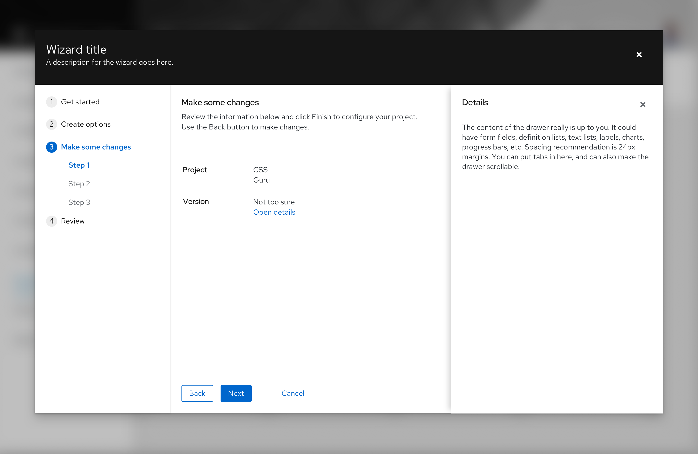

#### Use drawer when:

* You want to let consumers review additional information without switching contexts
* You need to add context or more description around the information you are showing
* You want to display additional learning resources

### Review and completion
The last step in a wizard should always be a review step. This step should include a summary of what the user has input so the user may confirm them before committing their changes.

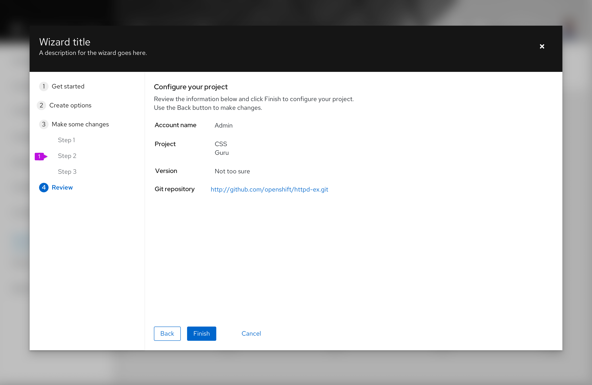

1. **Review step**
2. **Finish button:** On the last step of the wizard, the Next button is labeled Finish by default. This is a configurable choice and should be replaced by a more specific verb or verb-object word pair like “Create” or “Configure networks,” when possible.

If it will take a long time (more than a few seconds) for changes to be applied, a progress screen is recommended. This can be constructed from a variation of the [empty state](/components/empty-state/design-guidelines) pattern by embedding a progress bar and appropriate messaging within the body of the wizard.

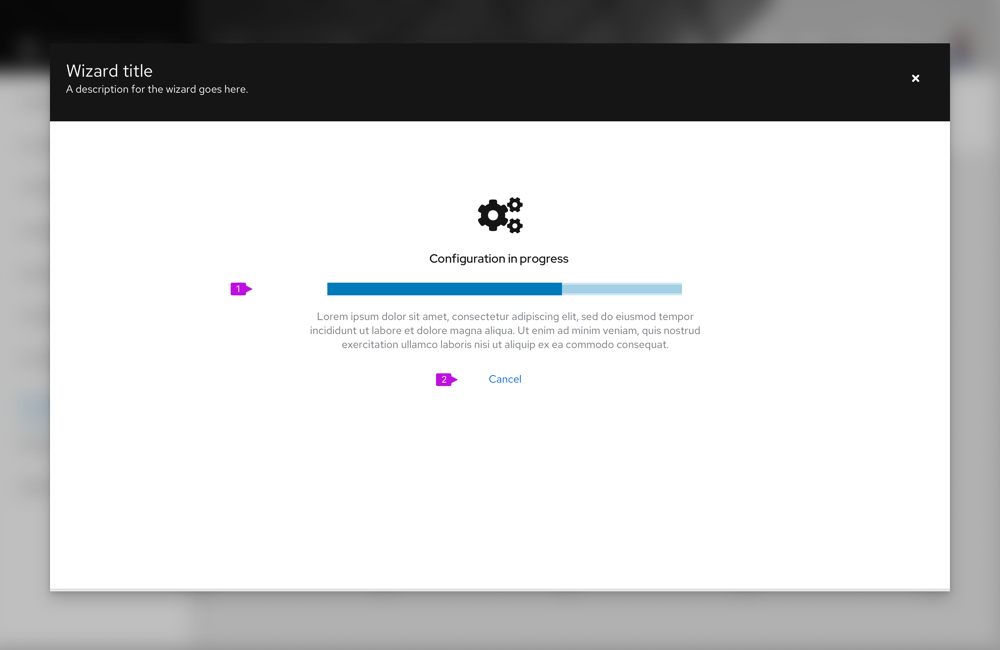

1. **Progress message:** Include a progress bar with appropriate messaging using an empty state pattern.
2. **Cancel button (optional):** Include a cancel button only if the operation can be terminated once it is started. Cancel should back out all changes and leave the system in the state that existed before the user launched the wizard.

Note that once changes have been committed, the steps sidebar is hidden and the user can no longer make changes.

Once the changes initiated by the wizard are completed, a final confirmation screen should be displayed. Again, this can leverage an empty state pattern to present a success (or failure) message to users.

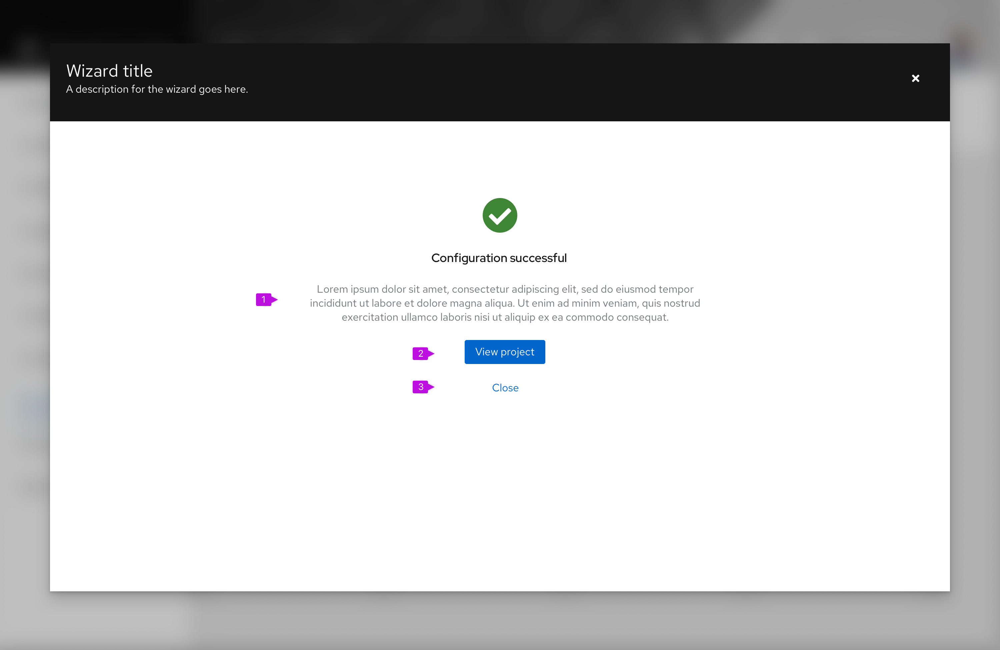

1. **Completion message:** Provide appropriate messaging to inform the user about the outcome of the wizard.

2. **Primary action:** In most cases this will be a navigational button to close the wizard and take the user to a page where they can see the results of their changes, e.g. a new project that was created. If there is no appropriate destination or if results will be seen on the current page, make the primary action Close.

3. **Secondary action(s) (optional):** If the primary action is other than Close, include a Close button here to close the wizard and return to the prior page. Other secondary actions can also be included. See [empty state guidelines](/components/empty-state) for button placement.

In some cases the result of a wizard is to dispatch a task to the background to execute changes in the back end. In these circumstances, we recommend that you provide a navigation link to monitor task progress and/or simply a Close button.

## Content considerations
You should keep the following in mind while designing your wizard screens:

* Keep step labels short. The title at the top of each screen may be used to elaborate on the step label, but in all cases there should be a direct relationship between the step label and the screen title.
* The last step should always be labeled review.
* Default button labels for wizard navigation are: "Next," "Back," and "Finish." If you are replacing the default button labels, keep them short and action oriented, such as “Create network.”

