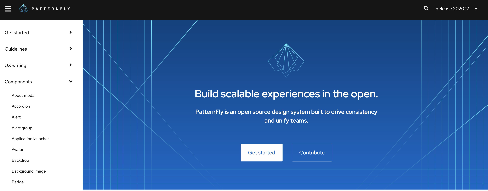
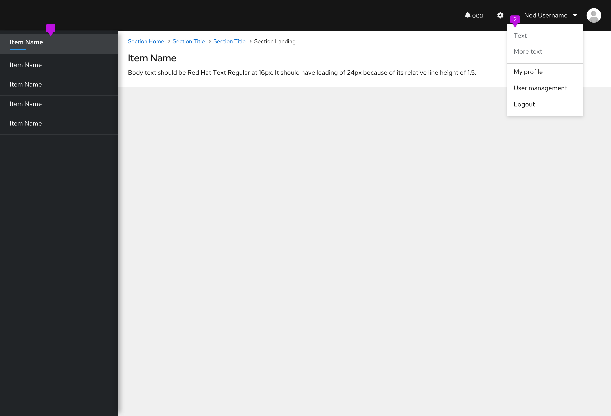

Consistent capitalization adds clarity and creates unity across your products' UIs.

## Capitalization types

We recommend using title and sentence case as appropriate:

- **Title case** capitalizes only the first letter of each word in a sentence, except for smaller words with fewer than four letters, like articles and conjunctions. 

    - For example: "PatternFly Design Resources With Tips and Best Practices."

    - **Note:** Hyperlinked articles in a UI are not displayed as titles. Instead, the copy typically reads something like, "Learn more about [tool name]." 

- **Sentence case** only capitalizes the first letter of the first word in a title, heading, subtitle, or subheading except for proper nouns, product names, acronyms, and initialisms. 
    
    - For example: “PatternFly’s design resources with tips and best practices.”

## Capitalization in breadcrumb trails

Usually, page titles appear in a breadcrumb trail. If all page titles are in title case then they should also appear in title case in the breadcrumb trail. If all page titles are in sentence case, they should also appear in sentence case in the breadcrumb trail. 

However, breadcrumb trails aren’t limited to page titles alone. If a name entered by a user (such as “vagrant-host”) is included in the breadcrumb trail, then use the same case that the name appears in. 

For example, this may look like: *Rules* > *Systems* > *System Tool* > *vagrant-host* 

## Capitalization across PatternFly

Follow these guidelines for PatternFly content, including documentation, UX copy, blog articles, and more. 

- Use **sentence case** for page titles, menu items, navigation items, headings, subtitles, and subheading. 

    - For example: On PatternFly's website, all navigation items, button text, and headings are written in sentence case:  

- **Capitalize** proper nouns, product names, acronyms, and initialisms.  
    
    - **Note**: “React” is always capitalized, even when referring to a component (such as “React component”). It’s the official name of a JavaScript library, and it’s written as a proper noun across the <a href="https://reactjs.org/">react.js org site</a>.  

- Write all components in **lowercase** unless they start a sentence. 
    
    - For example, "Card, button, and banner components are my favorites."

## Capitalization across Red Hat UIs

Similar to PatternFly, sentence case is the standard across Red Hat products. However, capitalization varies depending on each product area's context. 

Keep in mind that your main goal should be consistency. You may need to use different capitalization standards depending on what you're designing, but be sure to keep the capitalization within your product area consistent.   

In general, follow these guidelines:

- Write navigation items and their corresponding page titles in **title case**.
- Write in **sentence case** for all other areas, including menu items, button text, form field labels, and empty state headings.
- **Capitalize** proper nouns, acronyms, initialisms, product names, services, and features. 
- Keep capitalization for custom resources the same as the capitalization used during creation. For example, if a custom resource was created in all lowercase letters, don't change any of the letters to uppercase. 
- Capitalize **Red Hat feature names** when they’re used as proper nouns or when they refer to a capitalized UI term (like a navigation item). Write them in lowercase when they’re used to describe generic concepts. For more specifics, reference the following table:
    
    

    | **Feature name** | **UI text**  | **Reasoning**    |
    |------------------|--------------|------------------|
    | Compliance   | “Check your system compliance using Red Hat Insights Compliance.”                                                  | The first “compliance” is lowercase since it refers to compliance as a concept. The second “compliance” refers to a specific feature offered on cloud.redhat.com.                                     |
    | User Access  | “Manage user access for your organization using the User Access feature.”                                          | The first “user access” is lowercase because it refers to user access as a concept. The second “user access” is capitalized because it refers to the User Access feature offered on cloud.redhat.com. |
    | Sources      | “Add a source by going to **Settings > Sources.**” "Check the **Sources** table for status." Button text: "Add source" | “Sources” is only capitalized when it directly refers to a subsection, feature, or location in the UI. Always write buttons in sentence case. |

    

A UI that adheres to these guidelines may resemble the following image: 

   

1. **Navigation**: Navigation items are in title case. 
1. **Menu**: Menu items are in sentence case.

## Capitalization for tools outside your product portfolio

If you’re referencing tools outside your company’s product portfolio, write the product names as they appear in the respective company’s documentation. 

For example, if you’re referencing a product in Amazon Web Services and Amazon capitalizes it, you should also capitalize it in your writing.