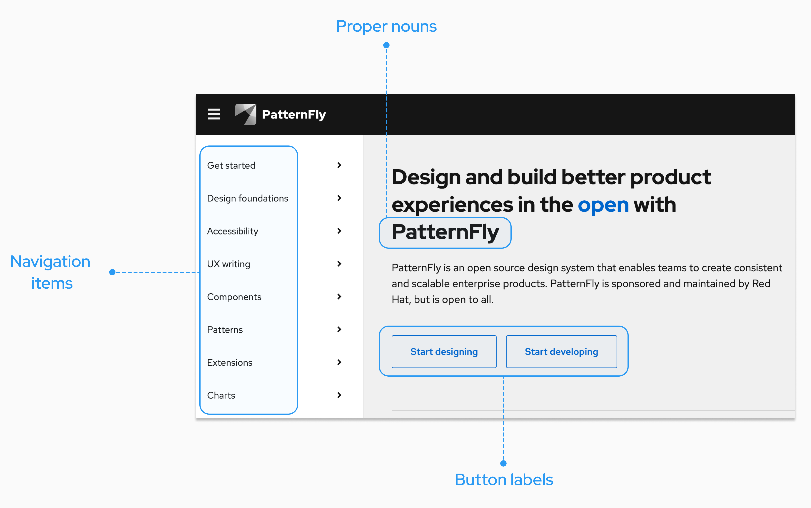

# Capitalization guidelines

Consistent capitalization adds clarity and creates unity across product UIs. When using PatternFly, we recommend writing in **sentence case**, which capitalizes the first letter of the first word in a title, heading, subtitle, or subheading -- except for proper nouns, product names, acronyms, and initialisms. 
    
For example: “PatternFly’s design resources with tips and best practices.”

Above all else, your main goal should be consistency. You may need to use different capitalization standards depending on what you're designing, but be sure to keep the capitalization within your product area consistent.

## Product UIs

When writing for products designed with PatternFly, you should adhere to the following capitalization patterns:

- Capitalize proper nouns, acronyms, initialisms, product names, services, and features. 
- Keep capitalization for custom resources the same as the capitalization used during creation. 
    - For example, if a custom resource was created in all lowercase letters, don't change any of the letters to uppercase. 
- Capitalize product feature names when they’re used as proper nouns or when they refer to a capitalized UI term (like a navigation item). Write them in lowercase when they’re used to describe generic concepts. For example, consider the following scenarios found in Red Hat products:

| **Feature name** | **UI text**  | **Reasoning**    |
|------------------|--------------|------------------|
| Compliance   | “Check your system compliance using Red Hat Insights Compliance.”                                                  | The first “compliance” is lowercase since it refers to compliance as a concept. The second “compliance” refers to a specific feature offered on cloud.redhat.com, so it is capitalized.                                     |
| User Access  | “Manage user access for your organization using the User Access feature.”                                          | The first “user access” is lowercase because it refers to user access as a concept. The second “user access” is capitalized because it refers to the User Access feature offered on cloud.redhat.com. |
| Sources      | “Add a source by going to **Settings > Sources.**” "Check the **Sources** table for status."  Button text: "Add source" | “Sources” is only capitalized when it directly refers to a subsection, feature, or location in the UI. Always write buttons in sentence case. |

### Capitalization in breadcrumb trails

Usually, page titles appear in a breadcrumb trail. When a breadcrumb item corresponds to a page title, you should match the capitalization of the original page title.

This is true even if the capitalization is not sentence case. For example, this may look like: *Rules* > *Systems* > *System Tool* 

Sometimes, user-named items will appear in a breadcrumb trail. If a custom name entered by a user (such as “vagrant-host”) is included in the breadcrumb trail, you should match the capitalization of the users' original entry.

For example, this may look like: *Rules* > *Systems* > *System Tool* > *vagrant-host* 

### Tools outside your product portfolio

If you’re referencing tools outside your company’s product portfolio, write the product names as they appear in the respective company’s documentation. 

For example, if you’re referencing a product in Amazon Web Services and Amazon capitalizes it, you should also capitalize it in your writing.

## PatternFly website documentation 

There are additional capitalization guidelines that you should follow if you contribute to any PatternFly content, like documentation or microcopy.

- Use sentence case for page titles, menu items, navigation items, headings, subtitles, and subheadings. 

- Capitalize proper nouns, product names, acronyms, and initialisms, like:
    - React. 
    - PatternFly.
    - HTML.

- Write all components in **lowercase** unless they start a sentence. 

- Format any code snippets according to the standards used for their language. 

 

All navigation items, button text, and headings are written in sentence case:

 

For example, "Card, button, and banner components are my favorites."
