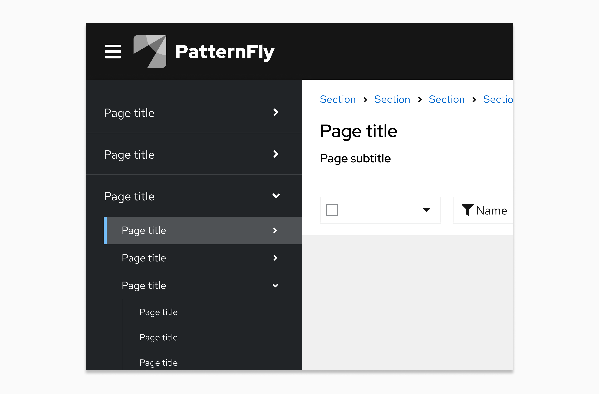

# Capitalization guidelines

Consistent capitalization adds clarity and creates unity across product UIs. PatternFly recommends writing in sentence case for all titles, headings, subtitles, or subheadings. **Sentence case** capitalizes only the first letter of the first word. The only exceptions to this are proper nouns, product names, acronyms, and initialisms, all of which should be capitalized.

For example: “When you use PatternFly’s design resources, you get helpful tips and best practices.”

**Above all else, your main goal should be consistency.** You may need to use different capitalization standards depending on what you're designing, but be sure to keep the capitalization within your product area consistent.

## Red Hat product UIs

When you write for a product, make sure you adhere to the following capitalization patterns.

- Default to sentence case across all UI elements, including navigation items, page titles, buttons, and so on. 

 

- Keep capitalization for custom resources the same as the capitalization style used during creation. 
    - For example, if a custom resource name was created with all lowercase letters, don't change any of the letters to uppercase when referencing this resource. 
- Capitalize product feature names when they’re used as proper nouns or when they refer to a capitalized UI term (like a navigation item). Write them in lowercase when they’re used to describe generic concepts. For example:

    

    | **Feature name** | **UI text**  | **Reasoning**    |
    |------------------|--------------|------------------|
    | Compliance   | “Check your system **compliance** using Red Hat Insights **Compliance**.”                                                  | The first “compliance” is lowercase since it refers to a concept. The second “compliance” refers to a specific feature offered on cloud.redhat.com, so it is capitalized.                                     |
    | Sources      | “Add a *source* by going to **Settings > *Sources*.**” "Check the *Sources* table for status."  Button text: "Add *source*" | “Sources” is only capitalized when it directly refers to a subsection, feature, or location in the UI. "Source" is lowercase in the button text because button labels should always be in sentence case. |
    

### Capitalization in breadcrumb trails

It is common for page titles to appear as an item in a breadcrumb trail. Match the capitalization of the original page title in the corresponding breadcrumb item even when the item does not use sentence case, or when a breadcrumb trail contains mixed capitalization standards.

  

Sometimes, user-named items will appear in a breadcrumb trail. If a custom resource name (for example, "customResource-name") is included in the breadcrumb trail, you should match the capitalization of the users' original entry. 

 

### Tools outside your product portfolio

If you’re referencing tools that aren't part of your company’s product portfolio, write the product names as they appear in the respective company’s documentation.

For example, if you’re referencing a product in Amazon Web Services that Amazon capitalizes, then you should also capitalize it in your writing.

## PatternFly website documentation 

There are additional capitalization guidelines that you should follow if you contribute to any PatternFly content, like documentation or microcopy.

- Use sentence case for page titles, menu items, navigation items, headings, subtitles, and subheadings. 

- Capitalize proper nouns, product names, acronyms, and initialisms. For example: React, PatternFly, and HTML.

Take the PatternFly website as an example, where all navigation items, button text, and headings are written in sentence case and all proper nouns are in title case:

- Write all components in lowercase unless they start a sentence. 

- Format any code snippets according to the standards used for their language. 

For example, the following image from our component documentation uses lowercase for the component name ("card") and capitalizes code appropriately ("isCompact" and "isLarge").

