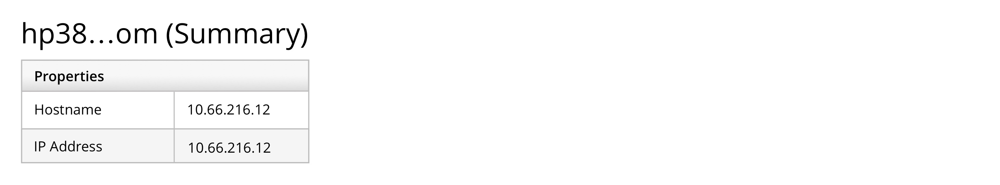

Truncate, or shorten, your content whenever a string overflows the container and you don't want multiple lines of text. Typically, this is done by utilizing ellipses (...).

For example, truncate page titles that show object/host names:

Truncate table or list view cells that contain long strings or lots of data:

Utilize this guide to determine when and where to utilize truncation.

## Where to truncate
Whether you should truncate strings at the beginning, end, or in the middle requires a bit of research.

If your product has a default truncation scheme, such as a setting for how to truncate host names, you should follow that practice. 

If the product doesn't have a default truncation scheme, think about how the product's users are apt to name objects. Is it more likely that the unique part of the name will be at the beginning or end of the string? Based on the answer, you should either truncate at the end of the string (abcdef...) or in the middle of the string (abc...ghi). To decide on a method, ask yourself: *Which part of the string that is not truncated is more likely to differentiate the item?*

And if users are able to customize settings regarding truncation, then you should match their chosen preference:

## Truncation guidelines and best practices

- Indicate truncated text with an ellipsis (…). If the text is part of a link, the ellipsis should also be part of the link.

- Leave no fewer than 4 characters when truncating text. Leave enough characters to give a fair idea of what the string says 
    - For example, don't truncate “demo1.internal-el6.satellite” to “de…”, since that doesn't properly convey the meaning of the full string.

- In any container holding a string, if there is not sufficient room for the full spelling or hyphenated word, consider abbreviating the text. 

- Avoid abbreviations or truncated text in navigation items (all levels of navigation in the masthead and left navigation).

- Ensure that there is at least one method for the user to view the entire string. We recommend using a tooltip (useful for fewer than 150 characters or so). You could also use expandable rows or overlays.

- Avoid truncation directly before or after punctuation whenever possible. It’s tricky to differentiate whether the punctuation is part of the ellipsis or part of the name 
    - For example, don't truncate “demo1.internal-el6.satellite” to “demo1…”, because it's unclear that there's a period in addition to the ellipses.

- If a table column is resizable, the truncated text should adjust accordingly.

-  Do not truncate text in column headings.