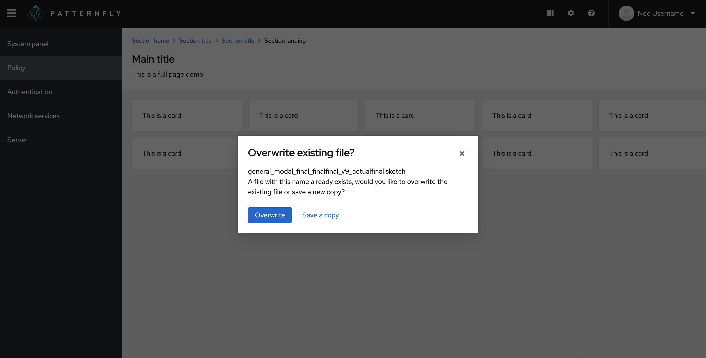

The **bullseye** layout centers content, both vertically and horizontally within a container.

## Elements 

1. **Bullseye:** The bullseye container, which contains the bullseye item.
2. **Bullseye item:** An individual section of content to be placed in the bullseye container.

## Usage 

A bullseye layout can only contain one section of content. 

As an example, the bullseye layout is commonly used with the [modal component](/components/modal) to surface important information and place content on top of another layout.

If you need to center more than one section of content on a page, you should choose a different [PatternFly layout](/layouts/about-layouts).