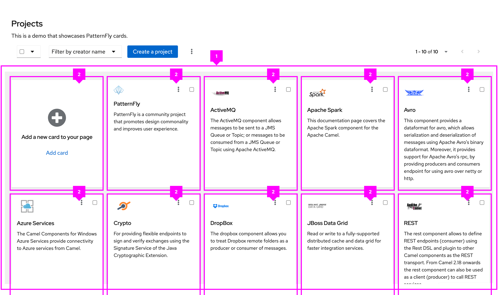
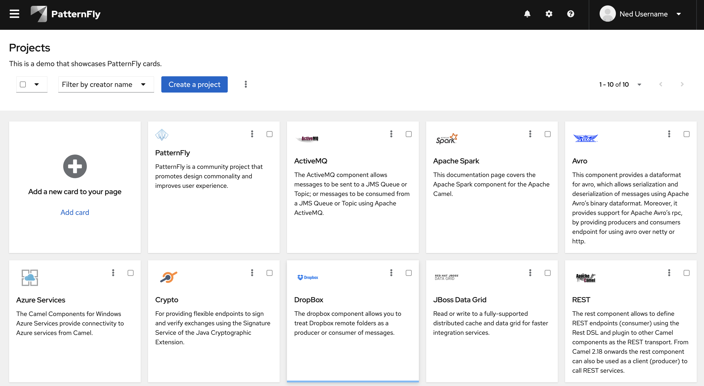

The **gallery** layout is used to arrange content in a responsive grid. Content will wrap responsively to create uniform rows and columns.

## Elements

The gallery layout is designed so that all of its elements are of uniform size, display horizontally, and wrap responsively.

1. **Gallery:** The gallery container that contains all gallery items
1. **Gallery item:** The individual items in a gallery container

## Usage

While a gallery layout resembles a grid, it is not the same as the grid layout.

Common use cases for the gallery layout include card views.

## Variations

Gutters can be applied to increase the spacing of gallery items.

Both a minimum and maximum width can be defined for gallery items. These values determine the width that a gallery item is allowed to be before they wrap.

