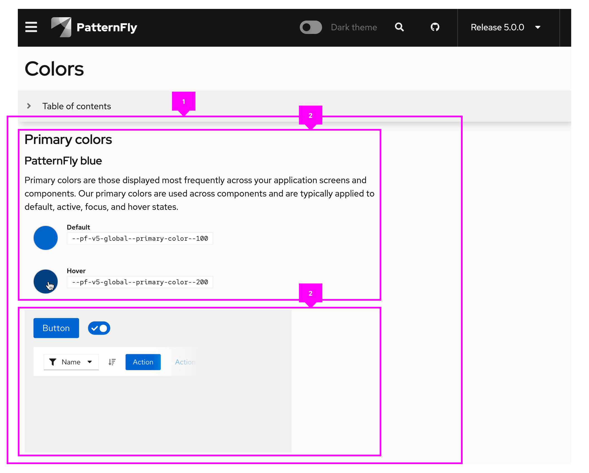
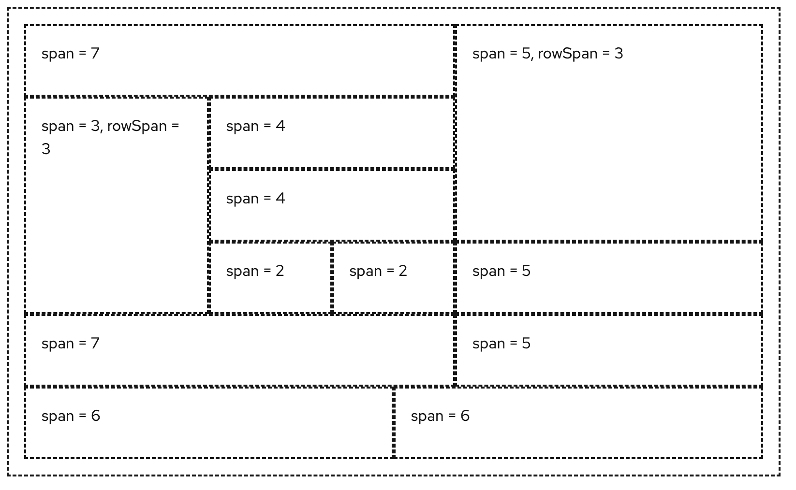
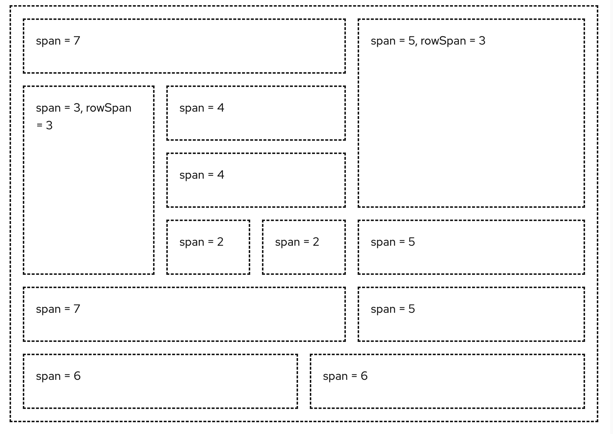

The **grid** layout places content on a fixed 12 column grid.

## Elements

1. **Grid**: The grid container, which holds all grid items.
1. **Grid item**: An individual section of content to be placed in the grid.

## Usage

Grid items can be ordered in a number of ways to create groups. The span value of all grid items must equal 12, but this can be achieved by modifying the span of each item to create different combinations of section sizes:

## Variations

### Gutters around items

To adjust spacing between items, you can apply gutters.

