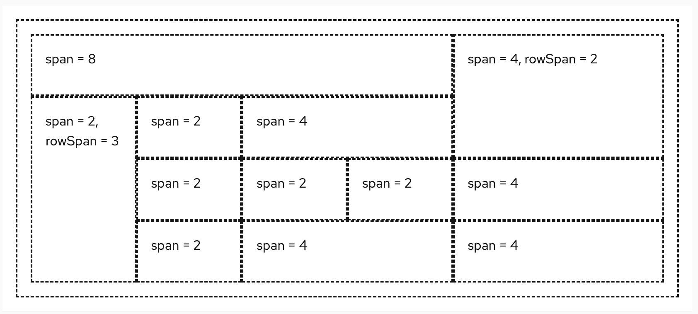

The **grid** layout places content on a fixed 12 column grid.

## Elements

1. **Grid**: The grid container, which holds all grid items.
1. **Grid item**: An individual section of content to be placed in the grid.

## Usage

Grid items can be ordered in a number of ways to create groups. The span value of all grid items must equal 12, but this can be achieved by combining different section sizes.

For example, the [basic grid React example](/layouts/grid) is organized to create the following grid:

However, by following the rule that section sizes can be customized as long as the span equals 12, the grid structure can easily be modified and adjusted to your needs:

## Variations

### Gutters around items

To adjust spacing between items, you can apply gutters.

### Adjusted for different screens 

By adjusting the column span, row span, and order at various [breakpoints](/developer-resources/global-css-variables#breakpoint-variables-and-class-suffixes), you can adapt the grid for different screen sizes.

[A couple of image examples?]