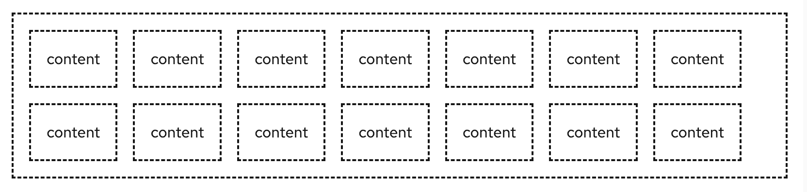
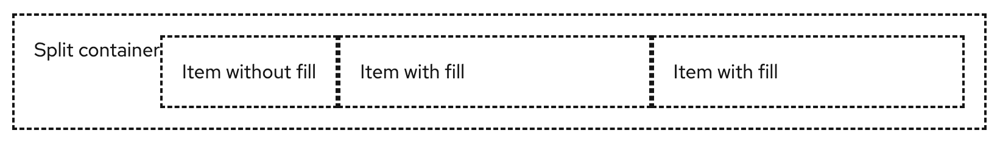

The **split** layout positions items horizontally in a container, with one item filling the remaining horizontal space as the viewport is resized.

##  Elements

You can specify which split item fills the remaining space

1. **Split**: the split container
1. **Split item**: the split child

The height of an item will be adjusted along the main-axis.

## Usage
Use when content should be flexible and may change dynamically. 

## Variations

-You can wrap items as necessary.

You can apply gutters to adjust spacing between items.

You can modify an item's fill to allow a split item to grow with available space. Multiple items can be set to fill. Setting a fill to multiple items does not constrain their width. These items will grow as their content dictates needed space. 

