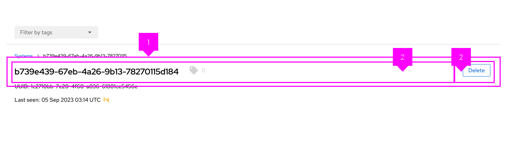
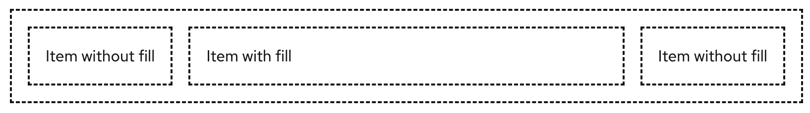

The **split** layout positions items horizontally in a container, with one item filling the remaining horizontal space as the viewport is resized.

##  Elements

1. **Split**: The split container, which holds all split items.
1. **Split item**: An individual section of content to be placed in the split layout.

## Usage
Use the split layout when content should be flexible and may change dynamically. 

## Variations

### Multiple items that fill space 

You can specify which split item fills the remaining horizontal space in the layout. More than one item can be set to fill, and they will share the remaining space equally.

### Items that wrap 

You can wrap split items to ensure that they fit among other content as the screen is resized. To implement wrappable items, refer to the related [React](/layouts/split#wrappable) and [HTML](/layouts/split/html#wrappable) examples.

### Gutters around items

To adjust spacing between split items, you can apply gutters.

