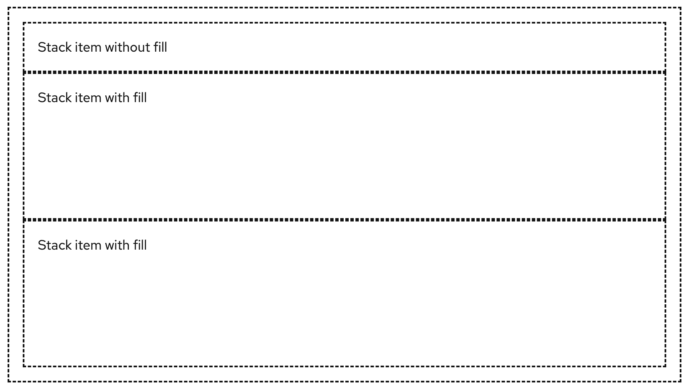
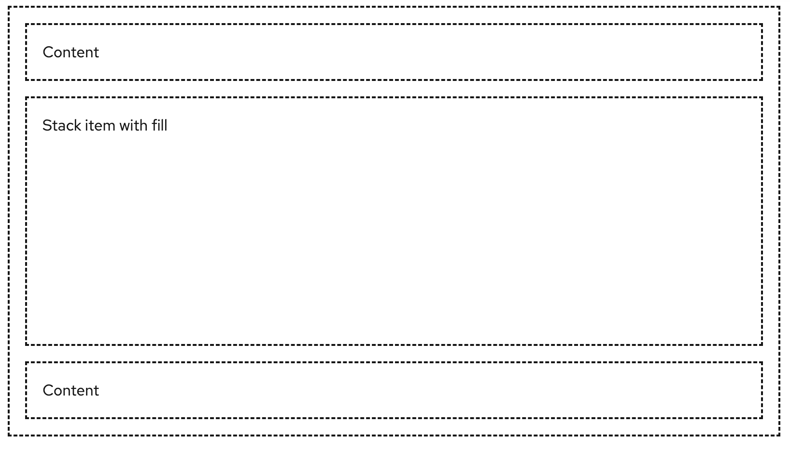

The **stack** layout positions items vertically, with one item filling the available vertical space.

## Elements

Placeholder example image: 

1. **Stack**: the stack container
1. **Stack item**: the stack child

## Usage

### When to use stack vs other layouts 

The stack layout does not wrap. If you need to use a wrapping layout, choose from the flex, gallery, level, or split layouts instead.

## Variations

You can modify an item's fill to allow a stack item to grow with available space. Multiple items can be set to fill. [link to example] Setting a fill to multiple items does not constrain their width. These items will grow as their content dictates needed space. 

Placeholder example image: 

You can apply gutters to adjust spacing between items.

Placeholder example image: 

