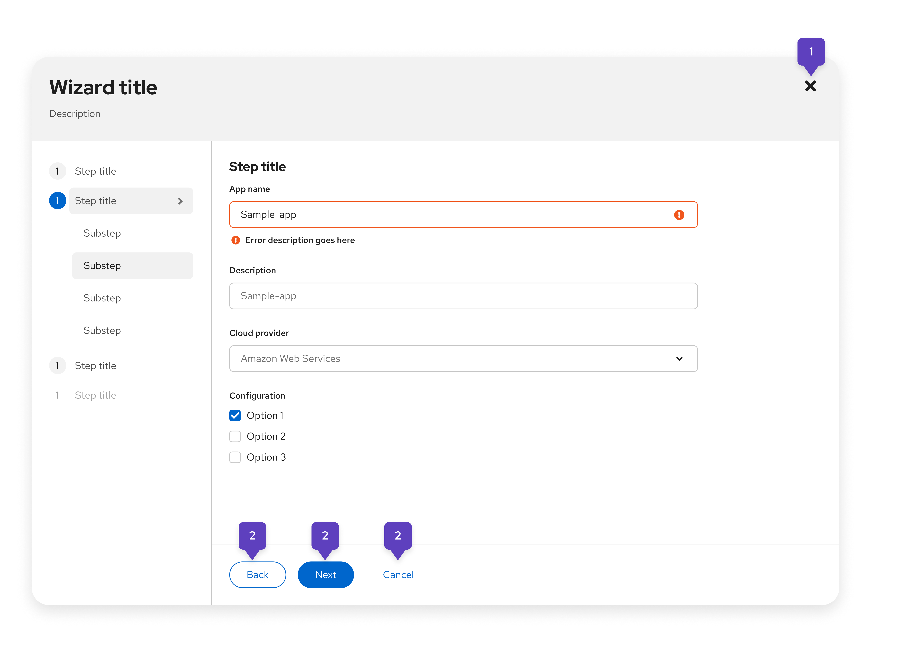

An **action** is any process that a user can trigger by clicking or selecting the component that is linked to the action. Common components include buttons, icons, menu items, cards, and so on. Actions can be found throughout many PatternFly components and typically cover common scenarios like adding, deleting, editing, filtering, and submitting. 

## Elements 

Actions are background processes, so they can be linked to different components for different use case scenarios.

Components that are linked to actions can be found in a number of other components. For example, an action button may be found in a toolbar, an action toggle item may be found in a table, and so on.

The following images illustrate some of the common applications of actions you may find, but do not cover all implementations that you may come across. 

1. **Icons:** Link to actions that cover simple, common processes that are easily identified by an icon. For example, closing, copying, and downloading. 
1. **Buttons:** One of the most common methods of triggering actions that are found in forms, wizards, modals, toolbars, and so on. Buttons include text and/or icon labels to help users identify the action that they will trigger. 

 

1. **Menu items:** Items in a menu can trigger actions. 
1. **Cards:** Can be linked to an action, which is triggered when the card is clicked or selected.

## Usage

Although many components have actions built into their design, you're able to customize the arrangement of components and actions in your UI. It is important to strategically place actions so that it's clear what data they impact and they're where users expect them to be.

When labeling or referring to actions in your UI, make sure that you adhere to our [terminology guidelines](/ux-writing/terminology) and align icons with the usage behavior outlined in our [icon design foundations.](/design-foundations/icons#all-icons) 

### Common actions 

| **Action** | **Process** |
|---|---|
| Add | |
| Clear | |
| Close | |
| Delete | |
| Edit | |

### Single actions 

### Multiple actions

### When not to use actions 
- Do not use actions in place of text links.

## Placement

### Page-level actions

### Component-level actions

### Actions in toolbars