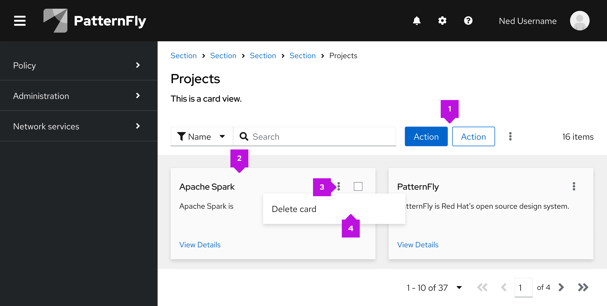

An **action** is any process that a user can trigger by clicking or selecting a linked component. Common actions include adding, deleting, editing, filtering, and submitting, for example. In PatternFly, most actions are shown in the UI as action buttons, action items (in menus), and action cards. These components are incorporated into the design of other components, such as a toolbar with action buttons, a dropdown menu with action items, and so on.

## Elements 

The following image of a card view demonstrates some of the more common uses of actions that you will find in a UI, but does not cover all scenarios. 

1. [**Action button:**](/components/button) Most buttons in a UI trigger an action. 
1. [**Action card:**](/components/card#actionable) A card itself can be actionable, meaning an action will be triggered when a user selects the card.
1. [**Action icon (button):**](/components/button) Icon buttons are commonly used to trigger recognizable and recurring actions. For example, ellipsis icons are used to open menus.
1. [**Action menu item:**](/components/menus/menu/design-guidelines#action-menu) To save space, actions may be placed within a menu. This is also useful when there are multiple actions that a user may take. 

## Usage

Use actions to make it clear and convenient for users to complete tasks in a UI. Using actions strategically makes the UI more efficient, effective, 

When labeling or referring to actions in your UI, make sure that you adhere to our [terminology guidelines](/ux-writing/terminology) and align any icons you use with the usage behavior outlined in our [icon design foundations.](/design-foundations/icons#all-icons) 

## Variations 

### Action buttons

Actions buttons should use styling according to our [button component guidelines.](/components/button/design-guidelines#variations)

## Component-level actions

Many PatternFly components have design options that allow you to include actions. If an action affects a specific component, then the button should be placed within the component, according to its design guidelines. By placing buttons near the content that they affect, users will be able to better understand the button's use case.

For example, if a button affects data in a table, place the button in the table's toolbar. 

## Page-level actions

Sometimes, an action isn't intended to affect a specific component and is intended for higher-level processes like editing the page header, launching related windows, or any action that affects the page as a whole. For these page-level actions, it's important to strategically place actions in the UI so that they can be easily found by users and so that it's clear which data sources or elements they impact.

### Usage 

Page-level actions will look different depending on how many actions appear on the page.

#### Single actions 
If there is only a single action, use a primary or secondary button. Use a primary if it is the primary action you would like the user to take on the page, and a secondary button if it is not the primary call to action.

#### Multiple actions
If there are multiple possible actions a user can take on the page, house them in a dropdown menu. For guidance on menu toggle styling, refer to the [dropdown menu design guidelines](/components/menus/dropdown/design-guidelines).

### Placement 

Actions that affect a page as a whole should be placed on the top right of a page, at the header level. 

Do not place any page-level actions in a toolbar, 

If getting to this page requires drilling down into an item inside a table, those actions should also appear in the row’s kebab of actions. 